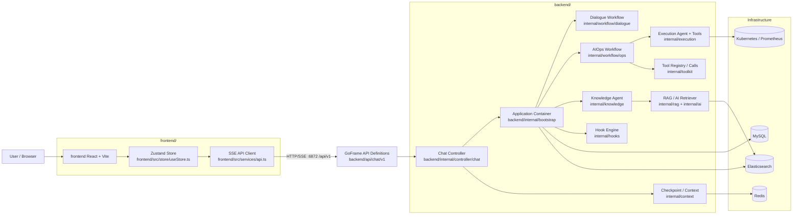
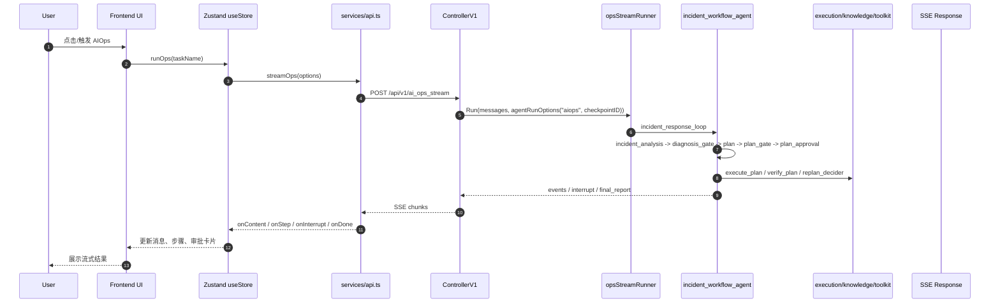

# 01 项目地图与验证基线

> 对应 `00-learning-plan.md` 的阶段一：**跑通项目与建立目录地图**。  
> 方法：用 `oh-my-codex:analyze` 的只读证据规则做源码扫描，用 `diagram-design` 思路把目录职责和请求链路沉淀成 Mermaid 图。  
> 日期：2026-08-18。

## 1. 本轮完成目标

- **验证基线**：确认后端测试、前端类型检查、前端构建均可通过。
- **目录地图**：把根目录、后端、前端的主要文件夹职责先建立起来。
- **第一条主链路**：从前端 `ai_ops_stream` 到后端 AIOps workflow 建立第一版调用链。
- **后续入口**：为下一篇 `02-bootstrap-and-request-flow.md` 准备文件/函数锚点。

## 2. 验证基线

本轮实际执行命令：

```powershell
cd D:\Code\project\oncall

$env:GOCACHE = (Resolve-Path ".gocache").Path
go test ./backend/...

cd frontend
cmd /c npm run lint
cmd /c npm run build
```

结果：

| 验证项 | 结果 | 说明 |
| --- | --- | --- |
| 后端测试 | 通过 | `go test ./backend/...` 全部通过，部分 package 无测试文件或使用 cached 结果 |
| 前端类型检查 | 通过 | `cmd /c npm run lint` 实际执行 `tsc --noEmit` |
| 前端构建 | 通过 | `cmd /c npm run build` 成功生成 `dist/` |
| 构建警告 | 存在 | Vite 提示 bundle 超过 500 kB，且 `frontend/src/services/api.ts` 同时被静态和动态 import |

> 学习备注：这些 warning 不阻塞第一轮阅读，但后续读前端性能/构建时要单独记录。

## 3. 根目录职责地图

当前根目录已经完成前后端拆分：

| 路径 | 职责 | 证据 |
| --- | --- | --- |
| `backend/` | Go 后端主模块，包含 HTTP/SSE API、Agent workflow、执行工具、知识检索、基础设施适配 | `go.work` 只 use `./backend`；`backend/main.go` 是后端入口 |
| `frontend/` | React + Vite 前端，负责聊天界面、AIOps 面板、SSE 消费、人工审批交互 | `frontend/package.json` 定义 Vite dev/build/lint；`frontend/src/services/api.ts` 调后端 API |
| `docs/` | 项目文档与学习笔记 | 本学习笔记位于 `docs/learning/` |
| `go.work` | Go workspace 根配置 | 内容为 `use ( ./backend )` |
| `.env` | 本地运行配置 | `backend/main.go` 先加载 `backend/.env`，再 fallback 到根目录 `../.env` |
| `.omx/`、`.codex/` | 本地 agent/runtime 配置与状态 | 非业务源码，阅读业务逻辑时暂不作为主线 |

证据锚点：

- `go.work:1-5`：workspace 指向 `./backend`。
- `backend/main.go:27-34`：后端支持加载当前目录 `.env` 和拆分后的根目录 `../.env`。
- `frontend/package.json:6-11`：前端 dev/build/lint 脚本。

## 4. 后端目录职责地图

| 路径 | 第一轮理解 | 先读哪些文件 |
| --- | --- | --- |
| `backend/main.go` | 后端进程入口：加载配置、初始化 Redis/MySQL/ES、创建 Application、注册 API、监听 6872 | `backend/main.go:24-136` |
| `backend/api/` | GoFrame API request/response 定义；声明 URL、method、字段 | `backend/api/chat/v1/chat.go` |
| `backend/internal/controller/` | HTTP/SSE Controller；把 API 请求转成 Agent runner 调用 | `backend/internal/controller/chat/chat_v1.go` |
| `backend/internal/bootstrap/` | 应用组装层；初始化模型、Agent、Hook、Redis storage、后台任务 | `backend/internal/bootstrap/app.go` |
| `backend/internal/workflow/` | 核心 workflow：dialogue、ops、agentteams | `backend/internal/workflow/ops/incident_workflow.go` |
| `backend/internal/execution/` | 执行 Agent 与执行工具；围绕 ExecutionPlan 做生成、校验、执行、验证 | `backend/internal/execution/tools/` |
| `backend/internal/knowledge/` | KnowledgeAgent 入口，偏知识上传/知识处理 | `backend/internal/knowledge/` |
| `backend/internal/rag/` | RAG 类型、融合、检索相关逻辑 | `backend/internal/rag/` |
| `backend/internal/ai/` | LLM、Embedding、Indexer、Retriever 等 AI 基础能力适配 | `backend/internal/ai/` |
| `backend/internal/toolkit/` | 工具注册/调用框架 | `backend/internal/toolkit/` |
| `backend/internal/prompt/` | Agent 角色提示词、工具边界、上下文 section 构造 | `backend/internal/prompt/role_prompts.go` |
| `backend/internal/hooks/` | Hook engine 与规则加载 | `backend/internal/hooks/` |
| `backend/internal/context/` | 会话上下文、checkpoint、Redis storage 等状态管理 | `backend/internal/context/` |
| `backend/internal/compact/` | 历史压缩/上下文裁剪 | `backend/internal/compact/` |
| `backend/internal/permissions/` | 执行权限、审批相关基础能力 | `backend/internal/permissions/` |
| `backend/internal/slash/` | Slash command 支持 | `backend/internal/slash/` |
| `backend/internal/agent/rca`、`backend/internal/agent/strategy` | 当前仍保留的 legacy/reserved agent 包；第一轮只标记，不急着判断归属 | 后续用 caller map 确认是否仍在主链路 |
| `backend/utility/` | 基础设施适配层：Redis memory、MySQL、Elasticsearch、middleware、tokenizer、common config | `backend/utility/*` |
| `backend/cmd/ragctl` | RAG 命令行工具 | `backend/cmd/ragctl/main.go` |
| `backend/manifest/`、`backend/hack/` | 部署配置和构建/生成脚本 | 第二轮再看 |

## 5. 前端目录职责地图

| 路径 | 第一轮理解 | 先读哪些文件 |
| --- | --- | --- |
| `frontend/package.json` | 前端工程入口；Vite、React、TypeScript、Zustand 依赖和脚本 | `frontend/package.json:6-30` |
| `frontend/src/main.tsx` | React 挂载入口 | 后续读 UI 启动 |
| `frontend/src/App.tsx` | 页面总装入口 | 后续读布局 |
| `frontend/src/services/api.ts` | 后端 API/SSE 客户端；封装 chat、ops、resume、upload | `frontend/src/services/api.ts:3-104` |
| `frontend/src/store/useStore.ts` | Zustand 状态中心；管理 sessions、streaming、opsSteps、interrupt | `frontend/src/store/useStore.ts:29-69` |
| `frontend/src/components/` | UI 组件：聊天区、输入区、审批卡片、Ops 面板、侧边栏等 | 后续按交互链路读 |
| `frontend/src/types.ts` | 前后端交互类型，如 `ResumeEndpoint`、interrupt、step 等 | `frontend/src/types.ts:3` 显示 resume endpoint 联合类型 |
| `frontend/src/index.css` | 样式入口 | 后续读 UI 时看 |
| `frontend/dist/` | 构建产物 | 不作为源码阅读主线 |

## 6. 当前高层架构图

源文件：`docs/learning/diagrams/01-high-level-architecture.mmd`



## 7. AIOps 第一条请求链路

源文件：`docs/learning/diagrams/02-aiops-request-flow.mmd`



证据锚点：

- `frontend/src/services/api.ts:61-73`：`streamOps` 调 `/ai_ops_stream`，`resumeOps` 调 `/ai_ops_resume_stream`。
- `frontend/src/services/api.ts:76-104`：`streamRequest` 使用 fetch + reader 解析 SSE 分片。
- `frontend/src/store/useStore.ts:263-297`：`runOps` 动态导入 `streamOps` 并处理 step/interrupt。
- `backend/api/chat/v1/chat.go:62-78`：定义 AIOps stream/resume 请求结构。
- `backend/internal/controller/chat/chat_v1.go:485-565`：`AIOpsStream` 和 `AIOpsResumeStream` 分别启动或恢复 ops runner。
- `backend/internal/workflow/ops/incident_workflow.go:170-201`：workflow 成员和 loop/final report stage。

## 8. 后端启动线索

当前第一版启动流程：

```text
backend/main.go
  -> load .env / ../.env
  -> read gf config
  -> init Redis memory
  -> init MySQL
  -> init optional Elasticsearch
  -> bootstrap.NewApplication
      -> init logger
      -> init hook engine
      -> init Redis client/storage/context manager
      -> init chat model / embedding
      -> create DialogueAgent
      -> create IntegratedOpsExecutor
      -> create KnowledgeAgent
      -> create IncidentWorkflowAgent
      -> start background tasks
  -> register /api/v1 routes
  -> listen on 6872
```

证据锚点：

- `backend/main.go:24-37`：入口和 env 加载。
- `backend/main.go:45-84`：Redis、MySQL、Elasticsearch 初始化。
- `backend/main.go:95-108`：调用 `bootstrap.NewApplication`。
- `backend/main.go:118-136`：注册 `/api/v1` 并监听 6872。
- `backend/internal/bootstrap/app.go:100-214`：Application 组装并返回核心依赖。

## 9. Evidence / Inference / Unknown

### Evidence

- 根目录通过 `go.work` 指向 `./backend`，说明 Go 后端已作为 workspace 子模块运行。
- `backend/main.go` 是 HTTP 服务入口，并将 Controller 绑定到 `/api/v1`。
- `frontend/src/services/api.ts` 写死 `BASE_URL = ''http://127.0.0.1:6872/api/v1''`，第一轮本地联调默认指向后端 6872。
- AIOps 主 workflow 在 `backend/internal/workflow/ops/incident_workflow.go` 中注册成员，并以 loop stage 组织 `incident_analysis -> diagnosis_gate -> plan -> plan_gate -> plan_approval -> execute_plan -> verify_plan -> replan_decider`。
- final report 是独立 sequential stage：`incident_final_report_stage -> final_report`。

### Inference

- 当前项目的核心不是传统 CRUD，而是“前端 SSE + 后端 Agent workflow + 工具执行 + 人工审批/恢复”的状态机型系统。
- `backend/internal/bootstrap` 实际承担轻量 IoC/container 职责：它创建并持有 DialogueAgent、KnowledgeAgent、OpsAgent、RedisClient、HookEngine 等核心依赖。
- `frontend/src/store/useStore.ts` 是前端交互状态中枢，后续读审批/恢复 UI 时应从它和 `InterruptCard` 交叉追踪。

### Unknown

- `.env` 中具体 LLM、Redis、MySQL、ES、K8s 配置未展开，第一轮不读取敏感配置。
- `backend/internal/agent/rca` 与 `backend/internal/agent/strategy` 是否仍属于活跃链路，需要后续 caller map 证明。
- RAG/Milvus/ES 的真实运行模式需要在 `knowledge`、`rag`、`ai` 第二轮深入。
- 前端 build warning 是否需要优化，暂不属于第一步学习范围。

## 10. 下一步阅读任务

下一步进入 `02-bootstrap-and-request-flow.md`，建议按这个顺序读：

1. `backend/main.go:24-136`
2. `backend/internal/bootstrap/app.go:100-214`
3. `backend/api/chat/v1/chat.go:62-78`
4. `backend/internal/controller/chat/chat_v1.go:485-565`
5. `frontend/src/services/api.ts:61-104`
6. `frontend/src/store/useStore.ts:263-297`

目标是写出一条“第一次 AIOps 请求从浏览器到 workflow，再通过 SSE 回到前端”的完整调用栈。

