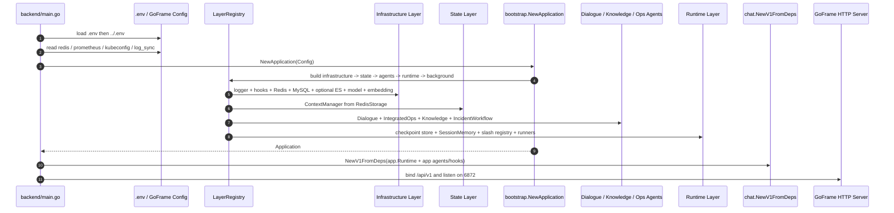
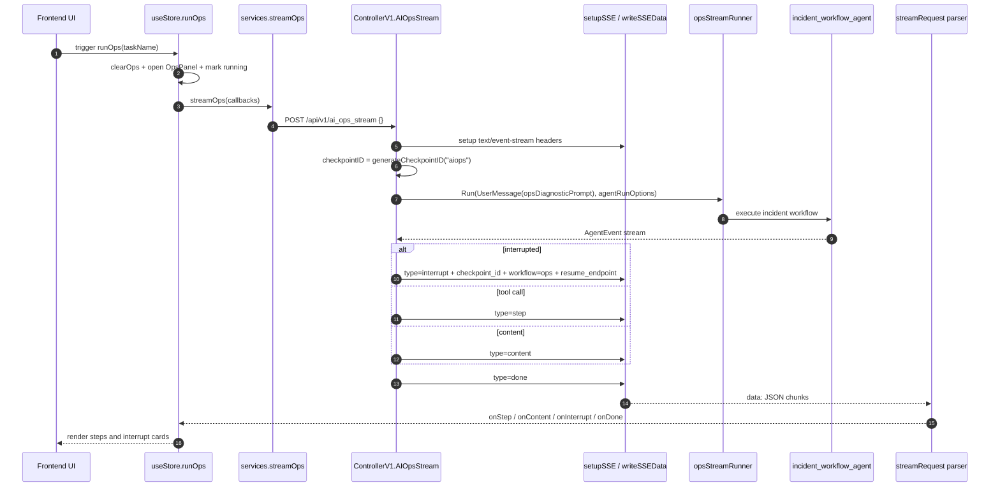

# 02 启动流程、第一次请求追踪与核心结构分析

> 对应 `00-learning-plan.md` 的阶段二：**Entry Point & Bootstrap / 第一次请求追踪**。
> 本篇重点不是泛泛描述，而是把启动流程、AIOps 首个请求、主要数据结构、关键函数逐一对上源码证据。
> 日期：2026-08-18。

## 1. 本轮问题

本轮要搞懂三件事：

1. **程序从哪里启动？**
   入口是 `backend/main.go:20` 的 `main()`。

2. **核心对象在哪里被组装？**
   应用容器是 `backend/internal/bootstrap/app.go:29` 的 `Application`，由 `NewApplication` 通过 layer registry 分层创建。

3. **第一次 AIOps 请求如何从前端进入后端 workflow？**
   前端通过 `frontend/src/services/api.ts:61` 的 `streamOps` 调用 `/ai_ops_stream`，后端由 `backend/internal/controller/chat/chat_v1.go:546` 的 `AIOpsStream` 接住，再交给 `opsStreamRunner.Run`。

## 2. 启动流程总览

```text
backend/main.go:main
  -> load .env / ../.env
  -> read GoFrame config
  -> bootstrap.NewApplication
      -> defaultLayerRegistry
      -> infrastructure layer: logger / hooks / Redis / MySQL / optional ES / model / embedding
      -> state layer: RedisStorage / ContextManager
      -> agents layer: DialogueAgent / IntegratedOpsExecutor / KnowledgeAgent / IncidentWorkflowAgent
      -> runtime layer: checkpoint store / SessionMemory / slash registry / chat+ops runners
      -> background layer: optional PodLogShipper
      -> start background tasks
  -> g.Server().Group("/api").Group("/v1")
  -> chat.NewV1FromDeps(ControllerDeps from app.Runtime)
  -> v1Group.Bind(chatController)
  -> server.SetPort(6872)
  -> server.Run()
```

## 3. 启动时序图

源文件：`docs/learning/diagrams/03-bootstrap-flow.mmd`



## 4. 第一次 AIOps 请求链路

```text
frontend/src/store/useStore.ts:runOps
  -> dynamic import frontend/src/services/api.ts:streamOps
  -> POST http://127.0.0.1:6872/api/v1/ai_ops_stream
  -> backend/api/chat/v1/chat.go:AIOpsStreamReq
  -> backend/internal/controller/chat/chat_v1.go:AIOpsStream
  -> setupSSE
  -> generateCheckpointID("aiops")
  -> run hook: EventTurnStart
  -> opsStreamRunner.Run([...UserMessage(opsDiagnosticPrompt)], agentRunOptions("aiops", checkpointID))
  -> iterate adk.AgentEvent
      -> if interrupted: buildInterruptPayload + workflow/resume_endpoint
      -> if tool calls: emit type=step
      -> if assistant content: emit type=content
      -> if final report: emit final report step
  -> emit type=done
  -> frontend streamRequest parses SSE
  -> useStore updates opsSteps / interrupt / running state
```

## 5. AIOps 请求时序图

源文件：`docs/learning/diagrams/04-aiops-bootstrap-request-flow.mmd`



## 6. 主要数据结构分析

### 6.1 `bootstrap.Config`

位置：`backend/internal/bootstrap/app.go:60-77`

| 字段 | 作用 | 学习重点 |
| --- | --- | --- |
| `RedisAddr` / `RedisPassword` / `RedisDB` / `RedisDialTimeout` | Redis 连接配置 | 后续影响 session、checkpoint、memory |
| `LogLevel` | zap logger 级别 | 影响本地调试可见性 |
| `PrometheusURL` | Prometheus 地址 | Ops 诊断工具的数据来源之一 |
| `KubeConfig` | Kubernetes kubeconfig | 命令执行和集群诊断工具依赖 |
| `LogSyncEnabled` / `LogSyncNamespaces` / `LogSyncInterval` / `LogSyncTailLines` / `LogSyncIndexPrefix` | Pod 日志同步到 ES 的配置 | 后续读日志检索和 RAG 时再深挖 |
| `HooksConfigPath` / `Hooks` | Hook engine 配置 | 影响 turn start/end、resume request 等事件 |

**理解**：这是后端应用启动时的“输入参数结构”。`main.go` 从 GoFrame config 和 env 组装它，再传给 `NewApplication`。

### 6.2 `bootstrap.Application`

位置：`backend/internal/bootstrap/app.go:29-47`

| 字段 | 作用 | 下游使用 |
| --- | --- | --- |
| `Infra` | 基础设施 layer | Logger、HookEngine、Redis、MySQL、ES、模型、embedding |
| `State` | 状态 layer | ContextManager |
| `Agents` | Agent layer | Dialogue、Knowledge、Ops、IntegratedOpsExecutor |
| `Runtime` | 运行时 layer | checkpoint、SessionMemory、slash registry、chat/ops runners |
| `Background` | 后台任务 layer | PodLogShipper 等可选长任务 |
| `ContextManager` | 会话上下文管理 | 后台任务、上下文存储 |
| `DialogueAgent` | 普通聊天 Agent | 兼容旧调用；生产路径通过 `Agents`/`Runtime` 注入 controller |
| `KnowledgeAgent` | 知识上传/知识处理 Agent | 文件上传或知识功能使用 |
| `OpsIntegration` | Ops 集成执行器 | 诊断工具/顺序工具查询相关 |
| `OpsAgent` | AIOps workflow Agent | 兼容旧调用；生产 runner 已在 `RuntimeLayer` 创建 |
| `Logger` | zap logger | controller / agents 记录日志 |
| `RedisClient` | Redis 客户端 | 兼容旧调用；生产 checkpoint store 已在 `RuntimeLayer` 创建 |
| `HookEngine` | Hook 执行引擎 | controller 为 Agent runner 注入 callbacks |

**理解**：`Application` 是本项目实际上的轻量 IoC 容器。新的主结构先按 layer 聚合依赖，再保留旧字段作为兼容入口，避免 controller 和 `main.go` 重新知道 Redis/MySQL/ES/runner 的细节。

### 6.3 `ControllerV1`

位置：`backend/internal/controller/chat/chat_v1.go:43-56`

生产入口的注入结构是 `ControllerDeps`，位置：`backend/internal/controller/chat/chat_v1.go:61-74`。

| 字段 | 作用 | 为什么重要 |
| --- | --- | --- |
| `dialogueAgent` | 普通聊天可恢复 Agent | `chat_stream` / `chat_resume_stream` |
| `chatStreamRunner` | 普通聊天 ADK runner | 管理 streaming + checkpoint |
| `opsStreamRunner` | AIOps ADK runner | AIOps 请求主入口依赖 |
| `rootAgentName` / `opsRootAgentName` | 根 Agent 名称 | 用于判断哪些内容应透出给前端 |
| `sessionMemory` | 会话历史记忆 | 普通聊天上下文 |
| `slashRegistry` | slash 命令注册表 | `/ops`、`/help` 等命令 |
| `workDir` | 工作目录 | slash / 日志 fallback |
| `logger` | 日志 | 错误与事件 |
| `opsAgent` | AIOps agent 原始对象 | 判断 ops 是否初始化 |
| `knowledgeAgent` | 知识 agent | 上传知识时使用 |
| `hookEngine` | Hook engine | run/resume 时注入 callbacks |

**理解**：`ControllerV1` 是 HTTP/SSE 边界层。生产路径通过 `NewV1FromDeps` 接收预构造 runner、checkpoint/session/slash 等运行时对象；兼容路径 `NewV1WithHooks` 仍可从旧参数创建这些运行时对象。

### 6.4 AIOps API 请求结构

位置：`backend/api/chat/v1/chat.go:62-78`

| 类型 | 字段 | 作用 |
| --- | --- | --- |
| `AIOpsStreamReq` | 无业务字段，仅 `g.Meta path:"/ai_ops_stream"` | 触发固定的系统健康检查 prompt |
| `AIOpsResumeStreamReq` | `checkpoint_id` required | 指定恢复哪个中断点 |
| `AIOpsResumeStreamReq` | `interrupt_ids` | 指定恢复哪些 interrupt target |
| `AIOpsResumeStreamReq` | `approved` / `resolved` | 人工审批或问题解决状态 |
| `AIOpsResumeStreamReq` | `comment` | 人工补充说明 |
| `AIOpsResumeStreamReq` | `selection_value` | 前端选择项回传 |

**理解**：AIOps 首次请求当前不接收用户输入，而是使用后端固定的 `opsDiagnosticPrompt`。恢复请求才承载用户对中断/审批的选择。

### 6.5 Checkpoint Store

位置：

- Redis 实现：`backend/internal/context/checkpoint_store.go:11-43`
- 生产运行时选择：`backend/internal/bootstrap/runtime.go:18-65`
- 生产内存 fallback：`backend/internal/bootstrap/runtime.go:84-111`
- 兼容构造器内存 fallback：`backend/internal/controller/chat/chat_v1.go:1752-1784`

| 类型 | 作用 | 关键行为 |
| --- | --- | --- |
| `RedisCheckPointStore` | 基于 Redis 保存 ADK checkpoint | key 格式为 `{prefix}:checkpoint:{checkPointID}`，TTL 默认 24h |
| `inMemoryCheckPointStore` | 无 Redis 时的内存 checkpoint store | 进程内 map + mutex，重启后丢失 |

**理解**：checkpoint 是 resume 的基础。首次请求创建 checkpoint_id；中断时前端拿到 checkpoint_id；恢复时后端用 checkpoint_id 从 store 取回 ADK 状态。

### 6.6 前端 `StreamOptions`

位置：`frontend/src/services/api.ts:21-28`

| 回调 | 触发事件 | 用途 |
| --- | --- | --- |
| `onContent` | `type=content` 或非 JSON 文本 | 追加文本内容 |
| `onStep` | `type=step` | 更新 AIOps 步骤 |
| `onInterrupt` | `type=interrupt` | 显示审批/详情选择卡片 |
| `onCommandAction` | `type=command_action` 且 trusted | 可信前端命令，如清空会话 |
| `onError` | `type=error` 或网络异常 | 标记失败 |
| `onDone` | `type=done` 或 `[DONE]` | 结束 streaming |

### 6.7 前端交互类型

位置：`frontend/src/types.ts:1-91`

| 类型 | 作用 |
| --- | --- |
| `WorkflowKind = ''chat'' | ''ops''` | 区分普通聊天和 AIOps workflow |
| `ResumeEndpoint` | 区分 `chat_resume_stream` 与 `ai_ops_resume_stream` |
| `InterruptData` | 前端 interrupt 卡片的核心载荷 |
| `AIOpsStep` | 聊天消息中的步骤结构 |
| `OpsStep` | Ops Panel 内部步骤结构 |
| `Message` / `Session` | 前端会话和消息结构 |

**理解**：前端并不直接理解后端 Agent 内部状态，它只消费统一 SSE JSON：`content`、`step`、`interrupt`、`done`、`error`。

## 7. 关键函数分析

### 7.1 `main()`

位置：`backend/main.go:20-104`

职责：

1. 加载 `.env`，优先当前目录，失败后尝试 `../.env`。
2. 读取 GoFrame config：Redis、Prometheus、KubeConfig、log sync、hooks config。
3. 把 Redis、Prometheus、KubeConfig、log sync、hooks config 组装成 `bootstrap.Config`。
4. 调用 `bootstrap.NewApplication`，由 bootstrap layer registry 创建基础设施、状态、Agent、运行时和后台任务。
5. 创建 GoFrame server，挂载 middleware。
6. 在 `/api/v1` 下用 `chat.NewV1FromDeps(...)` 绑定 controller，依赖主要来自 `app.Runtime`。
7. 监听端口 `6872`。

判断：`main()` 只负责“进程启动和路由注册”，不承载业务逻辑。

### 7.2 `bootstrap.NewApplication(cfg)`

位置：`backend/internal/bootstrap/app.go:104-117`

layer 注册位置：`backend/internal/bootstrap/application_layers.go:24-31`

职责：

1. 创建 `Assembly{Config, App}`。
2. 调用 `defaultLayerRegistry().Build(...)`，按固定顺序构建 `infrastructure -> state -> agents -> runtime -> background`。
3. 若存在 state/background layer，启动后台迁移和 Pod 日志同步任务。
4. 返回已填充 layer 字段和兼容字段的 `Application`。

判断：`NewApplication` 现在是分层装配入口，不再把 Redis、MySQL、ES、Agent、runner 的细节堆在一个长函数里。查具体依赖来源时先看 layer 函数：`buildInfrastructureLayer`、`buildStateLayer`、`buildAgentLayer`、`buildRuntimeLayer`、`buildBackgroundLayer`。

### 7.3 `chat.NewV1FromDeps(...)` / `NewV1WithHooks(...)`

生产入口位置：`backend/internal/controller/chat/chat_v1.go:163-190`

兼容入口位置：`backend/internal/controller/chat/chat_v1.go:105-152`

职责：

1. `NewV1FromDeps` 只接收已构造好的 controller 运行时依赖，并补默认 root agent name、workDir、SessionMemory、SlashRegistry。
2. `NewV1WithHooks` 保留旧签名：从 agent + redisClient 创建 checkpoint store、chat/ops runner、SessionMemory、SlashRegistry，再转调 `NewV1FromDeps`。
3. `main.go` 现在走 `NewV1FromDeps`，runner/checkpoint/slash/session 的生产创建点是 `RuntimeLayer`。

判断：这是 transport seam。Controller 不应该再知道 Redis/MySQL/ES 如何初始化，只消费运行时对象并负责 HTTP/SSE 协议转换。

### 7.4 `ControllerV1.AIOpsStream`

位置：`backend/internal/controller/chat/chat_v1.go:546-617`

职责：

1. 检查 `opsAgent` 和 `opsStreamRunner` 是否初始化。
2. 调用 `setupSSE` 设置 SSE 响应。
3. 生成 `checkpointID := generateCheckpointID("aiops")`。
4. 触发 `EventTurnStart` hook，结束时触发 `EventTurnEnd`。
5. 用固定 `opsDiagnosticPrompt` 创建用户消息。
6. 调 `opsStreamRunner.Run(..., agentRunOptions("aiops", checkpointID)...)。
7. 遍历 `AgentEvent`：
   - `event.Err`：写 `type=error`。
   - `event.Action.Interrupted`：写 `type=interrupt`，并附加 `workflow=ops`、`resume_endpoint=ai_ops_resume_stream`。
   - `msg.ToolCalls`：写 `type=step`。
   - assistant 内容：写 `type=content`。
   - final report：额外写最终报告 step。
8. 完成后写 `type=done`。

判断：这是 AIOps 首次请求的核心函数。它不直接“诊断”，而是把固定 prompt 交给 `opsStreamRunner`，再把事件流翻译成前端协议。

### 7.5 `ControllerV1.AIOpsResumeStream`

位置：`backend/internal/controller/chat/chat_v1.go:618-737`

职责：

1. 校验请求和 `checkpoint_id`。
2. 调用 `resumeAgent(..., session_id=aiops)`。
3. 重新设置 SSE。
4. 与 `AIOpsStream` 类似，遍历恢复后的 `AgentEvent`。
5. 遇到新 interrupt、step、content、final report、done 时继续写给前端。

判断：恢复接口不是重新跑一次 workflow，而是基于 checkpoint 让 ADK runner 从中断状态继续执行。

### 7.6 `agentRunOptions` / `resumeRunOptions`

位置：`backend/internal/controller/chat/chat_v1.go:960-988`

职责：

- `agentRunOptions(sessionID, checkpointID)`：
  - 注入 `adk.WithCheckPointID(checkpointID)`。
  - 注入 `adk.WithSessionValues({"session_id": sessionID})`。
  - 如果有 hook engine，注入 `adk.WithCallbacks(...)`。

- `resumeRunOptions(sessionValues, checkpointID)`：
  - 恢复时重新注入 session values。
  - 恢复时也注入 hook callbacks。

判断：这是“checkpoint + session values + hooks”进入 ADK 的唯一集中入口之一。

### 7.7 `resumeAgent`

位置：`backend/internal/controller/chat/chat_v1.go:1027-1068`

职责：

1. 检查 runner 是否存在。
2. 规范化 `interrupt_ids`。
3. 触发 `EventResumeRequest` hook。
4. 构造 resume options。
5. 如果没有 target interrupt id，直接 `runner.Resume(ctx, checkpointID, ...)`。
6. 如果有 target id，则用 `buildResumeTargetPayload` 组装参数，再 `runner.ResumeWithParams(...)`。

判断：这是所有恢复逻辑的通用封装。AIOps resume 和普通 chat resume 都依赖这个思路。

### 7.8 `setupSSE` / `writeSSEData` / `writeSSEPayload`

位置：`backend/internal/controller/chat/chat_v1.go:1258-1411`

职责：

- `setupSSE`：
  - 从 context 取 GoFrame request。
  - 设置 `Content-Type: text/event-stream`。
  - 设置 `Cache-Control: no-cache`、`Connection: keep-alive`、`X-Accel-Buffering: no`。
  - 写 200 并 Flush。

- `writeSSEData` / `writeSSEPayload`：
  - 把任意字符串转成 SSE 格式。
  - 每行前面加 `data: `。
  - 末尾补空行表示一个 SSE event 结束。
  - 处理多行、空数据和换行边界。

判断：这组函数定义了后端向前端发流式消息的底层协议格式。

### 7.9 `withSSEWorkflow`

位置：`backend/internal/controller/chat/chat_v1.go:1302-1313`

职责：

- 给 SSE payload 附加 `workflow` 和 `resume_endpoint`。
- AIOps 中断会设置 `workflow=ops` 和 `resume_endpoint=ai_ops_resume_stream`。

判断：这是前端判断 interrupt 应该走 chat resume 还是 ops resume 的关键字段来源。

### 7.10 `buildResumeTargetPayload`

位置：`backend/internal/controller/chat/chat_v1.go:1617-1633`

职责：

- 把 `approved`、`resolved`、`comment`、`selection_value` 转成 ADK resume target payload。
- 空字段不会写入 payload。
- 若 payload 为空，`resumeAgent` 会补默认 `comment=继续执行`。

判断：这是人工审批/恢复输入进入 workflow 的核心转换点。

### 7.11 前端 `streamOps` / `resumeOps` / `streamRequest`

位置：`frontend/src/services/api.ts:61-185`

职责：

- `streamOps`：POST `/ai_ops_stream`，body 是 `{}`。
- `resumeOps`：POST `/ai_ops_resume_stream`，body 包含 `checkpoint_id` 与审批/选择字段。
- `streamRequest`：
  - 用 fetch 发 POST。
  - 从 `response.body.getReader()` 读取流。
  - 按 `\n\n` 分割 SSE event。
  - 只解析 `data: ` 行。
  - 根据 JSON `type` 分派到 `onContent`、`onStep`、`onInterrupt`、`onCommandAction`、`onError`、`onDone`。

判断：前端协议解析集中在一个函数里，后续若后端新增 SSE 类型，通常要改这里。

### 7.12 前端 `useStore.runOps`

位置：`frontend/src/store/useStore.ts:257-311`

职责：

1. 清空旧 Ops steps。
2. 打开 Ops 面板，标记 running。
3. 动态导入 `streamOps`。
4. 创建/更新当前 step。
5. `onStep`：把上一步标 completed，新建步骤。
6. `onContent`：追加内容到当前步骤。
7. `onInterrupt`：标记暂停，并把 interrupt 放进当前步骤。
8. `onDone`：如果不是 interrupt 导致暂停，则结束 running。
9. `onError`：标记错误并结束 running。

判断：`runOps` 是前端 AIOps 面板的状态机入口。

## 8. 关键调用链表

| 顺序 | 文件/函数 | 输入 | 输出/副作用 |
| --- | --- | --- | --- |
| 1 | `frontend/src/store/useStore.ts:runOps` | taskName | 打开 Ops 面板，调用 `streamOps` |
| 2 | `frontend/src/services/api.ts:streamOps` | callbacks | POST `/ai_ops_stream` |
| 3 | `backend/api/chat/v1/chat.go:AIOpsStreamReq` | HTTP route metadata | GoFrame 绑定到 Controller 方法 |
| 4 | `ControllerV1.AIOpsStream` | empty req | 设置 SSE、生成 checkpoint、启动 runner |
| 5 | `agentRunOptions` | sessionID + checkpointID | 注入 checkpoint/session/hook callbacks |
| 6 | `opsStreamRunner.Run` | fixed ops prompt | 返回 `AsyncIterator[*AgentEvent]` |
| 7 | `incident_workflow_agent` | prompt + session state | 产生诊断/计划/审批/执行/报告事件 |
| 8 | `writeSSEData` | JSON string | 写成 SSE `data: ...\n\n` |
| 9 | `streamRequest` | SSE chunks | 按 `type` 分发到前端 callbacks |
| 10 | `useStore.runOps callbacks` | content/step/interrupt/done/error | 更新 UI 状态 |

## 9. 这一步需要记住的核心结论

- `main()` 是进程入口，`NewApplication` 是分层依赖装配中心，`RuntimeLayer + NewV1FromDeps` 是 HTTP Controller 和 ADK runner 的桥。
- AIOps 首次请求没有从前端传用户问题，而是后端使用固定 `opsDiagnosticPrompt`。
- `checkpoint_id` 是中断恢复的主键；首次请求生成，interrupt 下发，resume 回传。
- 后端把 ADK `AgentEvent` 转成统一 SSE JSON；前端只理解 SSE JSON 协议，不理解后端 workflow 内部细节。
- `workflow=ops` 和 `resume_endpoint=ai_ops_resume_stream` 是前端选择恢复接口的关键。
- `ControllerV1` 是当前最适合调试“请求没到 Agent / SSE 没到前端 / interrupt 不能恢复”的第一站。

## 10. 待继续深挖的问题

1. `opsDiagnosticPrompt` 为什么固定在 Controller，而不是前端传入？是否符合产品交互预期？
2. `session_id=aiops` 是否会导致所有 AIOps 共享一个逻辑 session？checkpoint_id 是否足够隔离？
3. `AIOpsStream` 和 slash `/ops` 是否走同一 `opsStreamRunner`，两条入口的 prompt 和 session 语义有什么不同？
4. `event.Action.Interrupted` 的原始结构来自 ADK 哪个节点？下一步需要读 `workflow/ops` 的 plan approval/detail request。
5. 前端 `runOps(taskName)` 目前没有把 `taskName` 传给后端，这个字段是不是只用于 UI 展示？

