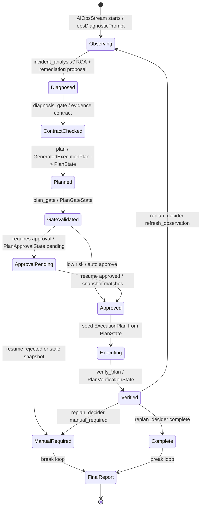

# 03 核心概念、领域模型与 Graph State

> 对应 `00-learning-plan.md` 的“核心概念与领域模型”。  
> 写法约定：**不单独堆数据结构表**；每个数据结构都放回它被创建、校验、审批、执行或恢复的代码路径里讲。  
> 日期：2026-08-18。

## 1. 本节阅读目标

这一节只回答一个问题：

> AIOps 工作流里那些术语到底对应什么代码对象，它们在什么时候被创建、写入、校验、消费、失效？

阅读入口仍然是 AIOps 主链路：

```text
incident_analysis
  -> diagnosis_gate
  -> plan
  -> plan_gate
  -> plan_approval
  -> execute_plan
  -> verify_plan
  -> replan_decider
  -> final_report
```

源码锚点：

- `backend/internal/workflow/ops/incident_workflow.go:40-120`
- `backend/internal/workflow/ops/state_bridge.go:35-180`
- `backend/internal/workflow/ops/plan_gate.go:62-332`
- `backend/internal/workflow/ops/diagnosis_gate.go:180-210`
- `backend/internal/execution/tools/generate_plan.go:34-150`
- `backend/internal/execution/tools/validate_plan.go:48-235`
- `backend/internal/execution/tools/tool_call_state.go:252-298`

## 2. 先从 workflow 成员理解术语边界

`NewIncidentWorkflowAgent` 创建的不是一个单体 Agent，而是一组被 Team 串起来的成员。代码在 `incident_workflow.go:55-86` 依次创建：

- `incidentAgent`：由 `NewOpsAgent` 创建，负责诊断、RCA、修复提案。
- `planAgent`：由 `NewPlanAgent` 创建，负责生成 canonical execution plan。
- `executionAgent`：由 `execution.NewExecutionAgent` 创建，负责执行已批准计划。
- `diagnosisGate`：检查诊断证据是否足够进入规划。
- `planGate`：验证 canonical plan 的安全性和结构。
- `planApproval`：把审批绑定到完整 plan snapshot。
- `verifyPlan`：检查完整计划执行结果。
- `replanDecider`：决定 complete / refresh_observation / manual_required。
- `reporter`：最终报告。

`newIncidentWorkflowTeam` 在 `incident_workflow.go:145-181` 把这些成员注册进两个 stage：

```text
LoopStage: incident_response_loop
  incident_analysis -> diagnosis_gate -> plan -> plan_gate -> plan_approval -> execute_plan -> verify_plan -> replan_decider

SequentialStage: incident_final_report_stage
  final_report
```

这里先确立一条关键边界：

> `plan` 负责产出计划，`plan_gate` 负责校验计划，`plan_approval` 负责审批计划，`execute_plan` 只能消费已经通过前两步的计划。

这不是文档约定，而是代码里的 guard 约束。后面会看到 `execute_step` 也有 prepared/validated 检查。

## 3. Graph State 是这些术语的承载体

`state_bridge.go` 里有一个常量：

```go
const incidentStateSessionKey = "incident_graph_state"
```

它说明 AIOps 的核心状态被放进 ADK session values，也就是这里说的 **Graph State**。真正承载状态的是 `IncidentState`。

但不要把 `IncidentState` 当普通 DTO 看。它更像一张“事故处置白板”，每个节点只在自己阶段写入一部分字段：

- `incident_analysis` 写根因、证据、修复意图、提案。
- `plan` 写 `PlanState`。
- `plan_gate` 写 `PlanGateState`。
- `plan_approval` 写 `PlanApprovalState`。
- `execute_plan` 写执行状态和步骤 trace。
- `verify_plan` 写 `PlanVerificationState`。
- `replan_decider` 写 `ReplanState`。
- `final_report` 写 `FinalStatus` 和 `FinalReport`。

这些字段集中定义在 `state_bridge.go:108-180`，但真正理解它们要看每个阶段怎么写。

## 4. 诊断阶段：从 RCA/Remediation 写入 IncidentState

`wrapWithIncidentState("incident_analysis", incidentAgent, ...)` 出现在 `incident_workflow.go:76`。这个 wrapper 的核心逻辑是 `stateBridgeAgent.track -> captureState -> updateByStage`：

- `track` 在 `state_bridge.go:237-254` 遍历 inner agent 的 `AgentEvent`。
- `captureState` 在 `state_bridge.go:256-307` 把 tool call、assistant content、interrupt 写入执行日志。
- `updateByStage` 在 `state_bridge.go:310-330` 根据 stage 名决定解析哪类结构化输出。

当 stage 是 `incident_analysis` 时，`updateByStage` 会尝试：

```go
parseRCAReport(messages) -> applyIncidentRCAReport(state, report)
parseRemediationProposal(messages) -> applyIncidentRemediationProposal(state, proposal)
```

这里 `IncidentState` 的诊断字段开始有意义：

- `RootCause`：根因。
- `TargetNode`：故障目标节点。
- `Path`：故障传播路径。
- `Impact`：影响面。
- `Confidence`：诊断置信度。
- `Evidence`：证据。
- `RemediationIntent`：修复意图。
- `PlanningConstraints`：计划生成时要遵守的约束。
- `RemediationProposal* / PlanID / PlanSummary / PlanRisk / FallbackPlan`：修复提案和旧字段兼容映射。

学习时要记住：这一阶段还不是 `ExecutionPlan`，只是“诊断 + 修复方向”。真正命令级计划在下一阶段生成。

## 5. 计划阶段：GeneratedExecutionPlan 被写成 canonical PlanState

`planAgent` 被 `wrapWithIncidentState("plan", planAgent, ...)` 包起来，见 `incident_workflow.go:77`。这意味着 plan agent 输出的结构化 JSON 会被 `stateBridgeAgent` 捕获。

在 `state_bridge.go:494-547`，`applyExecutionPlanState(state, plan)` 是关键函数。它接收的是 `GeneratedExecutionPlan`，来自 `incident_contract.go:75-82`：

```go
type GeneratedExecutionPlan struct {
    PlanID        string
    Description   string
    Steps         []GeneratedExecutionStep
    TotalSteps    int
    EstimatedTime int
    RiskLevel     string
}
```

它的每个 step 是 `GeneratedExecutionStep`，字段包括：

- `StepID`
- `Description`
- `Command`
- `Args`
- `ExpectedResult`
- `RollbackCommand`
- `RollbackArgs`
- `Timeout`
- `Critical`

这些字段不是静态摆设，`applyExecutionPlanState` 会把它们变成 `PlanState`：

```go
state.PlanState = &PlanState{
    PlanID:        plan.PlanID,
    Revision:      revision,
    Description:   plan.Description,
    RiskLevel:     plan.RiskLevel,
    Steps:         cloneGeneratedExecutionSteps(plan.Steps),
    StepSummaries: stepSummaries,
    TotalSteps:    totalSteps,
    EstimatedTime: plan.EstimatedTime,
    SnapshotHash:  snapshotHash,
    GeneratedAt:   now,
}
```

这里有两个特别重要的领域概念：

### 5.1 canonical plan

代码把 `GeneratedExecutionPlan` 写入 `state.PlanState` 后，这个 `PlanState` 就成为后续阶段的 **canonical plan**。后面 `plan_gate`、`plan_approval`、`execute_plan` 都不应该再自由生成或改写计划，而是围绕 `PlanState` 做校验、审批和消费。

### 5.2 snapshot hash + revision

`applyExecutionPlanState` 先调用 `computeExecutionPlanSnapshotHash(plan)`。这个函数在 `state_bridge.go:657-680` 对 `PlanID`、`Description`、`Steps`、`TotalSteps`、`EstimatedTime`、`RiskLevel` 做 JSON marshal，再计算 sha256。

然后它用 hash 判断计划是否变化：

- hash 没变：沿用旧 `Revision`。
- hash 变了：`Revision + 1`。
- 如果计划变更且旧审批不是 pending：把 `PlanApprovalState` 重置成 pending。

所以，`Revision` 和 `SnapshotHash` 是“计划快照身份”。审批不是审批某个 plan_id 字符串，而是审批某个具体 revision/hash。

## 6. ExecutionPlan：工具层也有一份计划结构

容易混淆的一点是：workflow 层有 `GeneratedExecutionPlan` / `PlanState`，execution tools 层也有 `ExecutionPlan`。

在 `backend/internal/execution/tools/generate_plan.go:42-61`：

```go
type ExecutionStep struct {
    StepID          int
    Description     string
    Command         string
    Args            []string
    ExpectedResult  string
    RollbackCommand string
    RollbackArgs    []string
    Timeout         int
    Critical        bool
}

type ExecutionPlan struct {
    PlanID        string
    Description   string
    Steps         []ExecutionStep
    TotalSteps    int
    EstimatedTime int
    RiskLevel     string
}
```

这跟 `GeneratedExecutionPlan` 字段几乎一致，但语义位置不同：

- `GeneratedExecutionPlan`：plan agent 输出、workflow 捕获的结构。
- `PlanState`：Graph State 中的 canonical plan。
- `ExecutionPlan`：execution tools 真正校验和执行时消费的计划结构。

桥接函数在 `plan_gate.go:76-102`：

```go
func planStateToExecutionToolPlan(plan *PlanState) *executiontools.ExecutionPlan
```

它把 `PlanState.Steps` 转成 `executiontools.ExecutionStep`。所以从代码看，计划的生命周期是：

```text
GeneratedExecutionPlan
  -> applyExecutionPlanState
  -> IncidentState.PlanState
  -> planStateToExecutionToolPlan
  -> executiontools.ExecutionPlan
```

这条转换链很关键：以后查计划字段丢失、审批错位、执行 step 不一致，优先沿这条链排查。

## 7. plan_gate：PlanState 被转成 ExecutionPlan 后校验

`newPlanGateAgent` 的 `Run` 在 `plan_gate.go:34-60`。它做三件事：

1. `state := getIncidentState(ctx)`
2. `validation := validateCanonicalPlan(state)`
3. `applyPlanGateValidationState(state, validation)`

`validateCanonicalPlan` 在 `plan_gate.go:62-74`：

- 如果 `state.PlanState` 缺失，直接返回 blocked。
- 否则调用 `planStateToExecutionToolPlan(state.PlanState)`。
- 再调用 `executiontools.ValidateExecutionPlan(plan)`。

这意味着 `plan_gate` 校验的不是模型刚输出的一段文本，而是 Graph State 里的 canonical plan。

`ValidateExecutionPlan` 的核心逻辑在 `validate_plan.go:176-235`：

- steps 为空：blocked + high risk。
- step 命令为空：blocked。
- 匹配绝对禁止命令：blocked，写入 `UnsafeCommands`。
- 匹配高风险命令：写入 `ReviewCommands`，增加 risk score。
- critical step 无 rollback：增加风险。
- 最终根据 blocked/riskScore 给出 low/medium/high。

校验结果会通过 `applyPlanGateValidationState` 写入 `PlanGateState`，见 `state_bridge.go:549-583`。这里 `PlanGateState` 保存：

- 被校验的 `PlanID`
- `Revision`
- `SnapshotHash`
- `Valid`
- `Blocked`
- `RequiresApproval`
- `RiskLevel`
- `Reasons`
- `UnsafeCommands`
- `ReviewCommands`

注意：`PlanGateState` 也保存 revision/hash，这样后面能判断 gate 结果是不是“当前计划”的结果。

## 8. plan_approval：审批绑定完整 plan snapshot

`planApprovalAgent.Run` 在 `plan_gate.go:138-175`。它不是简单问一句“是否批准”，而是围绕 `PlanState + PlanGateState` 做守卫。

先看 `planReadyForApproval`，在 `plan_gate.go:221-235`：

- 没有 `PlanState`：不能审批。
- 没有 `PlanGateState`：不能审批。
- `planGateMatchesCurrentPlan(state)` 为 false：不能审批，因为 gate 结果可能是旧 plan。
- gate blocked 或 invalid：不能审批。

`planGateMatchesCurrentPlan` 在 `plan_gate.go:237-244`，同时比较：

- plan_id
- revision
- snapshot_hash

如果 plan 需要人工审批，`markPlanApprovalPending` 在 `plan_gate.go:290-301` 写入：

```go
PlanApprovalState{
    PlanID: state.PlanState.PlanID,
    Revision: state.PlanState.Revision,
    SnapshotHash: state.PlanState.SnapshotHash,
    ApprovalStatus: "pending",
    ApprovalScope: "full_plan",
}
```

如果低风险可自动审批，`approveCurrentPlan` 在 `plan_gate.go:304-318` 写入：

```go
ApprovalStatus: "approved",
Approved: true,
ApprovedBy: "auto_low_risk",
ApprovalScope: "full_plan"
```

用户恢复审批时，`planApprovalAgent.Resume` 在 `plan_gate.go:177-219` 再次检查 `pendingPlanApprovalMatchesCurrentPlan`。如果 pending 的 snapshot 不等于当前 `PlanState`，它会拒绝复用旧审批并转 `manual_required`。

这就是项目里的审批语义：

> 审批绑定的是完整计划快照，不是 plan_id，也不是某个 step。

## 9. execute_plan：只消费已批准的 canonical plan

执行阶段有两层保护。

第一层在 workflow guard。 `diagnosis_gate.go:180-210` 的 `executionGuardAllowsExecution` 要求：

- incident contract 已通过。
- `PlanState` 存在。
- `PlanGateState` 存在。
- `planGateMatchesCurrentPlan(state)` 为 true。
- gate 没 blocked 且 valid。
- `currentPlanApproved(state)` 为 true。

通过后，`prepareExecutionToolStateFromApprovedPlan` 会：

1. `planStateToExecutionToolPlan(state.PlanState)`
2. `executiontools.PrepareApprovedExecutionPlanFromGraphState(ctx, plan)`

第二层在 execution tool。 `tool_call_state.go:252-298` 的 `PrepareApprovedExecutionPlanFromGraphState` 会把计划 seed 进 execution tool cache，并同时标记：

- `planPrepared = true`
- `planValidated = true`
- `planID / validatedPlanID = plan.PlanID`

然后 `execute_step.go:209-214` 在真正执行 step 前再次检查：

```go
if ok, _ := hasPreparedExecutionPlan(ctx); !ok { ... }
if ok, _ := hasValidatedExecutionPlan(ctx); !ok { ... }
```

所以 `execute_step` 不能绕过计划生成、plan_gate、plan_approval 直接执行。

## 10. verify_plan：用 PlanVerificationState 记录执行结果

`newVerifyPlanAgent` 在 `incident_nodes.go:62-103`。它运行时：

1. `state := getIncidentState(ctx)`
2. `payload := buildPlanVerificationPayload(state)`
3. `applyPlanVerificationState(state, map[string]any{...})`
4. 写执行日志。
5. 输出 JSON 给后续节点。

`PlanVerificationState` 定义在 `state_bridge.go:62-70`，它不保存完整执行日志，只保存 verification summary：

- `PlanID`
- `Revision`
- `Status`
- `Success`
- `FailedStepID`
- `Reason`
- `VerifiedAt`

`applyPlanVerificationState` 在 `state_bridge.go:585-616` 会优先取 payload 里的 `plan_id` / `plan_revision`，否则回退到当前 canonical plan。

这里的语义是：验证结果也是针对某个 plan revision 的，而不是泛泛地说“执行成功/失败”。

## 11. replan_decider：ReplanState 决定循环是否继续

`replanDeciderAgent.Run` 在 `incident_nodes.go:415-710`。它会读取多类事实：

- remediation proposal
- execution plan
- validation result
- step validation result
- execution status/result
- diagnostic insight
- 当前 `IncidentState`

然后调用 `recordReplanDecision`，在 `incident_nodes.go:405-412` 写入 `ReplanState`。真正写状态的是 `applyReplanDecisionState`，见 `state_bridge.go:697-735`。

`ReplanState` 定义在 `state_bridge.go:85-94`，核心字段是：

- `Decision`：complete / refresh_observation / manual_required / abort
- `Reason`
- `Source`
- `PlanID`
- `PlanRevision`
- `ObservationRefreshNeeded`
- `RuntimeObservationSummary`
- `UpdatedAt`

关键语义在 `applyReplanDecisionState`：

- `refresh_observation`：把 `ExecutionStatus` 设为 `replan_required`，`ExecutionSuccess=false`，`ObservationRefreshNeeded=true`，并调用 `invalidateCurrentPlanForObservationRefresh`。
- `manual_required` / `abort`：把执行状态设为人工处理。
- `complete`：把执行状态设为 success。

这解释了为什么 replan_decider 是循环收敛点：它把上游所有事实归一成下一步动作。

## 12. final_report：最后从 IncidentState 汇总输出

`finalReportAgent.Run` 在 `incident_nodes.go:742-760` 开始：

1. `state := getIncidentState(ctx)`
2. `state.FinalStatus = inferFinalStatus(state)`
3. `summary := buildFinalOpsSummary(state)`
4. `state.FinalReport = clipText(summary, 800)`
5. `persistFinalOpsReport(ctx, state, summary)`

也就是说 final report 不是重新诊断，而是读取前面阶段累计在 `IncidentState` 里的事实，生成最终面向前端/归档的总结。

## 13. 领域生命周期状态图

源文件：`docs/learning/diagrams/05-aiops-domain-state-lifecycle.mmd`



## 14. 术语速查，但按代码语义理解

| 术语 | 代码落点 | 正确理解 |
| --- | --- | --- |
| Graph State | `incident_graph_state` / `IncidentState` | AIOps 全链路共享状态白板 |
| IncidentState | `state_bridge.go:108-180` | 各阶段事实的聚合，不是某个单节点输出 |
| GeneratedExecutionPlan | `incident_contract.go:75-82` | plan agent 生成的结构化计划 |
| PlanState | `state_bridge.go:35-46` | Graph State 中的 canonical plan |
| ExecutionPlan | `execution/tools/generate_plan.go:54-61` | execution tools 消费/校验/执行的计划 |
| SnapshotHash | `computeExecutionPlanSnapshotHash` | 计划快照身份，用于防旧审批/旧 gate 复用 |
| Revision | `applyExecutionPlanState` | 计划变更版本号 |
| PlanGateState | `state_bridge.go:48-60` | plan_gate 针对当前 plan snapshot 的校验结果 |
| PlanApprovalState | `state_bridge.go:96-106` | 整体计划审批状态，绑定 plan_id + revision + hash |
| PlanVerificationState | `state_bridge.go:62-70` | 验证结果摘要，绑定 plan revision |
| ReplanState | `state_bridge.go:85-94` | 循环收敛决策：完成、刷新观察、人工处理 |
| IncidentInterruptInfo | `incident_contract.go:107-114` | 中断给前端/用户的结构化信息 |

## 15. 本节核心结论

- 本项目的 AIOps 不是“一个 Agent 一口气处理完”，而是多个节点围绕 `IncidentState` 逐步累积事实。
- `PlanState` 是 canonical plan；`ExecutionPlan` 是工具层消费结构；两者通过 `planStateToExecutionToolPlan` 转换。
- `Revision + SnapshotHash` 是计划身份，plan_gate 和 plan_approval 都必须匹配当前 snapshot。
- 审批绑定的是 full plan snapshot，不是单条命令，也不是 plan_id。
- execute_plan 的安全边界有两层：workflow guard + execution tool prepared/validated guard。
- replan_decider 是循环收敛点，它把执行和验证事实归一成 complete / refresh_observation / manual_required。
- final_report 读取 Graph State 汇总，不负责重新决策。

## 16. 下一节建议

下一节可以写 `04-ops-workflow.md`，重点从代码层完整走一遍：

```text
AIOpsStream
  -> incident_workflow_agent
  -> incident_response_loop
  -> each node Run/Resume
  -> interrupt / resume
  -> final_report
```

建议特别分析三个分支：

1. 低风险计划自动审批并执行成功。
2. 中高风险计划触发人工审批。
3. verify_plan 失败后 refresh_observation 进入下一轮。

