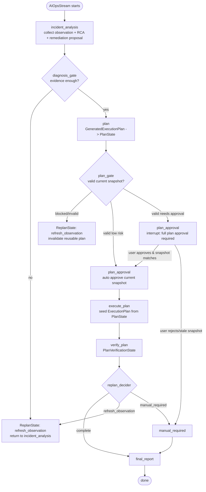

# 04 AIOps 主工作流：三条分支读代码

> 本节继续沿用上一节约定：**数据结构不独立成小节堆表**，而是放在每个 workflow 节点的代码行为里讲。
> 目标：看懂 AIOps workflow 如何从诊断进入计划、审批、执行、验证、重规划和最终报告。
> 日期：2026-08-19。

## 1. 本节目标

这一节要把 AIOps 主流程真正“跑一遍”，重点不是介绍有哪些类型，而是回答：

- 低风险计划为什么能自动批准并执行？
- 中高风险计划为什么会中断等待人工审批？
- verify_plan 失败后为什么会回到重新观察，而不是直接结束？
- 哪些代码保证 execute_plan 不能绕过 plan_gate 和 plan_approval？
- final_report 为什么能汇总前面的计划、验证和重规划事实？

主线文件：

- `backend/internal/workflow/ops/incident_workflow.go`
- `backend/internal/workflow/ops/state_bridge.go`
- `backend/internal/workflow/ops/diagnosis_gate.go`
- `backend/internal/workflow/ops/plan_gate.go`
- `backend/internal/workflow/ops/incident_nodes.go`
- `backend/internal/workflow/ops/incident_workflow_test.go`
- `backend/internal/workflow/ops/plan_gate_test.go`
- `backend/internal/workflow/ops/diagnosis_gate_test.go`

## 2. workflow 不是一条函数调用，而是一个可恢复 Team

先看 `NewIncidentWorkflowAgent`。它在 `incident_workflow.go:55-86` 创建了多个成员：

```text
incidentAgent       = NewOpsAgent
planAgent           = NewPlanAgent
executionAgent      = execution.NewExecutionAgent
diagnosisGate       = newDiagnosisGateAgent
planGate            = newPlanGateAgent
planApproval        = newPlanApprovalAgent
verifyPlan          = newVerifyPlanAgent
replanDecider       = newReplanDeciderAgent
reporter            = newFinalReportAgent
```

然后在 `incident_workflow.go:76-84`，一些 Agent 被 `wrapWithIncidentState` 包起来：

- `incident_analysis`：把 RCA 和 remediation proposal 写进 Graph State。
- `plan`：把 plan agent 输出写成 canonical `PlanState`。
- `execute_plan`：把执行结果、step trace、异常状态写进 Graph State。
- `plan_gate` / `verify_plan`：把校验和验证结果写入对应状态。

最后 `newIncidentWorkflowTeam` 在 `incident_workflow.go:145-181` 注册 stage：

```text
LoopStage: incident_response_loop
  incident_analysis
  diagnosis_gate
  plan
  plan_gate
  plan_approval
  execute_plan
  verify_plan
  replan_decider

SequentialStage: incident_final_report_stage
  final_report
```

测试 `incident_workflow_test.go:50-75` 明确锁住了这个 stage 顺序，说明它不是随便写在注释里的流程。

## 3. 总分支图

源文件：`docs/learning/diagrams/06-aiops-workflow-branches.mmd`



## 4. 分支一：低风险计划自动审批并执行

这一分支从 `plan_gate` 开始变得清晰。

### 4.1 plan 阶段先把模型输出固化为 PlanState

plan agent 输出的是结构化计划。上一节讲过，`state_bridge.go:494-547` 的 `applyExecutionPlanState` 会把 `GeneratedExecutionPlan` 写入 `IncidentState.PlanState`。

关键点是它同时生成：

- `Revision`
- `SnapshotHash`
- `StepSummaries`
- legacy mirror 字段，如 `ExecutionPlanID`、`ExecutionPlanDesc`、`ExecutionPlanRisk`

测试 `incident_workflow_test.go:187-241` 验证了两件事：

- 第一次捕获 plan 会写入 canonical `PlanState` 和 snapshot hash。
- 同一个 plan 再写一次 revision 不变；plan 内容变化后 revision 变成 2，hash 也变化。

这说明后续审批和执行围绕的是一个可识别的计划快照。

### 4.2 plan_gate 校验当前 PlanState

`plan_gate.go:34-60` 的 `planGateAgent.Run` 会：

1. `state := getIncidentState(ctx)`
2. `validation := validateCanonicalPlan(state)`
3. `applyPlanGateValidationState(state, validation)`
4. 输出 validation JSON。

`validateCanonicalPlan` 在 `plan_gate.go:62-74` 中先把 `PlanState` 转成 execution tools 层的 `ExecutionPlan`：

```text
PlanState -> planStateToExecutionToolPlan -> executiontools.ExecutionPlan
```

再调用 `executiontools.ValidateExecutionPlan(plan)`。所以 `plan_gate` 校验的是 Graph State 里的 canonical plan，不是临时文本。

### 4.3 低风险计划不需要人工审批

`applyPlanGateValidationState` 会写入 `PlanGateState.RequiresApproval`。当命令是低风险、只读、没有 review commands 时，`RequiresApproval=false`。

测试 `plan_gate_test.go:7-30` 用 `kubectl get pod ...` 这种只读命令证明：

- `PlanGateState.Valid=true`
- `PlanGateState.Blocked=false`
- `PlanGateState.RequiresApproval=false`

然后 `planApprovalAgent.Run` 在 `plan_gate.go:138-175` 判断：

- `planReadyForApproval(state)` 通过。
- `currentPlanApproved(state)` 若还没批准。
- `planApprovalRequired(state)` 为 false。
- 于是调用 `approveCurrentPlan(state, "auto_low_risk")`。

这里 `PlanApprovalState` 不是手动创建的“状态表”，而是 `approveCurrentPlan` 在 `plan_gate.go:304-318` 写入的执行凭证，里面绑定：

- `PlanID`
- `Revision`
- `SnapshotHash`
- `ApprovalStatus=approved`
- `Approved=true`
- `ApprovalScope=full_plan`

### 4.4 execute_plan 前还会检查审批凭证

`execute_plan` 不是拿到 plan 就执行。它先经过 `newContractGuardedExecutionAgent`，这个 wrapper 在 `incident_workflow.go:79` 包住 execution agent。

guard 的核心在 `diagnosis_gate.go:180-210`：

- incident contract 必须通过。
- `PlanState` 必须存在。
- `PlanGateState` 必须存在。
- `planGateMatchesCurrentPlan(state)` 必须为 true。
- plan gate 不能 blocked / invalid。
- `currentPlanApproved(state)` 必须为 true。

通过后，`prepareExecutionToolStateFromApprovedPlan` 把 `PlanState` 转成 execution tools 的 `ExecutionPlan`，再调用 `PrepareApprovedExecutionPlanFromGraphState`。

`tool_call_state.go:252-298` 会把工具缓存标记为：

- `planPrepared=true`
- `planValidated=true`

最后 `execute_step.go:209-214` 在真正执行命令前还会检查 prepared/validated。也就是说低风险路径虽然自动批准，但仍然不绕过 gate。

## 5. 分支二：中高风险计划触发人工审批

当 `plan_gate` 发现风险需要 review 时，`PlanGateState.RequiresApproval=true`。这个判断来自 `planValidationRequiresApproval`，逻辑在 `state_bridge.go:642-655`：

- `RequiresConfirmation=true` 需要审批。
- `ReviewCommands` 非空需要审批。
- `RiskLevel` 是 medium/high/critical 需要审批。

### 5.1 plan_approval 发出 interrupt

在 `planApprovalAgent.Run` 中，如果 `planApprovalRequired(state)` 为 true，它会：

1. 通过 `markPlanApprovalPending(state, reason)` 写入 pending 的 `PlanApprovalState`。
2. 调用 `interruptEvent(ctx, &IncidentInterruptInfo{...}, message)` 发出中断。

这段在 `plan_gate.go:154-167`。`IncidentInterruptInfo` 里会携带：

- `Type=plan_approval_required`
- `Reason`
- `PlanID`
- `PlanRevision`
- `SnapshotHash`
- `FallbackPlan`

这就是前端看到“需要整体计划审批”的来源。Controller 在 `AIOpsStream` 遇到 `event.Action.Interrupted` 时，会把它包装成 SSE interrupt，并附加：

- `workflow=ops`
- `resume_endpoint=ai_ops_resume_stream`

### 5.2 用户批准后还要检查 snapshot 是否匹配

恢复审批走 `planApprovalAgent.Resume`，在 `plan_gate.go:177-219`。

它先解析用户输入：

```text
parsePlanApprovalDecision(info.ResumeData)
```

如果用户批准，代码并不是直接执行，而是先检查：

```go
pendingPlanApprovalMatchesCurrentPlan(state)
```

这个函数在 `plan_gate.go:279-288`，同样比较：

- `PlanID`
- `Revision`
- `SnapshotHash`

如果 pending snapshot 与当前 canonical plan 不匹配，代码会：

- 重新标记 pending。
- 写 `ReplanState=manual_required`。
- break loop，拒绝复用旧审批。

测试 `plan_gate_test.go:74-88` 覆盖了这个行为：计划变化后，旧 pending approval 不再匹配当前 plan。

### 5.3 用户拒绝则进入 manual_required

如果用户拒绝审批，`planApprovalAgent.Resume` 会：

- `rejectCurrentPlan(state, reason)`
- `applyReplanDecisionState(state, "manual_required", reason, "plan_approval", "")`
- `state.FinalStatus = "unresolved"`
- break loop 进入最终报告。

这说明人工审批不是“只影响 UI”，它会改变 Graph State，并决定 workflow 是否继续执行。

## 6. 分支三：验证失败后 refresh_observation

`verify_plan` 的职责不是执行命令，而是根据 Graph State 检查执行结果是否覆盖完整计划。

`newVerifyPlanAgent` 在 `incident_nodes.go:62-103`，其 `Run` 会：

1. 读取 `IncidentState`。
2. 调 `buildPlanVerificationPayload(state)`。
3. 调 `applyPlanVerificationState` 写入 `PlanVerificationState`。
4. 输出 verification JSON。

`buildPlanVerificationPayload` 在 `incident_nodes.go:105-180` 开始。它会根据 `state.ExecutionStatus` 和 execution trace 生成：

- `VerificationStatus`
- `ExecutionStatus`
- `Success`
- `PlanID`
- `PlanRevision`
- `FailedStepID`
- `FailedReason`
- `RuntimeObservationSummary`
- `ExecutedSteps`

这一步绑定的是 plan revision，所以不是泛泛地说“执行失败”。

### 6.1 replan_decider 读取验证/执行事实

`replanDeciderAgent.Run` 在 `incident_nodes.go:415-710`。它会解析：

- remediation proposal
- generated execution plan
- validation result
- step validation result
- execution status
- execution result
- diagnostic insight
- 当前 `IncidentState`

然后根据分支调用 `recordReplanDecision`。这个函数在 `incident_nodes.go:405-412`，最终写入 `ReplanState`。

### 6.2 refresh_observation 会让 workflow 回到 incident_analysis

当 replan_decider 判断应该刷新观察，它会写：

```text
Decision = refresh_observation
Source = validate_result / execution_diagnostic / execution_status / manual_resume ...
```

`applyReplanDecisionState` 在 `state_bridge.go:697-735` 处理这个 decision：

- `ExecutionStatus = replan_required`
- `ExecutionSuccess = false`
- `ObservationRefreshNeeded = true`
- 调用 `invalidateCurrentPlanForObservationRefresh(state)`
- 写 `ObservationRefreshReason` 和 `RuntimeObservationSummary`

测试 `incident_workflow_test.go:243-270` 验证了 `ReplanState` 会引用 canonical plan 的 `PlanID` 和 `PlanRevision`。测试 `plan_gate_test.go:129-140` 也验证 refresh observation 会让已批准计划失效。

这解释了为什么验证失败不应该继续拿旧计划硬跑：一旦 runtime 事实变了，代码会要求重新观察并重新规划。

## 7. final_report：不重新决策，只汇总 Graph State

最终报告节点在 `incident_nodes.go:742-760`：

```text
state := getIncidentState(ctx)
state.FinalStatus = inferFinalStatus(state)
summary := buildFinalOpsSummary(state)
state.FinalReport = clipText(summary, 800)
persistFinalOpsReport(ctx, state, summary)
```

`buildFinalOpsSummary` 会读取前面累积的状态，而不是重新跑诊断或执行。测试 `diagnosis_gate_test.go:133-180` 覆盖了最终报告应包含：

- canonical plan id
- replan decision
- verify_plan 失败信息
- failed_step_id

所以 final report 的输入不是某个单独 agent 的最后一句话，而是整条 workflow 写入 `IncidentState` 的结果。

## 8. 三条典型路径速记

### 8.1 低风险自动成功路径

```text
incident_analysis 写 RCA/proposal
diagnosis_gate 通过
plan 写 PlanState revision/hash
plan_gate valid + low risk + requires_approval=false
plan_approval auto approve full plan snapshot
execute_plan guard 通过并 seed execution tool cache
execute_step 通过 prepared/validated guard
verify_plan success
replan_decider complete
final_report 汇总
```

### 8.2 中高风险人工审批路径

```text
plan_gate valid but requires_approval=true
plan_approval 写 pending PlanApprovalState
plan_approval interruptEvent(plan_approval_required)
Controller 写 SSE interrupt + workflow=ops + resume_endpoint=ai_ops_resume_stream
前端 resumeOps(checkpoint_id, approved/comment)
planApproval.Resume 解析用户决定
  approved + snapshot matches -> approveCurrentPlan -> execute_plan
  rejected -> manual_required -> final_report
  stale snapshot -> manual_required -> final_report
```

### 8.3 验证失败重规划路径

```text
execute_plan 写 execution result / trace
verify_plan 写 PlanVerificationState failed
replan_decider 读取 verification/execution facts
recordReplanDecision(refresh_observation)
applyReplanDecisionState:
  ExecutionStatus = replan_required
  ObservationRefreshNeeded = true
  current plan invalidated for observation refresh
LoopStage 下一轮回到 incident_analysis
```

## 9. 如何读代码不迷路

建议按这个顺序打开文件：

1. `incident_workflow.go:59-120`：先看 Agent 如何创建。
2. `incident_workflow.go:145-181`：确认 stage 顺序。
3. `state_bridge.go:237-330`：看每个 stage 输出如何写 Graph State。
4. `state_bridge.go:494-583`：看 PlanState 和 PlanGateState 如何写入。
5. `plan_gate.go:34-118`：看 plan_gate 如何校验 canonical plan。
6. `plan_gate.go:138-332`：看 plan_approval 如何绑定 snapshot。
7. `diagnosis_gate.go:180-210`：看 execute_plan 前的 guard。
8. `incident_nodes.go:74-180`：看 verify_plan 如何生成验证结果。
9. `incident_nodes.go:405-710`：看 replan_decider 如何决定 complete / refresh / manual。
10. `incident_nodes.go:742-820`：看 final_report 如何汇总。

## 10. Evidence / Inference / Unknown

### Evidence

- `incident_workflow_test.go:50-75` 锁定了 loop stage 成员顺序和 final report stage。
- `incident_workflow_test.go:187-241` 验证 PlanState 捕获、revision/hash、旧审批失效。
- `plan_gate_test.go:7-30` 验证低风险只读计划通过 gate 且不需要审批。
- `plan_gate_test.go:54-72` 验证 execute_plan guard 要求 plan_gate 和 approval。
- `plan_gate_test.go:74-88` 验证 pending approval 必须匹配当前 plan snapshot。
- `diagnosis_gate_test.go:133-180` 验证 final report 包含 canonical plan、replan decision 和 verify_plan 失败信息。

### Inference

- 这个 workflow 的设计重心是“可审计状态机”，不是“LLM 自由对话”。每个节点负责写入或验证 Graph State 的一部分。
- `PlanState + SnapshotHash + Revision` 是避免旧审批/旧校验结果被复用的核心机制。
- 前端 interrupt/resume 只是人机交互入口，真正决定是否继续执行的是后端 `PlanApprovalState` 和 `ReplanState`。

### Unknown

- `diagnosis_gate` 具体如何判断 incident contract 足够，需要下一轮单独读 `diagnosis_gate.go` 更深处。
- `execute_plan` 内部如何按 step 调 `execute_step` / `validate_result` / `rollback`，下一节 `05-execution-plan-tools.md` 继续拆。
- `persistFinalOpsReport` 写入的报告是否会进入 RAG 索引，已在 `08-knowledge-rag-tools.md` 和 `20-final-report-archive-loop.md` 展开：源码显示它会先落盘到 `logs/ops_reports`，满足 eligibility 时再写 ops v2 Milvus/BM25；真实 Milvus 写入仍需要 live 环境 smoke 才能证明。

## 11. 下一节建议

下一节写 `05-execution-plan-tools.md`，专门拆 execution tools：

- `generate_plan`
- `normalize_plan`
- `validate_plan`
- `execute_step`
- `validate_result`
- `rollback`
- execution tool state cache
- prepared/validated guard
- bash approval interrupt

