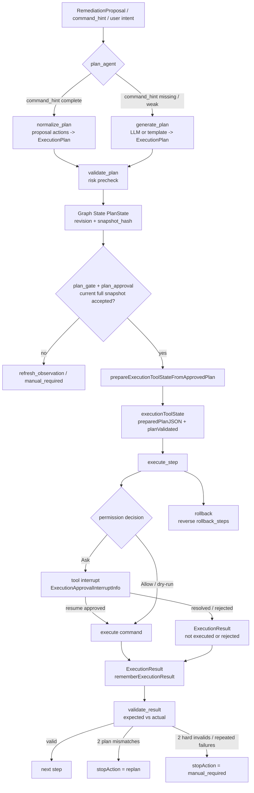

# 05 ExecutionPlan 工具体系：从计划准备到逐步执行

> 本节继续遵守上一节约定：**不把数据结构单独列成“类型大全”**，而是跟着代码路径解释它们为什么存在、什么时候被读写、如何约束下一步。  
> 目标：看懂 `plan_agent` 生成/预检命令级计划后，`execution_agent` 如何只消费已经通过 `plan_gate` 与 `plan_approval` 的 canonical plan。  
> 日期：2026-08-19。

## 1. 本节目标

这一节回答五个问题：

- `generate_plan`、`normalize_plan`、`validate_plan` 到底属于哪个阶段？
- `execution_agent` 为什么不能自己重新生成计划？
- `PlanState` 进入执行阶段时，如何变成 execution tools 能识别的 `ExecutionPlan`？
- `execute_step` 如何处理审批、重复执行、命令输出和恢复？
- `validate_result` 如何判断“继续执行 / 重新规划 / 人工介入”？

主线文件：

- `backend/internal/workflow/ops/plan_agent.go`
- `backend/internal/execution/agent.go`
- `backend/internal/execution/tools/generate_plan.go`
- `backend/internal/execution/tools/normalize_plan.go`
- `backend/internal/execution/tools/validate_plan.go`
- `backend/internal/execution/tools/tool_call_state.go`
- `backend/internal/execution/tools/execute_step.go`
- `backend/internal/execution/tools/validate_result.go`
- `backend/internal/execution/tools/rollback.go`
- `backend/internal/workflow/ops/diagnosis_gate.go`
- `backend/internal/execution/tools/tool_call_state_test.go`

## 2. 先划清边界：计划工具在 plan_agent，执行工具在 execution_agent

最容易误解的是：`backend/internal/execution/tools/` 目录里同时放了“生成计划”和“执行命令”的工具，但它们不在同一个 Agent 阶段使用。

`NewPlanAgent` 在 `backend/internal/workflow/ops/plan_agent.go:40-45` 注册的是：

```text
normalize_plan
generate_plan
validate_plan
```

也就是说，计划阶段负责把上游 remediation proposal 或用户意图转成命令级 `ExecutionPlan`，并做一次风险预检。

相反，`NewExecutionAgent` 在 `backend/internal/execution/agent.go:53-57` 只注册：

```text
execute_step
validate_result
rollback
```

`backend/internal/execution/agent.go:43-57` 的注释和实现共同说明：execution 阶段消费的是 Graph State 里已经通过 `plan_gate` 和 `plan_approval` 的 canonical plan，不再让模型重新调用 `generate_plan` 或 `validate_plan` 来改写计划。

这个边界非常重要：

```text
plan_agent:      生成 / 规范化 / 预检 ExecutionPlan
plan_gate:       把 PlanState 的当前 snapshot 作为 canonical plan 校验
plan_approval:   批准当前完整 plan snapshot
execution_agent: 只执行、验证、必要时回滚
```

如果读代码时把这些工具按目录而不是按 Agent 注册点理解，就会误以为 execution 阶段能绕过 plan gate 自己生成新计划。

## 3. 工具体系图

源文件：`docs/learning/diagrams/07-execution-tools-data-flow.mmd`



## 4. plan_agent：把上游提案压成命令级计划

`normalize_plan` 和 `generate_plan` 的核心差异不是输出类型，而是输入质量。

### 4.1 command_hint 完整时：normalize_plan 走确定性路径

`NormalizePlanTool.InvokableRun` 在 `backend/internal/execution/tools/normalize_plan.go:41-103` 先解析 `proposal`。这里的 `proposal` 对应 `RemediationProposalInput`，其中 `Actions` 每一项携带 `Goal`、`CommandHint`、`SuccessCriteria`、`RollbackHint`、`ReadOnly` 等字段；这些字段不是为了“建模好看”，而是为了把上游修复建议逐步映射成 `ExecutionStep`。

代码分支很直接：

- `proposalHasCompleteCommandHints(proposal)` 为真时，调用 `normalizeProposalToPlan(proposal)`。
- command hint 不完整时，退回 `GeneratePlanTool.generatePlanWithLLM`，失败再用 template。
- 生成后的 plan 必须通过 `validateExecutionPlanStructure(plan)`。
- 然后用 `assessExecutionPlanRisk(plan)` 重算风险。
- 最后调用 `markExecutionPlanPrepared(ctx, plan.PlanID)` 和 `rememberExecutionPlan(ctx, plan)`。

所以这里出现的 `ExecutionPlan` / `ExecutionStep` 应该这样读：它们是 `proposal.actions` 的命令级投影。一个 `ExecutionStep` 里的 `Command`、`Args`、`ExpectedResult`、`RollbackCommand`、`Timeout`、`Critical`，分别决定后面 `validate_plan` 怎么打风险、`execute_step` 怎么执行、`validate_result` 怎么自动补齐预期、`rollback` 能不能反向恢复。

### 4.2 command_hint 不足时：generate_plan 补齐缺口

`GeneratePlanTool.InvokableRun` 在 `backend/internal/execution/tools/generate_plan.go:94-155` 做的是更宽的生成入口。它可以从结构化 `proposal` 读，也可以从 `intent` / `context` 读。

这段代码里，数据是这样向前流动的：

```text
RemediationProposalInput / intent / context
  -> buildPlanIntentAndContext
  -> generatePlanWithLLM or generatePlanWithTemplate
  -> validateExecutionPlanStructure
  -> assessExecutionPlanRisk
  -> markExecutionPlanPrepared + rememberExecutionPlan
  -> JSON ExecutionPlan
```

`backend/internal/execution/tools/generate_plan.go:22-61` 定义的 `ProposalActionInput`、`RemediationProposalInput`、`ExecutionStep`、`ExecutionPlan` 就是在这条路径里被消费的：上游动作不是直接执行，而是先被整理成带 `plan_id`、`steps`、`risk_level` 的命令级计划。

注意：`markExecutionPlanPrepared` 和 `rememberExecutionPlan` 主要让同一轮工具调用可以复用刚生成的计划，例如 `validate_plan` 空参兜底读取已缓存 plan。AIOps workflow 真正进入执行阶段时，仍然要以 Graph State 里的 canonical `PlanState` 为准，而不是相信 plan_agent 内部缓存。

## 5. validate_plan：计划级风险预检，不等于最终执行授权

`ValidatePlanTool.InvokableRun` 在 `backend/internal/execution/tools/validate_plan.go:48-73` 先解析 plan，再调用 `t.validate(plan)`。如果 `PlanValidationResult.Valid == true`、`Blocked == false` 且 `RequiresConfirmation == false`，它才会 `markExecutionPlanValidated(ctx, plan.PlanID)`；否则会 `clearExecutionPlanValidated(ctx)`。

这个结果对象的字段要放回流程里理解：

- `Valid`：结构上是否可执行。
- `Blocked`：是否命中绝对禁止命令。
- `RiskLevel`：综合命令模式、关键步骤、回滚缺失等得到的低/中/高风险。
- `Reasons`：给 plan gate / 用户看的可解释原因。
- `UnsafeCommands` / `ReviewCommands`：分别记录禁止命令和需要人工审查的命令。

真正的风险规则在 `backend/internal/execution/tools/validate_plan.go:176-246`：

- `plan == nil` 或 `steps` 为空会直接 blocked。
- 每个 `ExecutionStep` 会通过 `renderPlanCommand(step)` 渲染成命令文本。
- `absoluteForbiddenPatterns()` 命中 `rm -rf /`、`mkfs`、`dd if=`、`shutdown/reboot`、fork bomb 等会 blocked。
- `highRiskPatterns()` 命中 `kubectl delete/drain/scale/patch`、`docker stop/restart/rm`、`systemctl stop/restart/disable`、`helm upgrade/rollback/uninstall` 等会提高风险并进入 review。
- 关键步骤如果没有 rollback command，也会提高风险。

这里的关键认知是：`validate_plan` 做的是计划级预检，它不会代替 `plan_gate` 和 `plan_approval`。在 workflow 里，`plan_gate` 会围绕 `PlanState.SnapshotHash` 判断当前计划是否仍然是被校验的那个版本；`plan_approval` 批准的也是当前完整 plan snapshot，而不是某个孤立命令。

## 6. Graph State 到 execution tools：唯一支持入口

第 04 节已经讲过，workflow 的 canonical 计划存放在 `IncidentState.PlanState`。到了执行阶段，`diagnosis_gate.go` 再做一次硬门禁。

`executionGuardAllowsExecution` 在 `backend/internal/workflow/ops/diagnosis_gate.go:180-199` 依次检查：

```text
incident contract allows execution
PlanState 存在且有 PlanID
PlanGateState 存在
plan_gate 结果匹配当前 plan snapshot
plan_gate 没有 blocked 且 valid
currentPlanApproved(state) == true
```

通过后，`prepareExecutionToolStateFromApprovedPlan` 在 `backend/internal/workflow/ops/diagnosis_gate.go:202-210` 把 `PlanState` 转回 execution tools 使用的 `ExecutionPlan`，然后调用：

```text
executiontools.PrepareApprovedExecutionPlanFromGraphState(ctx, plan)
```

这一步是第 05 节最关键的桥。

`PrepareApprovedExecutionPlanFromGraphState` 在 `backend/internal/execution/tools/tool_call_state.go:274-280` 的注释明确写着：这是 ops execution stage 满足 `execute_step` prepared/validated guards 的唯一支持方式。随后 `prepareApprovedExecutionPlanState` 在 `tool_call_state.go:283-319` 把 execution tool runtime 状态写成：

```text
planPrepared     = true
planID           = approved PlanID
preparedPlanJSON = approved ExecutionPlan JSON
executedStepIDs  = reset
validatedStepIDs = reset
planValidated    = true
validatedPlanID  = approved PlanID
stopExecution    = false
stopAction       = ""
```

这里的 `executionToolState` 不要孤立背字段。它是 execution agent 的“小型运行时记忆”：

- `preparedPlanJSON` 让 `execute_step` / `validate_result` 能按步骤找命令和预期。
- `executedStepIDs`、`validatedStepIDs` 防止同一步骤重复执行或重复校验。
- `lastExecutionResultJSON` 支持 `validate_result` 空参时复用上一步输出。
- `consecutivePlanMismatches` 和 `consecutiveHardInvalids` 决定是否进入 `replan` 或 `manual_required`。
- `stopExecution` / `stopReason` / `stopAction` 会让后续 `execute_step` 直接跳过。

测试 `backend/internal/execution/tools/tool_call_state_test.go:72-109` 锁定了这个行为：从 approved canonical plan seed 状态后，`planPrepared` 和 `planValidated` 都必须为真，旧的 executed step 状态会被清空。

## 7. execute_step：执行前先过三层闸

`execute_step` 不是简单的 `exec.Command` 包装。`ExecuteStepTool.InvokableRun` 在 `backend/internal/execution/tools/execute_step.go:173-220` 先做参数和模式规范化：

- 命令为空直接失败。
- 如果 `command` 里是一整行命令，会转成 `bash` 模式。
- `bash` 模式要求有 script。
- timeout 缺省为 15 秒。
- 然后必须通过 `hasPreparedExecutionPlan(ctx)` 和 `hasValidatedExecutionPlan(ctx)`。

这两个 guard 让 execution agent 不能在没有 approved canonical plan 的情况下调用任意命令。测试 `backend/internal/execution/tools/tool_call_state_test.go:60-70` 也验证了：没准备计划时，`execute_step` 会返回 `execution plan not prepared`。

### 7.1 重复执行保护

通过 prepared/validated guard 后，`execute_step` 在 `backend/internal/execution/tools/execute_step.go:223-343` 继续看当前步骤是否应该跳过：

- `shouldSkipExecutionStep` 在 `tool_call_state.go:799-812` 发现 `stopExecution == true` 会跳过。
- 同一个 step 已经在 `validatedStepIDs` 里，也会跳过。
- 同一步骤未完成校验前执行超过 `maxSameStepExecutionAttempts`，会 `markExecutionStopped(..., "manual_required")`。
- 同一步骤同一命令已经成功执行，会返回之前结果并提示继续 `validate_result` 或下一步。
- 同一步骤同一命令连续失败超过阈值，会停止重复执行并建议人工处理或重规划。

这里的 `ExecutionResult` 不是单纯记录 stdout/stderr。它的 `Skipped`、`Approved`、`Resolved`、`Executed`、`Mode`、`ExitCode`、`Comment` 字段共同描述了“这个步骤在流程上发生了什么”，后面 `rememberExecutionResult` 会把它写回 `executionToolState`，供 `validate_result` 自动补全和重复保护使用。

### 7.2 变更命令审批

权限判断发生在 `backend/internal/execution/tools/execute_step.go:346-383`：

```text
permissionChecker.Check("execute_step", command/args/script)
  -> Deny: 返回 rejected ExecutionResult
  -> Ask: tool.Interrupt(ctx, ExecutionApprovalInterruptInfo)
  -> Allow: 继续执行
```

中断时携带的 `ExecutionApprovalInterruptInfo` 在 `backend/internal/execution/tools/execute_step.go:36-44`，它包含 `StepID`、`Command`、`Args`、`Timeout`、`Reason`、`RawCommand`。这些字段直接服务于前端/恢复接口：用户看到的是“哪一步、哪条命令、为什么要确认”。

恢复后，`execute_step` 在 `backend/internal/execution/tools/execute_step.go:385-439` 分三种情况：

- `resolved=true`：认为用户已经外部处理完成，返回 `Success=true`、`Resolved=true`、`Executed=false`。
- `approved=false`：返回 `command execution rejected by user`，不执行。
- `approved=true`：允许继续；如果 `allowAlways` 为真，还会写入 checker 的 allow-always 规则。

命令是否需要审批，代码还保留了语义判断函数：`approvalReasonForCommand` 在 `backend/internal/execution/tools/execute_step.go:680-708` 将只读 `kubectl get/describe/logs/top`、只读 docker/systemctl/bash 脚本放行，变更类命令返回审批原因。

### 7.3 真正执行命令

实际命令执行集中在 `executeCommand`，位于 `backend/internal/execution/tools/execute_step.go:923-968`：

- 根据 timeout 创建 `context.WithTimeout`。
- `bash` 模式走 `bash -lc script`。
- 其他命令走 `exec.CommandContext(command, args...)`。
- `CombinedOutput()` 后生成 `ExecutionResult`。
- 输出会被 `sanitizeExecutionOutput` 截断，避免大段日志灌回模型上下文。

执行完成后，`rememberExecutionResult` 在 `tool_call_state.go:396-463` 记录最后一次结果、步骤执行计数、同命令成功/失败状态；如果 `result.Success && result.Resolved`，还会把该 step 直接加入已验证步骤，避免重复执行。

## 8. validate_result：校验结果，同时判断是否该停止

`validate_result` 从 `ValidationResult` 开始，但它真正控制的是 execution loop 的下一步。

`ValidateResultTool.InvokableRun` 在 `backend/internal/execution/tools/validate_result.go:86-145` 做三件事：

1. `parseValidateResultInput` 解析入参。
2. `t.validate(...)` 计算基础校验结果。
3. `recordValidationProgress(...)` 根据结果更新运行时状态，并写出 `ShouldStop` / `StopAction`。

### 8.1 validate_result 会从执行上下文自动补齐参数

`parseValidateResultInput` 在 `backend/internal/execution/tools/validate_result.go:151-182` 支持空参或半空参：

- 如果没传 `step_id`，从 `getLastExecutionResult(ctx)` 取最近执行步骤。
- 如果没传 `actual_output`，从最近 `ExecutionResult.Output` 取。
- 如果没传 `expected_result`，从 prepared plan 里按 `step_id` 找 `ExecutionStep.ExpectedResult`。

因此，`ExecutionStep.ExpectedResult` 不是静态说明字段，它会在执行后成为默认校验目标；`ExecutionResult.Output` 也不只是日志，它会成为 `ValidationResult.Actual` 的来源。

### 8.2 基础校验方法

`ValidateResultTool.validate` 在 `backend/internal/execution/tools/validate_result.go:186-264` 支持：

```text
exact
contains
regex
exit_code
not_empty
success
```

随后 `applyHeuristics` 在 `backend/internal/execution/tools/validate_result.go:267-319` 做语义修正：如果步骤是观测型预期，命令成功且有输出，即使字面 contains 没匹配，也可能被视为 descriptive observation；如果实际输出与上游故障假设冲突，会标记为 `plan_mismatch`，并设置 `MismatchDetected` 与 `MismatchReason`。

这就是为什么 `ValidationResult` 里既有 `Valid`，又有 `FailureCategory`、`MismatchDetected`、`MismatchReason`、`ShouldStop`、`StopAction`。它不只是“字符串是否匹配”，还承担“当前计划还适不适合继续”的判断。

### 8.3 两类停止：replan 与 manual_required

停止逻辑集中在 `recordValidationProgress`，位于 `backend/internal/execution/tools/tool_call_state.go:827-885`：

- `validation.Valid == true`：记录 `lastValidStepID`，追加 `validatedStepIDs`，清空硬失败计数。
- `validation.MismatchDetected == true`：累计 `consecutivePlanMismatches`。连续 2 次后，设置 `stopExecution=true`、`stopAction="replan"`，原因是现场可能恢复、RCA 过期或观测假设不成立。
- 普通校验失败：累计 `consecutiveHardInvalids`。连续 2 次后，设置 `stopAction="manual_required"`。
- 另一个重复失败保护在 `tool_call_state.go:660` 之后：同类工具失败达到 3 次，也会进入人工处理路径；测试 `tool_call_state_test.go:21-41` 锁住了这个 `manual_required` 阈值。

所以读 execution tools 时，要把 `ExecutionResult -> ValidationResult -> executionToolState.stopAction` 连起来看。真正驱动 workflow 后续分支的不是某个单独 bool，而是一段运行时证据累计后的调度决策。

## 9. rollback：可调用的反向恢复工具，但不是万能补偿事务

`RollbackTool.InvokableRun` 在 `backend/internal/execution/tools/rollback.go:61-157` 接收：

```text
step_id
rollback_steps[]
reason
```

它按 `rollback_steps` 的逆序执行，每个 rollback step 只有 `step_id`、`command`、`args`。没有 rollback command 的步骤会跳过；每个命令仍然通过 `exec.CommandContext` 执行；最终输出 `RollbackResult`，记录 `RolledBack`、`Failed`、`Success`、`Duration` 和 message。

这里要注意一个边界：代码证明 `rollback` 是 `execution_agent` 注册的工具，但当前证据没有证明每次 `validate_result` 失败后 workflow 一定自动调用 rollback。更稳妥的理解是：rollback 是 execution agent 在需要恢复时可用的工具，是否调用取决于 agent 运行时计划和上下文，而不是一个固定的 Go 分支。

## 10. 推荐阅读顺序

这一节可以按下面顺序读源码：

1. `backend/internal/workflow/ops/plan_agent.go:40-45`：确认计划工具注册点。
2. `backend/internal/execution/agent.go:53-57`：确认执行阶段只注册执行/验证/回滚工具。
3. `backend/internal/execution/tools/normalize_plan.go:41-103`：看 command_hint 完整时如何规范化。
4. `backend/internal/execution/tools/generate_plan.go:94-155`：看 command_hint 不足时如何生成并缓存 plan。
5. `backend/internal/execution/tools/validate_plan.go:176-246`：看计划风险如何判定。
6. `backend/internal/workflow/ops/diagnosis_gate.go:180-210`：看 Graph State 如何守住执行入口。
7. `backend/internal/execution/tools/tool_call_state.go:274-319`：看 approved plan 如何 seed execution runtime。
8. `backend/internal/execution/tools/execute_step.go:173-470`：看执行、审批、中断、恢复、重复保护。
9. `backend/internal/execution/tools/validate_result.go:86-319`：看校验和 plan mismatch 语义。
10. `backend/internal/execution/tools/tool_call_state.go:827-885`：看 stop action 如何变成 `replan` / `manual_required`。

## 11. 证据、推断与未知

**证据**

- `plan_agent` 注册 `normalize_plan`、`generate_plan`、`validate_plan`，见 `backend/internal/workflow/ops/plan_agent.go:40-45`。
- `execution_agent` 只注册 `execute_step`、`validate_result`、`rollback`，见 `backend/internal/execution/agent.go:53-57`。
- `execute_plan` 前会检查 current plan 已经过 plan gate 且 approval 匹配当前 snapshot，见 `backend/internal/workflow/ops/diagnosis_gate.go:180-210`。
- approved canonical plan 通过 `PrepareApprovedExecutionPlanFromGraphState` seed 到 execution tool runtime，见 `backend/internal/execution/tools/tool_call_state.go:274-319`。
- `execute_step` 没有 prepared plan 会失败，测试见 `backend/internal/execution/tools/tool_call_state_test.go:60-70`。
- approved plan seed 后会同时设置 prepared 与 validated，并清空旧执行状态，测试见 `backend/internal/execution/tools/tool_call_state_test.go:72-109`。
- `validate_result` 连续 plan mismatch 会触发 `replan`，连续硬失败会触发 `manual_required`，见 `backend/internal/execution/tools/tool_call_state.go:827-885`。

**推断**

- `executionToolState` 的核心作用是把模型工具调用变成“可恢复、可去重、可停止”的执行循环，而不是替代 Graph State；因为 execution 阶段入口明确从 approved canonical `PlanState` seed，并且 tests 锁定了 prepared/validated 状态。
- `ExecutionStep.ExpectedResult` 和 `ExecutionResult.Output` 是 execution loop 的闭环关键字段；前者来自计划，后者来自真实命令输出，两者在 `validate_result` 汇合。

**未知 / 后续可读**

- 当前代码证据没有显示 rollback 在 workflow 中由固定 Go 分支自动调用；下一步可以读 execution prompt 和运行日志，判断模型通常在什么场景主动调用 rollback。
- 还需要继续梳理 permissions / deferred gateway：`execute_step` 的 Ask/Deny/Allow 不只来自 `approvalReasonForCommand`，还经过 `permissions.Checker` 和 toolkit gateway。

