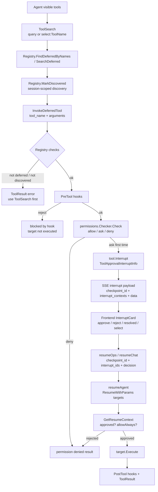

# 06 工具网关、权限与中断恢复：ToolSearch 到 Resume 的完整链路

> 本节继续保持同一写法：**数据结构跟着调用链讲**，不单独堆类型表。  
> 目标：看懂 Agent 为什么默认只看到 `ToolSearch` / `InvokeDeferredTool`，目标工具如何被发现、审批、中断、恢复，以及前端如何把中断转成用户操作。  
> 日期：2026-08-19。

## 1. 本节目标

上一节讲了 `execute_step` 会在变更命令前触发审批。本节把范围扩大到整个工具系统：

- 为什么业务工具不直接全部暴露给 Agent？
- `ToolSearch` 发现工具后，状态保存在哪里？
- `InvokeDeferredTool` 为什么要二次检查“当前 session 是否发现过”？
- 权限系统如何给出 `allow / ask / deny`？
- `tool.Interrupt` 如何经由 SSE 发到前端，再通过 resume 回到具体 interrupt target？

主线文件：

- `backend/internal/toolkit/types.go`
- `backend/internal/toolkit/gateway.go`
- `backend/internal/toolkit/adapter.go`
- `backend/internal/permissions/permissions.go`
- `backend/internal/controller/chat/chat_v1.go`
- `backend/api/chat/v1/chat.go`
- `frontend/src/services/api.ts`
- `frontend/src/components/InterruptCard.tsx`
- `frontend/src/store/useStore.ts`
- `frontend/src/types.ts`
- `backend/internal/toolkit/toolkit_test.go`
- `backend/internal/permissions/permissions_test.go`

## 2. 第一层边界：Agent 默认只拿到两个网关工具

先看工具注册点。`BuildDeferredGatewayEinoToolsWithHooks` 在 `backend/internal/toolkit/adapter.go:143-150` 创建 deferred gateway registry，然后只把 `reg.ListAlways()` 里的工具适配成 Eino tools 返回。

`NewDeferredGatewayRegistryWithHooks` 在 `backend/internal/toolkit/adapter.go:99-105` 的注释已经说清楚：这个 registry 只暴露 `ToolSearch` 和 `InvokeDeferredTool`，用于 domain agents 按需选择业务工具，而不是拿到通用文件编辑能力。

真正注册发生在 `registerDeferredAndGateway`，见 `backend/internal/toolkit/adapter.go:108-123`：

```text
deferredTools[]
  -> NewDeferredEinoTool(ctx, base)
  -> reg.RegisterDeferred(wrapped)
  -> reg.Register(ToolSearchTool)
  -> reg.Register(InvokeDeferredTool)
```

所以 `k8s_monitor`、`metrics_collector`、`execute_step` 这类业务工具存在于 registry 里，但默认不是直接可见工具。Agent 实际看到的是：

```text
ToolSearch
InvokeDeferredTool
```

测试 `backend/internal/toolkit/toolkit_test.go:291-313` 也锁住了这个结论：`BuildDeferredGatewayEinoTools` 返回的 tool names 必须正好是 `InvokeDeferredTool` 和 `ToolSearch`。

提示词也在强化同一件事。`DeferredToolGuidance` 在 `backend/internal/prompt/sections.go:139-145` 写明：默认可见工具是 `ToolSearch` 与 `InvokeDeferredTool`，业务工具必须先发现再调用，且 `InvokeDeferredTool.arguments` 必须匹配目标工具 schema。`ops` prompt 在 `backend/internal/prompt/role_prompts.go:124-129` 也要求先 `ToolSearch select:xxx`，再 `InvokeDeferredTool`。

## 3. 链路图

源文件：`docs/learning/diagrams/08-tool-gateway-permission-resume-flow.mmd`



## 4. ToolSearch：发现工具，同时写入当前 session 的发现状态

`ToolSearchTool.Execute` 在 `backend/internal/toolkit/gateway.go:27-67` 做两种搜索：

- `query` 以 `select:` 开头时，走 `Registry.FindDeferredByNames(names)`，适合精确选择工具。
- 普通关键词时，走 `Registry.SearchDeferred(query, maxResults)`。

这里要注意 `Registry` 里的发现状态不是单纯返回给模型看的文本。`ToolSearchTool.Execute` 在 `gateway.go:60-63` 会对每个命中的 schema 调用 `t.Registry.MarkDiscovered(ctx, name)`。

`Registry.MarkDiscovered` 的状态写入逻辑在 `backend/internal/toolkit/types.go:96-118`：

- 优先写入 ADK session value：key 是 `toolkit.deferred_discovered_tools`。
- 如果没有 ADK session，就退回 `ContextWithDeferredDiscoverySession` 传入的 scope。
- 只允许 deferred tool 被标记为 discovered。

`Registry.IsDiscovered` 在 `backend/internal/toolkit/types.go:120-135` 用同样的 session/scope 读取状态。因此，`ToolSearch` 不是一个简单搜索框，而是 `InvokeDeferredTool` 的前置授权步骤：它把“本轮/本会话已经看过目标工具 schema”写进运行时状态。

测试 `backend/internal/toolkit/toolkit_test.go:58-81` 验证了完整顺序：未 discovery 直接 invoke 会失败；先 `ToolSearch select:k8s_monitor` 后，`InvokeDeferredTool` 才能执行。`toolkit_test.go:83-102` 进一步验证 discovery 是按 session 隔离的，session A 发现过不代表 session B 可调用。

## 5. InvokeDeferredTool：检查的不是网关本身，而是目标工具

`InvokeDeferredTool.Execute` 在 `backend/internal/toolkit/gateway.go:84-119` 是工具系统的核心入口。它按顺序做这些事：

1. 校验 registry 存在。
2. 从 `args["tool_name"]` 取目标工具名。
3. `Registry.Get(toolName)` 找到 target，并确认它是 deferred tool。
4. `Registry.IsDiscovered(ctx, toolName)` 检查当前 session 是否已经通过 `ToolSearch` 发现。
5. 从 `args["arguments"]` 取目标工具参数。
6. 运行 pre-tool hooks。
7. 对目标工具名和目标参数调用 `permissions.Checker.Check(toolName, targetArgs)`。
8. 通过后执行 `target.Execute(ctx, targetArgs)`。
9. 运行 post-tool hooks。

这里的关键点是第 7 步。`permissions.CategoryForTool` 在 `backend/internal/permissions/permissions.go:589-606` 把 `InvokeDeferredTool` 本身归为 read，但 `InvokeDeferredTool.Execute` 并不是只检查网关；它会拿目标 `toolName` 再做权限判断。因此：

```text
InvokeDeferredTool(tool_name="execute_step", arguments={...})
  -> Check("execute_step", targetArgs)
```

而不是：

```text
Check("InvokeDeferredTool", ...)
```

测试 `backend/internal/toolkit/toolkit_test.go:105-117` 证明安全 read deferred tool 在 default mode 下可以直接执行；`toolkit_test.go:120-130` 后续用写类目标工具验证 target permission 会生效。

## 6. hooks：权限之前还有可插拔前置/后置拦截

`InvokeDeferredTool.Execute` 在 `backend/internal/toolkit/gateway.go:104-118` 先跑 pre hooks，再跑权限和 target，最后跑 post hooks。

这意味着工具调用链不是单纯：

```text
permission -> execute
```

而是：

```text
pre-hook -> permission -> target.Execute -> post-hook
```

测试提供了两个重要保证：

- `backend/internal/toolkit/toolkit_test.go:139-168`：pre hook reject 时，目标工具不会执行。
- `backend/internal/toolkit/toolkit_test.go:171-197`：target 执行完成后，会产生 post hook notification。

阅读这块时不要把 `ToolResult` 当成普通字符串。`backend/internal/toolkit/types.go:21-24` 的 `ToolResult` 只有 `Output` 和 `IsError` 两个字段，pre-hook、permission、target、post-hook 都围绕它传递是否中断或失败。

## 7. permissions.Checker：allow / ask / deny 的来源

权限结果由 `Decision` 表达。`backend/internal/permissions/permissions.go:12-23` 定义了：

```text
DecisionEffect = allow | deny | ask
Decision       = Effect + Reason
```

`Checker.Check` 在 `backend/internal/permissions/permissions.go:532-587` 是完整决策入口。它把工具名和参数先转成 `content`，再按下面顺序判断：

1. Plan mode 下，写入指定 plan file 可以 allow。
2. command 类工具如果是安全只读命令，直接 allow。
3. 命中危险命令模式，直接 deny。
4. read/write 类工具先过 path sandbox；受保护路径直接 deny，越界路径默认 ask。
5. OS sandbox command 模式下，按规则逐段评估 compound command。
6. 用户/项目/local permission rule 命中则按规则决定。
7. session allow rules 命中则 allow。
8. 最后按 mode matrix 返回默认效果。

默认 mode matrix 在 `backend/internal/permissions/permissions.go:42-46`：

```text
default:     read allow, write ask, command ask
acceptEdits: read allow, write allow, command ask
bypass:      read allow, write allow, command allow
```

命令安全判断也很重要。`IsSafeCommand` 在 `backend/internal/permissions/permissions.go:356-378` 只接受没有 shell metachar 的安全前缀，例如 `kubectl get`、`kubectl describe`、`go test`、`git status` 等。`DetectDangerous` 在 `permissions.go:67-90` 拦截 `rm -rf /`、`mkfs`、`dd of=/dev`、`curl | sh`、`git reset --hard`、`shutdown/reboot` 等危险模式。

对 `execute_step`，`ExtractContent` 在 `backend/internal/permissions/permissions.go:407-415` 会把 `command + args` 或 bash script 抽成最终命令文本。所以审批判断看的是目标步骤真正要执行的命令，而不是工具调用外壳。

测试 `backend/internal/permissions/permissions_test.go:9-60` 覆盖危险命令和安全命令；`permissions_test.go:230-237` 验证 mutating command 默认 ask、危险 compound command deny；`permissions_test.go:240-260` 验证 `AllowAlways` 后同一规则会在 session 中 allow，并写入 `.oncall/permissions.local.yaml`。

## 8. ask 分支：InterruptInfo 如何变成前端卡片

当 `Checker.Check` 返回 ask 时，`InvokeDeferredTool` 会走 `permissionDecisionResult`。这段逻辑在 `backend/internal/toolkit/gateway.go:174-202`：

- `Deny` 直接返回 `permission denied`。
- 如果当前还没有被 interrupt 过，调用 `einotool.Interrupt(ctx, &ToolApprovalInterruptInfo{...})`。
- 如果恢复时当前 target 没有 resume data，再次 interrupt。
- 有 resume data 后解析 `approved` 和 `allowAlways`。
- `approved=false` 返回 rejected。
- `approved=true` 返回内部哨兵值 `__ONCALL_PERMISSION_APPROVED__`，外层才继续执行 target。

`ToolApprovalInterruptInfo` 在 `backend/internal/toolkit/gateway.go:161-172` 携带 `ToolName`、`Args`、`Reason`，用于表达“哪个工具、哪些参数、为什么要审批”。

这和上一节的 `execute_step` 自己触发的 `ExecutionApprovalInterruptInfo` 是两条相邻但不同的路径：

- Gateway 级审批：`InvokeDeferredTool -> permissions.Checker -> ToolApprovalInterruptInfo`。
- execute_step 内部审批：`execute_step -> permissionChecker.Check("execute_step", ...) -> ExecutionApprovalInterruptInfo`。

二者最后都会进入 ADK interrupt/resume 机制，只是中断数据结构不同。

## 9. Controller：InterruptInfo 通过 SSE 发给前端

后端把 interrupt 转成统一 SSE payload。`buildInterruptPayload` 在 `backend/internal/controller/chat/chat_v1.go:1428-1455` 生成：

```text
type = "interrupt"
checkpoint_id
interrupt_contexts
message
interrupt_data
bash_request?
detail_request?
```

其中 `normalizeInterruptData` 在 `chat_v1.go:1457-1475` 把任意 interrupt data 转成 JSON 兼容对象；`extractBashApprovalPayload` 在 `chat_v1.go:1477-1506` 从结构化数据里提取 `command / args / timeout / reason / raw_command`，给前端审批卡片使用；`extractDetailSelectionPayload` 在 `chat_v1.go:1508-1554` 处理需要用户选择的 detail selection。

`writeSSEData` 在 `backend/internal/controller/chat/chat_v1.go:1211-1231` 负责按 SSE 格式写出并 flush。`withSSEWorkflow` 在 `chat_v1.go:1241-1251` 会补充 `workflow` 和 `resume_endpoint`，使同一张前端卡片能判断恢复应该走 chat 还是 ops。

AIOps 恢复流也复用同一套机制。`AIOpsResumeStream` 在 `backend/internal/controller/chat/chat_v1.go:557-625` 调用 `resumeAgent`，如果恢复后又遇到新的 interrupt，会继续把新的 interrupt payload 写回 SSE。

## 10. resumeAgent：把用户决策绑定到 interrupt target

恢复入口的数据结构在 `backend/api/chat/v1/chat.go:68-78`：

```text
AIOpsResumeStreamReq
  checkpoint_id
  interrupt_ids[]
  approved?
  resolved?
  comment?
  selection_value?
```

`resumeAgent` 在 `backend/internal/controller/chat/chat_v1.go:966-1005` 会先规范化 `interrupt_ids`，再构造 target payload。如果没有指定 interrupt id，就普通 `runner.Resume(ctx, checkpointID, ...)`；如果有 id，就构造：

```text
targets[interrupt_id] = { approved, resolved, comment, selection_value }
runner.ResumeWithParams(ctx, checkpointID, ResumeParams{Targets: targets}, ...)
```

`buildResumeTargetPayload` 在 `backend/internal/controller/chat/chat_v1.go:1556-1570` 只把用户真实提交的字段放进去；如果用户没传任何字段，`resumeAgent` 会补一个 `comment = "继续执行"`。

这一步解释了为什么前端必须保存 `checkpoint_id` 和 `interrupt_contexts[].id`：checkpoint 决定恢复哪个会话状态，interrupt id 决定把用户决策投递给哪个被中断的 tool call。

## 11. Frontend：InterruptData 是后端 interrupt payload 的 UI 投影

前端的 `InterruptData` 在 `frontend/src/types.ts:36-45`，字段正好对应后端 payload：

```text
checkpoint_id
interrupt_contexts
message
bash_request?
detail_request?
workflow?
resume_endpoint?
```

`streamRequest` 在 `frontend/src/services/api.ts:76-185` 读取 SSE；当 JSON `type === "interrupt"` 时，调用 `mapInterruptData`。`mapInterruptData` 在 `frontend/src/services/api.ts:187-204` 会解析 checkpoint、message、contexts、bash_request、detail_request、workflow、resume_endpoint。

`runOps` 的 `onInterrupt` 在 `frontend/src/store/useStore.ts:297-303` 会把当前 Ops step 标记为暂停并挂上 interrupt。用户点击卡片后，`InterruptCard.submitResume` 在 `frontend/src/components/InterruptCard.tsx:210-219` 组装：

```text
{ ...payload, interrupt_ids }
resumeOps(checkpointId, requestPayload, options)
```

审批按钮由 `handleAction` 在 `InterruptCard.tsx:228-230` 生成：

```text
approved / resolved
```

选择类中断由 `handleSelection` 在 `InterruptCard.tsx:232-234` 生成：

```text
selection_value
```

所以前端不是“重新发一个新任务”，而是把用户决策带着 checkpoint 和 interrupt target 回填到原来的 ADK run。

## 12. 推荐阅读顺序

这一节按下面顺序读最不容易迷路：

1. `backend/internal/toolkit/adapter.go:99-150`：确认 domain agents 默认只暴露 gateway。
2. `backend/internal/toolkit/gateway.go:16-67`：读 `ToolSearch` 如何发现并标记工具。
3. `backend/internal/toolkit/types.go:96-135`：读 discovery 状态如何按 session/scope 保存。
4. `backend/internal/toolkit/gateway.go:84-119`：读 `InvokeDeferredTool` 的 discovery、hook、permission、target 调用顺序。
5. `backend/internal/permissions/permissions.go:532-587`：读 `Checker.Check` 的 allow/ask/deny 决策顺序。
6. `backend/internal/toolkit/gateway.go:174-202`：读 gateway ask 如何进入 `tool.Interrupt` 和 resume context。
7. `backend/internal/controller/chat/chat_v1.go:1428-1455`：读 interrupt SSE payload。
8. `backend/internal/controller/chat/chat_v1.go:966-1005`：读 resume target payload 如何投递到 interrupt id。
9. `frontend/src/services/api.ts:187-204`：读前端如何解析 interrupt。
10. `frontend/src/components/InterruptCard.tsx:210-234`：读用户决策如何恢复执行。

## 13. 证据、推断与未知

**证据**

- `BuildDeferredGatewayEinoTools` 只暴露 `ToolSearch` 和 `InvokeDeferredTool`，见 `backend/internal/toolkit/adapter.go:139-150` 和测试 `backend/internal/toolkit/toolkit_test.go:291-313`。
- deferred tool 必须先发现再调用，且发现状态按 session/scope 隔离，见 `backend/internal/toolkit/gateway.go:27-67`、`backend/internal/toolkit/types.go:96-135` 和测试 `backend/internal/toolkit/toolkit_test.go:58-102`。
- `InvokeDeferredTool` 会对目标工具而非网关本身运行 hooks 和权限检查，见 `backend/internal/toolkit/gateway.go:84-119`。
- 权限系统的核心结果是 `allow / ask / deny`，决策入口是 `Checker.Check`，见 `backend/internal/permissions/permissions.go:12-23` 和 `backend/internal/permissions/permissions.go:532-587`。
- ask 分支会通过 `tool.Interrupt` 暂停，并在 resume data 中解析 `approved / allowAlways`，见 `backend/internal/toolkit/gateway.go:174-202`。
- 后端 interrupt SSE payload 包含 `checkpoint_id`、`interrupt_contexts` 和结构化数据，见 `backend/internal/controller/chat/chat_v1.go:1428-1455`。
- AIOps resume 请求携带 `checkpoint_id`、`interrupt_ids`、`approved/resolved/comment/selection_value`，见 `backend/api/chat/v1/chat.go:68-78` 和 `backend/internal/controller/chat/chat_v1.go:966-1005`。
- 前端 `InterruptData` 和 `InterruptCard` 会把 interrupt 展示为审批/选择卡片，并通过 `resumeOps` 或 `resumeChat` 恢复，见 `frontend/src/types.ts:36-45`、`frontend/src/services/api.ts:187-204`、`frontend/src/components/InterruptCard.tsx:210-234`。

**推断**

- 这个设计的核心目的不是减少 tool 数量，而是把工具使用拆成“发现 schema -> 按目标工具做权限 -> 可中断恢复”的安全链路；因为测试同时锁住了 discovery、session 隔离、hook reject 和 target permission。
- `checkpoint_id + interrupt_ids` 是恢复链路的最小定位信息：前者定位可恢复 run，后者定位具体被中断的 tool call。

**未知 / 后续可读**

- 当前文档只解释了 gateway、permission 和 HTTP/SSE 恢复链路；下一节可以继续读 checkpoint store 与 ADK session values，解释 checkpoint 如何落到 Redis 或内存。
- `permissions.RuleEngine` 的 YAML 解析和本地规则格式还没有展开，后续可单独做“权限配置与安全边界”小节。

