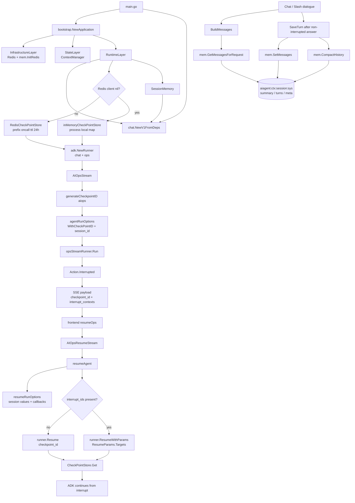

# 07 Checkpoint、SessionMemory 与恢复：一次中断为什么能继续跑

> 本节继续保持同一写法：**数据结构跟着调用链讲**，不单独堆类型表。
> 目标：区分“可恢复运行状态”和“跨轮对话记忆”，看懂 `checkpoint_id`、ADK session values、Redis checkpoint、`SessionMemory` 在一次 AIOps / Chat 请求里的职责边界。
> 日期：2026-08-19。

## 1. 本节目标

前两节已经讲了工具审批会触发 `tool.Interrupt`，前端再把审批结果 resume 回后端。本节补上“为什么可以 resume”的底层状态链路：

- ADK Runner 运行时如何拿到 `CheckPointStore`？
- `checkpoint_id` 是在哪里生成、放入 run option、再随中断发给前端的？
- resume 时为什么只要 `checkpoint_id + interrupt_ids + 用户决策` 就能回到目标 interrupt？
- `SessionMemory` 和 checkpoint 都使用 Redis，但它们保存的不是同一类状态：前者是跨轮聊天历史，后者是一次未完成运行的恢复点。
- `ContextManager` 也连接 Redis，但当前源码证据显示它是另一套上下文存储/迁移机制，不等同于 ADK checkpoint。

主线文件：

- `backend/main.go`
- `backend/internal/bootstrap/app.go`
- `backend/internal/controller/chat/chat_v1.go`
- `backend/internal/context/checkpoint_store.go`
- `backend/internal/context/session_memory.go`
- `backend/utility/mem/mem.go`
- `backend/api/chat/v1/chat.go`
- `frontend/src/services/api.ts`

## 2. 先建立边界：checkpoint 不是聊天记忆

这个项目里有两类很容易混淆的“状态”：

```text
可恢复运行状态：ADK CheckPointStore
  解决问题：当前 agent run 被 interrupt 了，后续如何从中断点继续？
  入口数据：checkpoint_id、interrupt_ids、approved/resolved/comment/selection_value
  主要链路：RunnerConfig.CheckPointStore -> WithCheckPointID -> Resume/ResumeWithParams

跨轮对话记忆：SessionMemory / utility/mem
  解决问题：下一轮普通聊天或 slash dialogue prompt 如何带上历史上下文？
  入口数据：session_id、question、answer、token 预算
  主要链路：BuildMessages -> mem.GetMessagesForRequest -> SaveTurn -> mem.SetMessages/CompactHistory
```

生产启动路径中，`RuntimeLayer` 同时创建 `SessionMemory`、`CheckPointStore` 和 chat/ops 两个 `adk.Runner`。`SessionMemory` 进入 controller 字段，直接在聊天流完成后保存问答；`CheckPointStore` 被塞进 `adk.NewRunner` 的 `RunnerConfig`，后续具体 Set/Get 由 ADK Runner 在运行和恢复时使用。代码锚点在 `backend/internal/bootstrap/runtime.go:18-65`。

## 3. 启动注入：Redis 先进 Infrastructure，再由 RuntimeLayer 变成 checkpoint store

主程序启动时，`main.go` 调用 `bootstrap.NewApplication`，由 bootstrap 的 layer registry 依次构建 infrastructure、state、agents、runtime、background。`main.go` 成功拿到 `Application` 后，不再把 `app.RedisClient` 传给 controller；它把 `app.Runtime` 中已经创建好的 runner、SessionMemory、SlashRegistry 等运行时对象封装进 `chat.ControllerDeps`，再调用 `chat.NewV1FromDeps`。证据在 `backend/main.go:54-68` 与 `backend/main.go:82-98`。

`buildInfrastructureLayer` 里 Redis 是强依赖：先创建 `redis.NewClient`，再 `Ping`，失败就返回错误；随后调用 `mem.InitRedis(redisClient, nil)`，初始化 `utility/mem` 这套会话记忆工具。`buildStateLayer` 再创建 `NewRedisStorage(redisClient, "oncall")` 和 `NewContextManager(storage)`。证据在 `backend/internal/bootstrap/application_layers.go:34-134` 与 `backend/internal/bootstrap/application_layers.go:136-147`。

到了 `buildRuntimeLayer`，checkpoint store 的选择逻辑出现：

- `redisClient != nil`：创建 `appcontext.NewRedisCheckPointStore(redisClient, "oncall", 24*time.Hour)`。
- `redisClient == nil`：退回 `newInMemoryCheckPointStore()`。
- chat runner 和 ops runner 共用同一个 `checkpointStore`，但 agent 不同：一个绑定 `DialogueAgent`，一个绑定 `OpsAgent`。见 `backend/internal/bootstrap/runtime.go:29-57`。

这里要注意一个细节：生产启动路径里 Redis `Ping` 失败会让 `NewApplication` 失败，所以 `RuntimeLayer` 的 nil fallback 主要覆盖部分装配测试或特殊构造路径；不是当前 `main.go` 的正常降级运行方式。`NewV1WithHooks` 仍保留一套同类 fallback，但生产入口已经不走它。

## 4. Redis checkpoint store：只管字节，不理解业务

`RedisCheckPointStore` 本身很薄：只保存 `client / prefix / ttl` 三个字段。`NewRedisCheckPointStore` 在 ttl 小于等于 0 时默认 24 小时；当前生产运行时传入的是 `prefix="oncall"` 和 `ttl=24*time.Hour`。见 `backend/internal/context/checkpoint_store.go:11-28` 与 `backend/internal/bootstrap/runtime.go:29-35`。

真正的 key 规则在 `Get/Set` 里：

```text
oncall:checkpoint:<checkpoint_id>
```

`Get` 用 `client.Get(...).Bytes()` 读取，遇到 `redis.Nil` 返回 `(nil, false, nil)`；`Set` 用同样的 key 写入 `checkPoint []byte` 并带 ttl。也就是说，这一层不关心 `InterruptContext`、审批结果、Agent 名称或工具名，它只实现 ADK 要求的 CheckPointStore 字节读写接口。证据在 `backend/internal/context/checkpoint_store.go:30-47`。

内存 fallback 同样只管字节：`inMemoryCheckPointStore` 是 `map[string][]byte + sync.RWMutex`，Get/Set 都复制 byte slice，避免调用方共享底层数组。生产运行时版本在 `backend/internal/bootstrap/runtime.go:84-111`；兼容构造器版本在 `backend/internal/controller/chat/chat_v1.go:1752-1784`。推断上，它只能覆盖当前进程生命周期；服务重启或多实例部署时，这个 map 不会共享，也不会持久化。

## 5. AIOps 第一次运行：checkpoint_id 从这里出生

AIOps 的入口是 `AIOpsStream`，API 定义在 `/ai_ops_stream`，请求体没有业务字段；恢复入口是 `/ai_ops_resume_stream`，请求体里要求 `checkpoint_id`，并可携带 `interrupt_ids / approved / resolved / comment / selection_value`。这些字段就是前后端 resume 合同。证据在 `backend/api/chat/v1/chat.go:62-78`。

第一次 AIOps run 的关键步骤集中在 `AIOpsStream`：

1. 检查 `opsAgent` 和 `opsStreamRunner` 是否初始化。
2. `checkpointID := generateCheckpointID("aiops")` 创建本次 run 的恢复点 ID。
3. hook 事件里带上 `SessionID: "aiops"` 和 `CheckpointID: checkpointID`。
4. 调用 `opsStreamRunner.Run(...)`，用户消息是固定的 `opsDiagnosticPrompt`。
5. run option 来自 `c.agentRunOptions("aiops", checkpointID)`。
6. 如果 event 中出现 `Action.Interrupted`，后端把 `checkpointID` 和 interrupt contexts 打包进 SSE payload 发给前端。

证据在 `backend/internal/controller/chat/chat_v1.go:546-586`。

`agentRunOptions` 是这个链路里最重要的小函数：它把 `checkpointID` 放进 `adk.WithCheckPointID(checkpointID)`，同时把 `session_id` 放入 `adk.WithSessionValues(map[string]any{"session_id": sessionID})`。如果 hook engine 存在，还会把同样的 `SessionID/CheckpointID` 放入 callback handler 的 hook context。证据在 `backend/internal/controller/chat/chat_v1.go:960-973`。

这里的数据结构不是“独立概念”，而是直接服务运行恢复：

```text
checkpointID
  -> adk.WithCheckPointID
  -> Runner 使用 CheckPointStore 保存可恢复状态
  -> interrupt SSE payload 暴露给前端
  -> resume 请求带回 checkpoint_id

session_id
  -> adk.WithSessionValues
  -> 工具发现/权限/Hook 等运行时上下文可读取当前 session
  -> Chat/Slash 场景也用于 SessionMemory key
```

## 6. 中断后：前端只需要把定位符和用户决策带回来

前端 API 封装也体现了这个合同。`resumeChat` 调 `/chat_resume_stream`，body 包含 `id`、`checkpoint_id` 和用户决策；`resumeOps` 调 `/ai_ops_resume_stream`，body 包含 `checkpoint_id` 和用户决策。AIOps 不额外传 session id，因为后端固定恢复到 `session_id="aiops"`。证据在 `frontend/src/services/api.ts:48-73`。

后端 AIOps resume 入口先要求 `checkpoint_id` 非空，然后调用：

```text
resumeAgent(
  ctx,
  c.opsStreamRunner,
  req.CheckpointID,
  req.InterruptIDs,
  req.Approved,
  req.Resolved,
  req.Comment,
  req.SelectionValue,
  map[string]any{"session_id": "aiops"},
)
```

证据在 `backend/internal/controller/chat/chat_v1.go:618-628`。

`resumeAgent` 再把 `interrupt_ids` 规范化，发出 `EventResumeRequest` hook，然后构建 `resumeRunOptions(sessionValues, checkpointID)`。如果没有 target ids，就调用 `runner.Resume(ctx, checkpointID, baseOpts...)`；如果有 target ids，就把用户决策封装成 `adk.ResumeParams{Targets: targets}`，再调用 `runner.ResumeWithParams(ctx, checkpointID, ..., baseOpts...)`。证据在 `backend/internal/controller/chat/chat_v1.go:1027-1068`。

注意 `resumeRunOptions` 没有再调用 `adk.WithCheckPointID`，它只恢复 `sessionValues` 和 hook callbacks。原因从调用形态可以看出来：resume 的定位点已经作为 `runner.Resume/ResumeWithParams` 的显式参数传入，checkpoint ID 不再需要通过 run option 重复设置。证据在 `backend/internal/controller/chat/chat_v1.go:974-988` 与 `backend/internal/controller/chat/chat_v1.go:1012-1068`。

## 7. SessionMemory：普通聊天上下文，不是 ADK 恢复点

`SessionMemory` 的入口在控制器初始化时创建：`sessionMemory: appcontext.NewSessionMemory(nil, logger)`。默认配置包括：

- `ReserveToolTokens = 20000`
- `MaxRecentTurns = 20`
- `SummarizeAfterTurns = 40`
- `SummaryMaxRunes = 1200`

这些默认值来自 `DefaultSessionMemoryConfig`，证据在 `backend/internal/context/session_memory.go:16-44`。

普通 chat 或 slash dialogue prompt 会先调用 `BuildMessages(ctx, sessionID, question)`，它把当前问题 trim 后交给 `mem.GetMessagesForRequest(ctx, sessionID, schema.UserMessage(question), ReserveToolTokens)`。如果 Redis/mem 加载失败，它不会中断请求，而是 warn 后只返回当前 user message。证据在 `backend/internal/context/session_memory.go:87-123`，调用点可见 `ChatStream` 与 `streamSlashDialoguePrompt` 的 `c.sessionMemory.BuildMessages(...)`，`backend/internal/controller/chat/chat_v1.go:263` 与 `backend/internal/controller/chat/chat_v1.go:743`。

回答完整且没有中断时，控制器才保存一轮对话。`SaveTurn` 会创建 user/assistant message，按 tokenizer 估算或精确统计 prompt/completion tokens，然后调用 `memory.SetMessages(...)` 写入 Redis，再调用 `memory.CompactHistory(...)` 按阈值压缩历史。证据在 `backend/internal/context/session_memory.go:126-202`。

`utility/mem` 负责实际 Redis 结构：`InitRedis` 把 Redis client 存进包级变量；`SetMessages` 对 user/assistant 消息做 sanitize、token 估算/校准，然后按 user+assistant 顺序 append 到 turn 结构，并写 meta；`GetMessagesForRequest` 会读取 system、summary、turns，按工具/RAG/输出等预算裁剪 turns，再把当前 user message append 到返回 messages 里。证据分别在 `backend/utility/mem/mem.go:72-88`、`backend/utility/mem/mem.go:146-211`、`backend/utility/mem/mem.go:319-387`。

它使用的 key 和 checkpoint 完全不同：

```text
aiagent:ctx:<session_id>:sys
aiagent:ctx:<session_id>:summary
aiagent:ctx:<session_id>:turns
aiagent:ctx:<session_id>:meta
```

证据在 `backend/utility/mem/mem.go:389-396`。所以，看到 Redis 里既有 `oncall:checkpoint:*` 又有 `aiagent:ctx:*` 时，不要把它们混成一层：前者是 ADK run 恢复点，后者是后续 prompt 构建用的历史上下文。

## 8. ContextManager 的位置：存在，但不要把它误读成 resume 主链路

`bootstrap.NewApplication` 还创建了 `ContextManager`，底层是 `NewRedisStorage(redisClient, "oncall")`，并在后台任务里每 5 分钟调用 `cm.MigrateToL2(ctx)` 做上下文迁移。证据在 `backend/internal/bootstrap/app.go:147-151` 和 `backend/internal/bootstrap/app.go:292-328`。

但在本节追踪到的 AIOps resume 主链路中，恢复定位使用的是 `checkpoint_id -> runner.Resume/ResumeWithParams -> RunnerConfig.CheckPointStore`。当前源码证据没有显示 `ContextManager` 参与 `AIOpsResumeStream` 或 `resumeAgent` 的 checkpoint 读取。因此学习时可以先把它放在“会话上下文存储/迁移”章节，避免和 ADK checkpoint 混淆。

## 9. 链路图

源文件：`docs/learning/diagrams/09-checkpoint-session-memory-flow.mmd`



## 10. 证据、推断与未知

**证据**

- `main.go` 调用 `bootstrap.NewApplication` 后，把 `app.Runtime` 中的 runner、SessionMemory、SlashRegistry 注入 `chat.NewV1FromDeps`。见 `backend/main.go:54-68` 与 `backend/main.go:82-98`。
- `buildRuntimeLayer` 创建 `RedisCheckPointStore` 或内存 fallback，并把同一个 store 注入 chat/ops 两个 `adk.NewRunner`。见 `backend/internal/bootstrap/runtime.go:18-65`。
- `AIOpsStream` 生成 `checkpointID`，通过 `agentRunOptions` 写入 `adk.WithCheckPointID`，中断时再把同一个 ID 放入 SSE payload。见 `backend/internal/controller/chat/chat_v1.go:546-586` 与 `backend/internal/controller/chat/chat_v1.go:960-973`。
- `AIOpsResumeStream` 必须带 `checkpoint_id`，并通过 `resumeAgent` 调 `runner.Resume` 或 `runner.ResumeWithParams`。见 `backend/api/chat/v1/chat.go:68-76` 与 `backend/internal/controller/chat/chat_v1.go:618-628`、`backend/internal/controller/chat/chat_v1.go:1027-1068`。
- Redis checkpoint key 是 `oncall:checkpoint:<checkpoint_id>`；SessionMemory key 是 `aiagent:ctx:<session_id>:sys/summary/turns/meta`。见 `backend/internal/context/checkpoint_store.go:31-46` 与 `backend/utility/mem/mem.go:389-396`。
- `SessionMemory` 在读取失败时 fallback 到当前问题，保存时写 Redis 并触发 compact。见 `backend/internal/context/session_memory.go:105-123` 与 `backend/internal/context/session_memory.go:145-202`。

**推断**

- `inMemoryCheckPointStore` 只适合测试或单进程临时 fallback；因为它是进程内 map，源码没有跨进程共享或持久化机制。依据是 `backend/internal/bootstrap/runtime.go:84-111` 与 `backend/internal/controller/chat/chat_v1.go:1752-1784`。
- 当前生产入口不太可能走 nil Redis fallback；因为 `buildInfrastructureLayer` Redis Ping 失败会让 `bootstrap.NewApplication` 返回错误，`main.go` 会 `log.Fatalf`。依据是 `backend/internal/bootstrap/application_layers.go:63-78` 与 `backend/main.go:54-71`。

**未知 / 后续可读**

- ADK Runner 何时调用 `CheckPointStore.Set/Get` 的内部细节不在本仓库源码里；本仓库能确认的是 RunnerConfig 注入、`WithCheckPointID` 传参，以及 resume 调用形态。
- `ContextManager` 的 L1/L2 存储、迁移策略还没有展开。它和 checkpoint 使用同一个 Redis 基础设施，但本节没有证据表明它参与 AIOps resume 主链路，适合放到后续“上下文管理与历史压缩”专题继续读。

## 11. 阅读检查清单

读完本节，可以用下面几个问题自测：

- `checkpoint_id` 是在哪里生成的？它第一次进入 ADK Runner 的位置在哪里？
- `/ai_ops_resume_stream` 为什么不需要 `session_id`，但 `/chat_resume_stream` 需要 `id`？
- Redis 里 `oncall:checkpoint:*` 和 `aiagent:ctx:*` 分别代表什么？
- 如果 Redis 不可用，当前 `main.go` 启动路径会怎样？`RuntimeLayer` 和 `NewV1WithHooks` 各自保留的 in-memory fallback 又适合什么场景？
- 为什么不能把 `ContextManager` 直接等同于 ADK checkpoint store？
