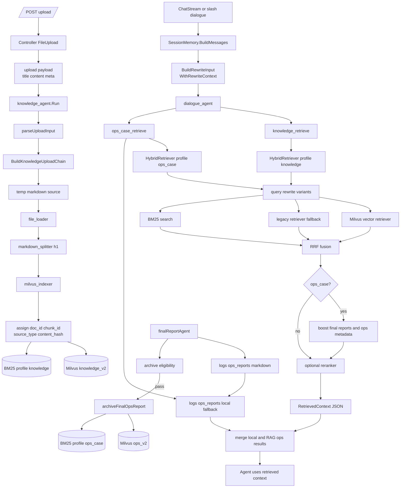

# 08 知识检索、Hybrid RAG 与案例闭环：knowledge_retrieve / ops_case_retrieve 怎么工作

> 本节继续保持同一写法：**数据结构跟着调用链讲**，不单独堆类型表。
> 目标：看懂知识从上传到入库，再到对话工具检索、AIOps 最终报告归档为案例的完整闭环。
> 日期：2026-08-19。

## 1. 本节目标

这一节补上总学习计划里“知识检索、RAG 与工具系统”的核心部分。前面已经讲过工具网关和 checkpoint，本节只关注知识数据本身如何流动：

- 前端上传的 `.txt/.md/.markdown` 文件如何进入 `knowledge_agent`？
- `knowledge_agent` 为什么是“上传专用 Agent”，而不是通用问答 Agent？
- `knowledge_retrieve` 与 `ops_case_retrieve` 分别查询什么 profile？
- Hybrid RAG 的 rewrite、embedding、BM25、RRF、reranker 是如何串起来的？
- AIOps 最终报告如何落盘并归档为 `ops_case` 可检索案例？
- 哪些验证命令只能证明离线 BM25，不能证明完整 live hybrid 链路？

主线文件：

- `backend/internal/controller/chat/chat_v1.go`
- `backend/internal/knowledge/agent.go`
- `backend/internal/knowledge/orchestration.go`
- `backend/internal/knowledge/indexer.go`
- `backend/internal/workflow/dialogue/agent.go`
- `backend/internal/workflow/dialogue/tools/KnowledgeRetrieveTool.go`
- `backend/internal/workflow/dialogue/tools/OpsCaseRetrieveTool.go`
- `backend/internal/rag/rewrite.go`
- `backend/internal/rag/hybrid.go`
- `backend/internal/rag/types.go`
- `backend/internal/rag/config.go`
- `backend/internal/rag/fusion.go`
- `backend/internal/workflow/ops/incident_nodes.go`
- `backend/cmd/ragctl/main.go`

## 2. 总图：两条入口，一套检索结果结构

知识系统有两条主要入口：

```text
上传入口：/upload
  FileUpload -> knowledgeAgent.Run -> BuildKnowledgeUploadChain
  -> temp markdown source -> file_loader -> markdown_splitter -> milvus_indexer
  -> v2 chunk metadata -> Milvus + BM25 sidecar

检索入口：dialogue_agent 工具
  knowledge_retrieve -> profile=knowledge
  ops_case_retrieve -> profile=ops_case
  -> HybridRetriever.RetrieveContext
  -> RetrievedContext JSON 返回给 Agent
```

`rag.RetrievedContext` 是检索工具返回给 Agent 的统一结果容器：它包含 `status/profile/query/rewritten_queries/rewrite_confidence/degraded_reasons/latency_ms/candidate_counts/count/results`。每个 `RetrievedResult` 再携带 `id/content/score/rrf_score/vector_score/bm25_score/source/retrieval_path/meta`。这些字段不是抽象类型表，而是为了让 Agent 和日志知道：结果来自 embedding、BM25、legacy、local file，是否 degraded，以及每一阶段候选数量。证据在 `backend/internal/rag/types.go:23-60`。

## 3. 上传链路：FileUpload 把文件内容包装成 uploadInput

API 层的上传入口是 `/upload`，请求类型声明为 `multipart/form-data`，响应只返回 `fileName/filePath/fileSize`。证据在 `backend/api/chat/v1/chat.go:52-60`。

控制器 `FileUpload` 做的事情很直接：

1. 从 GoFrame request 里取 `file`。
2. 要求 `knowledgeAgent` 已初始化。
3. 只允许 `.txt/.md/.markdown`。
4. 读完整文件内容。
5. 组装 JSON payload：`title` 是文件名，`content` 是文本内容，`meta` 带 `filename/upload_time/size`。
6. 把这个 JSON 作为一条 user message 发给 `knowledgeAgent.Run`，且 `EnableStreaming=false`。
7. 消费 agent event，遇到 error 就返回 `knowledge upload failed`；最终返回文件名、虚拟路径和大小。

证据在 `backend/internal/controller/chat/chat_v1.go:473-544`。

这里的 `uploadInput` 就是在链路里被使用的数据形状：`Content` 是必填正文，`Title/Tags/Meta` 是可选字段。`KnowledgeUploadAgent.Run` 会调用 `parseUploadInput` 从最后一条 user message 中解析 JSON；如果不是 JSON，就把整段内容当正文，并从第一行推断标题。证据在 `backend/internal/knowledge/agent.go:23-38`、`backend/internal/knowledge/agent.go:72-108`、`backend/internal/knowledge/agent.go:114-175`。

## 4. KnowledgeUploadAgent：上传专用，不负责在线检索

`NewKnowledgeAgent` 的注释和 description 都说明它是上传专用：创建 `BuildKnowledgeUploadChain`，返回名为 `knowledge_agent` 的 Agent，描述是“知识库上传代理，仅负责将文本分片并索引到向量库”。证据在 `backend/internal/knowledge/agent.go:41-62`。

`BuildKnowledgeUploadChain` 分三步：

```text
uploadInput
  -> writeUploadToSource
  -> indexingRunnable.Invoke(document.Source)
  -> uploadResult{IDs}
```

`writeUploadToSource` 会把上传内容写成临时 `.md` 文件；如果 payload 里有 `Meta`，它会把 `meta: ...` 追加到正文末尾；随后 `indexingRunnable` 处理完临时文件后执行 `os.Remove(src.URI)`。证据在 `backend/internal/knowledge/orchestration.go:60-80` 和 `backend/internal/knowledge/orchestration.go:82-108`。

真正的索引图由 `BuildKnowledgeGraph` 创建：

```text
START -> file_loader -> markdown_splitter -> milvus_indexer -> END
```

- `file_loader` 来自 Eino file loader，`UseNameAsID=true`。
- `markdown_splitter` 是 markdown header splitter，目前只把 `#` 映射为 `h1`，且 `TrimHeaders=false`。
- `milvus_indexer` 是当前 v2 knowledge chunks 的写入器。

证据在 `backend/internal/knowledge/orchestration.go:16-58`、`backend/internal/knowledge/loader.go:10-20`、`backend/internal/knowledge/transformer.go:10-23`。

## 5. 入库细节：Milvus 是权威写入，BM25 是旁路索引

`newIndexer` 创建的是 Milvus-backed indexer，目标 collection 是 `common.LoadMilvusConfig(ctx).KnowledgeV2Collection`。也就是说，当前知识上传不是写 legacy collection，而是写 knowledge v2 collection。证据在 `backend/internal/knowledge/indexer.go:23-31`。

`IndexerImpl.Store` 在写 Milvus 之前会调用 `assignChunkDocumentIDs(docs)`。这个函数把每个 chunk 的 `doc_id/chunk_id/source_type/updated_at/content_hash` 写进 `doc.MetaData`，并把 `doc.ID` 设置为 `chunkID`。如果没有 `source_type`，默认补成 `knowledge`。这组 metadata 后面会被检索、去重和评估复用。证据在 `backend/internal/knowledge/indexer.go:33-48` 和 `backend/internal/knowledge/indexer.go:86-138`。

Milvus 写入成功后，`Store` 还会调用 `upsertKnowledgeBM25`。这个函数只在 `rag.LoadConfig(ctx).BM25Enabled` 为 true 时工作；它打开 `rag.NewProfileBM25Index(config.BM25Root, rag.ProfileKnowledge)`，把 Eino `schema.Document` 转为 `rag.DocumentChunk`，写入本地 BM25 JSONL 索引。失败只记录 warn，“milvus write remains authoritative”。证据在 `backend/internal/knowledge/indexer.go:42-47` 和 `backend/internal/knowledge/indexer.go:59-84`。

这一点很重要：知识库的在线主存储是 Milvus，BM25 是 Hybrid RAG 的本地召回补充与离线评估基础。不要把 `.oncall/rag/bm25` 当成唯一知识库。

## 6. Dialogue Agent 如何拿到 retriever

`bootstrap.NewApplication` 会先创建 chat model 和 dialogue embedder，再创建 `dialogue.NewDialogueAgent`；随后才创建 `knowledge.NewKnowledgeAgent` 和 `ops.NewIncidentWorkflowAgent`。证据在 `backend/internal/bootstrap/app.go:153-212`。

`NewDialogueAgent` 内部会读取 Milvus 和 RAG 配置：

- `dialogueRetrieverCollections` 根据 `ragConfig.HybridEnabled` 决定 collection。
- Hybrid 开启时：knowledge 使用 `KnowledgeV2Collection + legacy Collection`，ops 使用 `OpsV2Collection + legacy ops collection`。
- Hybrid 关闭时：只创建 primary Milvus retriever。

证据在 `backend/internal/workflow/dialogue/agent.go:59-71` 和 `backend/internal/workflow/dialogue/agent.go:186-208`。

随后 `buildDialogueTools` 把两个检索工具注册进 dialogue 工具集合：

```text
NewKnowledgeRetrieveTool(knowledgeRetriever)
NewOpsCaseRetrieveTool(opsCaseRetriever)
```

同一批 deferred tools 还包括 intent、detail selection、bash approval、web search、k8s、metrics，最后统一交给 `toolkit.BuildAlwaysEinoTools`。证据在 `backend/internal/workflow/dialogue/agent.go:116-143`。

## 7. Query rewrite：历史上下文只通过 ctx 传给 retriever

普通聊天入口 `ChatStream` 会先用 `SessionMemory.BuildMessages` 组装历史消息，然后调用：

```go
ctx = rag.WithRewriteContext(ctx, rag.BuildRewriteInput(question, messages))
```

再把 `messages` 发给 `chatStreamRunner.Run`。证据在 `backend/internal/controller/chat/chat_v1.go:263-292`。slash dialogue prompt 也有同样做法，证据在 `backend/internal/controller/chat/chat_v1.go:738-761`。

`BuildRewriteInput` 会从 messages 中抽取 system summary 和最近 user/assistant turns：

- system 内容拼成 `SessionSummary`，最多 1200 runes。
- user/assistant 内容转成 `RecentTurns`，最多保留最近 4 条。
- 当前 query 本身不会重复进入 recent turns。

证据在 `backend/internal/rag/rewrite.go:17-29` 和 `backend/internal/rag/rewrite.go:63-114`。

到检索时，`HybridRetriever.RetrieveContext` 使用 `RewriteInputFromContext(ctx, query)` 读取这个 rewrite context，再调用 rewriter。若模型 rewrite 失败，就 degraded 到原始 query。证据在 `backend/internal/rag/hybrid.go:87-107`。这说明聊天历史不是直接塞进 retriever 的参数 JSON，而是通过 Go context 传入 RAG rewrite 层。

## 8. knowledge_retrieve：业务知识检索工具

`KnowledgeRetrieveTool.Info` 定义工具名为 `knowledge_retrieve`，参数只有 `query` 和可选 `top_k`。`top_k` 会通过 `rag.DefaultConfig().CapFinalTopK` 截断到默认/最大范围。证据在 `backend/internal/workflow/dialogue/tools/KnowledgeRetrieveTool.go:21-69`。

执行时它有三种路径：

- retriever 为空：返回 `status=degraded`，原因是 `knowledge retriever unavailable`。
- retriever 实现了 `RetrieveContext`：直接拿完整 `rag.RetrievedContext`，把每条结果 content 截断到 500 runes 后 JSON 返回。
- retriever 只是普通 Eino retriever：调用 `Retrieve`，再把 `schema.Document` 转成 `rag.RetrievedResult`，source 标记为 `embedding_legacy`。

证据在 `backend/internal/workflow/dialogue/tools/KnowledgeRetrieveTool.go:70-155`。工具输出最终都会走 `marshalAndLogRetrievedContext`，写出 `profile/status/final_count/latency_ms/candidate_counts/degraded_count` 这些日志字段，证据在 `backend/internal/workflow/dialogue/tools/KnowledgeRetrieveTool.go:157-191`。

## 9. HybridRetriever：rewrite -> 多路召回 -> RRF -> rerank

`HybridRetriever` 的配置里同时挂着 profile、vector retriever、legacy retriever、BM25 index、rewriter、reranker。`NewHybridRetriever` 默认 profile 是 `knowledge`，默认 rewriter 是 `NoopRewriter`。证据在 `backend/internal/rag/hybrid.go:13-54`。

`RetrieveContext` 的主要步骤是：

1. 清洗 query，确定 `finalTopK`。
2. 用 rewrite context 生成最多 3 个 query variants。
3. 对每个 variant 先走 vector retriever；失败时尝试 legacy retriever。
4. 如果 BM25 开启且 index 可用，再走 BM25 search。
5. 把多路 ranked lists 交给 `FuseRankedLists` 做 RRF 融合。
6. 如果 profile 是 `ops_case`，调用 `BoostOpsCaseResults` 给最终报告和关键 metadata 轻微加权。
7. 如果 reranker 开启，有 HTTP reranker 就调用；没有就 degraded 并直接截断到 finalTopK。
8. 返回 `RetrievedContext`，包含 status、rewritten queries、degraded reasons、candidate counts 和 results。

证据在 `backend/internal/rag/hybrid.go:87-201`。

`FuseRankedLists` 的去重优先级是 `chunk_id -> content_hash -> id -> content hash`，并在 retrieval path 中追加 `rrf`；`BoostOpsCaseResults` 会对带 `root_cause/target_node/final_status/service/namespace` metadata 的结果加一点分，对 `ops_final_report` 再加一点分。证据在 `backend/internal/rag/fusion.go:9-90` 与 `backend/internal/rag/fusion.go:103-129`。

默认配置说明了当前 RAG 的“开关矩阵”：Hybrid、Rewrite、BM25 默认开启，Reranker 默认关闭；embedding/BM25/fusion topK 默认 20，最终 topK 默认 3，最大 10，BM25 根目录是 `.oncall/rag/bm25`。证据在 `backend/internal/rag/config.go:13-65`。

## 10. ops_case_retrieve：案例检索还有本地最终报告 fallback

`OpsCaseRetrieveTool` 和 `KnowledgeRetrieveTool` 的工具参数相同，但 profile 是 `ops_case`，描述是检索历史运维事故和最终报告。证据在 `backend/internal/workflow/dialogue/tools/OpsCaseRetrieveTool.go:21-59`。

执行时它会先读本地 `logs/ops_reports/*.md`：`retrieveLocalFinalReports` 去掉 front matter 后按关键词打分，命中结果的 source 是 `local_file`，metadata 里标记 `type/source_type=ops_final_report`。证据在 `backend/internal/workflow/dialogue/tools/OpsCaseRetrieveTool.go:61-80` 和 `backend/internal/workflow/dialogue/tools/OpsCaseRetrieveTool.go:237-292`。

如果 hybrid retriever 可用，它会同时拿 RAG 结果，再用 `mergeOpsCaseResults` 合并本地报告和检索结果。本地 `ops_final_report` 会被优先排序，去重键优先用 ID，否则用 content。证据在 `backend/internal/workflow/dialogue/tools/OpsCaseRetrieveTool.go:83-98` 和 `backend/internal/workflow/dialogue/tools/OpsCaseRetrieveTool.go:294-330`。

所以 `ops_case_retrieve` 的学习重点不是“只是另一个 Milvus collection”，而是：它把线上 v2/legacy 检索结果、本地最终报告 fallback、ops_case profile boosting 合在一起，尽量让历史处置经验可被当前对话复用。

## 11. AIOps 最终报告如何进入 ops_case 闭环

AIOps 工作流结束时，`finalReportAgent.Run` 会从 Graph State 生成 summary，写回 `state.FinalReport`，调用 `persistFinalOpsReport` 落盘；如果 `finalOpsArchiveEligibility` 通过，再调用 `archiveFinalOpsReport` 写入知识库。证据在 `backend/internal/workflow/ops/incident_nodes.go:762-795`。

`persistFinalOpsReport` 的本地路径是 `logs/ops_reports`，文件 front matter 包含 `session_id/final_status/plan_id/plan_revision/verification_status/replan_count/terminal_decision/generated_at` 等字段。证据在 `backend/internal/workflow/ops/incident_nodes.go:1663-1695`。

`archiveFinalOpsReport` 会写入 Milvus ops v2 collection，`schema.Document` 的 metadata 明确标记：

```text
type = ops_final_report
source_type = ops_final_report
doc_id / chunk_id = reportID
content_hash = rag.ContentHash(report)
plan_id / plan_revision / verification_status / terminal_decision / evidence_count / confidence ...
```

写 Milvus 成功后，它还会调用 `upsertOpsReportBM25` 写入 `rag.ProfileOpsCase` 的 BM25 index。证据在 `backend/internal/workflow/ops/incident_nodes.go:1697-1764` 和 `backend/internal/workflow/ops/incident_nodes.go:1766-1787`。

归档前还有质量门：`finalOpsArchiveEligibility` 要求 report 不为空且长度至少 80、final status 不为空/unknown、有证据或行动、confidence 或 evidence 不能全缺。证据在 `backend/internal/workflow/ops/incident_nodes.go:1789-1811`。

## 12. 离线验证边界：ragctl inspect 不是 live hybrid trace

`ragctl` 提供 `inspect/rebuild-bm25/eval/backfill-v2` 四类命令。它很适合学习和离线验证 BM25，但是 `inspect` 明确声明自己是 `offline_bm25_only`，不会调用 query rewrite、embedding retrieval、RRF fusion、reranker、Milvus 或运行中的 chat service。证据在 `backend/cmd/ragctl/main.go:47-77`。

所以学习时可以这样分层验证：

```powershell
# 只看本地 BM25 index 和配置，不证明 live hybrid
cd backend
go run ./cmd/ragctl inspect --profile knowledge --query "redis timeout" --top-k 5 --final-top-k 3

# 用固定 corpus 做离线质量门
cd backend
go run ./cmd/ragctl eval --dataset testdata/rag_eval_gold.jsonl --profile all --corpus testdata/rag_eval_gold_corpus.jsonl
```

但如果要证明线上 `knowledge_retrieve` 真的跑通 rewrite + Milvus + BM25 + fusion，需要启动服务和依赖，然后通过 dialogue tool 做 live smoke。`ragctl inspect` 本身不能证明这件事。

同时要注意：当前 `backend/testdata/rag_eval_gold_corpus.jsonl` 是可运行的离线 fixture，但部分条目的 metadata 仍带旧 runbook `source_path`；仓库里没有对应的独立 runbook 文档。因此本节把 fixture 内容和 `backend/cmd/ragctl/main_test.go` 作为证据，不把旧 metadata path 当作现存文档。

## 13. 链路图

源文件：`docs/learning/diagrams/10-knowledge-rag-flow.mmd`



## 14. 证据、推断与未知

**证据**

- 上传入口 `/upload` 只允许文本/Markdown，控制器把内容包装为 JSON user message 后调用 `knowledgeAgent.Run`。见 `backend/internal/controller/chat/chat_v1.go:473-544`。
- `knowledge_agent` 是上传专用，底层链路是临时 Markdown 文件 -> file loader -> markdown splitter -> Milvus indexer。见 `backend/internal/knowledge/agent.go:41-62` 与 `backend/internal/knowledge/orchestration.go:16-80`。
- knowledge v2 chunks 写入前会补 `doc_id/chunk_id/source_type/content_hash`，Milvus 写入成功后尝试写 BM25 sidecar。见 `backend/internal/knowledge/indexer.go:33-84` 与 `backend/internal/knowledge/indexer.go:86-138`。
- Dialogue agent 同时创建 `knowledge_retrieve` 和 `ops_case_retrieve`，Hybrid 开启时使用 v2 + legacy collection。见 `backend/internal/workflow/dialogue/agent.go:59-74` 与 `backend/internal/workflow/dialogue/agent.go:186-190`。
- Hybrid RAG 的完整在线链路是 rewrite -> embedding/legacy/BM25 -> RRF -> ops boost -> optional rerank -> `RetrievedContext`。见 `backend/internal/rag/hybrid.go:87-201`。
- AIOps 最终报告既落盘到 `logs/ops_reports`，也可能写入 ops v2 Milvus 和 ops_case BM25。见 `backend/internal/workflow/ops/incident_nodes.go:762-795` 与 `backend/internal/workflow/ops/incident_nodes.go:1663-1787`。

**推断**

- BM25 是辅助召回和离线评估路径，不是上传成功的唯一权威依据；因为 `IndexerImpl.Store` 在 Milvus 成功后才尝试 BM25，且 BM25 失败只 warn。
- `ops_case_retrieve` 对本地 final reports 的优先合并，是为了让即使 Milvus/RAG degraded，也能复用最近落盘的处置报告。

**未知 / 后续可读**

- 当前没有在本节做 live smoke，因此不能证明本机 Milvus、Embedding、reranker 服务实际可用；这里只证明源码链路。
- `internal/ai/retriever` 和 `internal/ai/indexer` 的 Milvus schema、连接配置还没展开。下一轮如果继续深入，可以单独读“Milvus collection 与 embedding 适配层”。
- `ragctl eval` 的 gold 数据质量边界应以当前仓库里的 `backend/testdata/rag_eval_seed.jsonl`、`backend/testdata/rag_eval_gold.jsonl`、`backend/testdata/rag_eval_gold_corpus.jsonl` 和 `backend/cmd/ragctl/main_test.go` 为准；当前仓库没有独立的 RAG operational runbook 文档，所以不能把外部/旧 runbook 当作证据源。

## 15. 阅读检查清单

读完本节，可以用下面几个问题自测：

- `/upload` 返回的 `filePath` 为什么不是实际存储路径？真正入库结果在哪里被消费？
- `knowledge_agent` 为什么不负责在线检索？在线检索工具挂在哪个 Agent 上？
- `source_type=knowledge` 和 `source_type=ops_final_report` 后续分别影响哪些 profile？
- `RetrievedContext.CandidateCounts` 能帮助你判断哪些召回阶段退化了吗？
- 为什么 `ragctl inspect` 不能作为 live hybrid 成功的证据？
