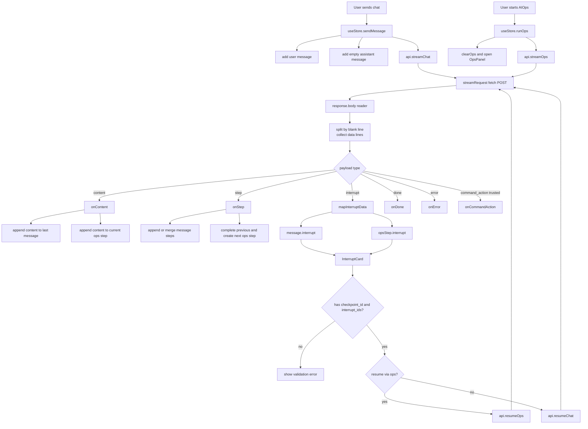

# 09 前端 SSE、状态管理与审批交互：从 streamRequest 到 InterruptCard

> 本节继续保持同一写法：**数据结构跟着调用链讲**，不单独堆类型表。  
> 目标：看懂前端如何消费后端 SSE、如何把内容/步骤/中断写入 Zustand store，以及用户点击审批后如何调用 chat 或 ops resume。  
> 日期：2026-08-19。

## 1. 本节目标

后端已经能发出 `content / step / interrupt / done / error` 等 SSE payload。前端要解决的问题是：

- 一个 `fetch` streaming response 如何被拆成 SSE `data:` 消息？
- `interrupt` payload 如何标准化成 `InterruptData`？
- 普通 Chat 和 AIOps Panel 为什么各有一套状态落点？
- `InterruptCard` 如何判断走 `/chat_resume_stream` 还是 `/ai_ops_resume_stream`？
- 为什么 resume 需要 `checkpoint_id + interrupt_ids`，缺一都会在前端直接报错？

主线文件：

- `frontend/src/services/api.ts`
- `frontend/src/types.ts`
- `frontend/src/store/useStore.ts`
- `frontend/src/components/InterruptCard.tsx`
- `frontend/src/components/ChatArea.tsx`
- `frontend/src/components/OpsPanel.tsx`

## 2. 前端的核心数据落点：Message、OpsStep、InterruptData

前端类型里，`InterruptData` 保存后端中断恢复所需的最小合同：

```text
checkpoint_id
interrupt_contexts[]  // 每项含 id/address/info/is_root_cause
message
bash_request?
detail_request?
handled?
workflow?
resume_endpoint?
```

`Message` 可携带 `steps` 和 `interrupt`，用于普通聊天区域；`OpsStep` 也可携带 `interrupt`，用于右侧 AIOps Panel。也就是说，同一个后端中断，在前端可能落到两种 UI 容器：聊天消息的最后一条 assistant message，或 ops panel 的某个步骤。证据在 `frontend/src/types.ts:1-92`。

`useStore` 持久化的状态名是 `oncall_history`，保存最近 50 个 sessions、theme、opsSteps、currentOpsTask 和 sidebar 状态；这意味着刷新页面后，历史消息和 ops step 可以恢复，但流式请求本身不会自动重连。证据在 `frontend/src/store/useStore.ts:378-399`。

## 3. API 层：streamRequest 是所有流式请求的共用解析器

`api.ts` 把四个流式入口都包成同一个 `streamRequest`：

- `streamChat(sessionId, question)` -> `/chat_stream`，body 是 `{ id, question }`。
- `resumeChat(sessionId, checkpointId, data)` -> `/chat_resume_stream`，body 是 `{ id, checkpoint_id, ...data }`。
- `streamOps()` -> `/ai_ops_stream`，body 是 `{}`。
- `resumeOps(checkpointId, data)` -> `/ai_ops_resume_stream`，body 是 `{ checkpoint_id, ...data }`。

证据在 `frontend/src/services/api.ts:40-74`。这也解释了为什么 Chat resume 需要 session id，而 AIOps resume 不需要：AIOps 后端固定使用 `session_id="aiops"`，普通 chat 后端需要 `id` 找到对应会话。

`streamRequest` 使用 `fetch` 发 POST JSON，然后读取 `response.body.getReader()`，用 `TextDecoder` 增量 decode。它按 `\n\n` 拆 SSE event，再从每行 `data: ` 中拼出 payload。证据在 `frontend/src/services/api.ts:76-118`。

之后它按协议分派：

- `[DONE]` 或 `{type:"done"}` -> `onDone()` 并 return。
- `[ERROR]` 或 `{type:"error"}` -> `onError()` 并 return。
- `{type:"interrupt"}` -> `onInterrupt(mapInterruptData(json))`。
- `{type:"step"}` -> `onStep({ step, content, status:"completed" })`。
- `{type:"command_action"}` 且 `trusted_control=true` -> `onCommandAction`。
- `{type:"content"}` -> `onContent(json.content)`。
- 非 JSON 文本 -> 当作 raw content。

证据在 `frontend/src/services/api.ts:120-170`。

## 4. 中断标准化：mapInterruptData 把后端 payload 变成 UI 可消费状态

`mapInterruptData` 从 raw JSON 里抽取：

```text
checkpoint_id
message
interrupt_contexts
bash_request
detail_request
workflow
resume_endpoint
```

其中 `workflow` 只接受 `chat|ops`，`resume_endpoint` 只接受 `chat_resume_stream|ai_ops_resume_stream`；`interrupt_contexts` 会规范化为 `id/address/info/is_root_cause`。证据在 `frontend/src/services/api.ts:188-226`。

`bash_request` 和 `detail_request` 的来源有三层候选：raw 中直接的结构化字段、`interrupt_data`、`data`；如果没有结构化 bash request，还会从 message 和 interrupt context 的 info 中尝试解析命令文本。证据在 `frontend/src/services/api.ts:228-285`。

这一步让后端可以兼容不同 interrupt payload：命令审批、补充细节、普通人工确认都能映射到同一个 `InterruptCard`。

## 5. Chat 流：先放用户消息和空 assistant，再增量填充

`sendMessage` 是普通聊天的 store action。它先向当前 session 添加用户消息，然后添加一条空的 assistant 消息作为流式内容容器；接着设置 `isStreaming=true`、`connectionStatus="streaming"`，再动态 import `streamChat`。证据在 `frontend/src/store/useStore.ts:320-348`。

回调处理逻辑是：

- `onContent`：把 chunk append 到最后一条 assistant message。
- `onStep`：把 step append 到最后一条 message 的 `steps`。
- `onCommandAction`：目前只信任 `clear_session`，会清空当前 session 消息。
- `onInterrupt`：把 `InterruptData` 写到最后一条 assistant message 上。
- `onDone`：把最后一步状态置 completed，停止 streaming，连接回 idle。
- `onError`：最后一步置 error，停止 streaming，连接置 error，并把错误文本 append 到最后一条 message。

证据在 `frontend/src/store/useStore.ts:348-375`。

`updateLastMessage` 的实现也很关键：content 是追加而不是替换；steps 通过 `mergeMessageSteps` 按 step 编号合并；interrupt 会保留最新值。证据在 `frontend/src/store/useStore.ts:19-33` 与 `frontend/src/store/useStore.ts:150-163`。

## 6. Ops 流：右侧 Panel 用 opsSteps 表达流程

`runOps` 是 AIOps 面板的入口。它会先 `clearOps()`，打开 ops panel，设置 `isOpsRunning=true` 和 `currentOpsTask`，再调用 `streamOps`。证据在 `frontend/src/store/useStore.ts:263-278`。

回调处理逻辑是：

- `onStep`：如果已有当前步骤，先标 completed；再用后端 step content 创建新 `OpsStep`。
- `onContent`：没有 current step 时根据内容推断一个步骤标题，然后把内容追加到当前 step。
- `onInterrupt`：把 `pausedByInterrupt=true`，必要时创建“执行确认/人工确认”步骤，再把 interrupt 附到当前 step。
- `onDone`：当前 step 标 completed；`isOpsRunning` 设置成 `pausedByInterrupt`。
- `onError`：创建或更新“流程异常”步骤，状态置 error，并停止 ops running。

证据在 `frontend/src/store/useStore.ts:263-318`。

这里的一个细节值得注意：如果被 interrupt 暂停，`onDone` 后 `isOpsRunning` 会保持 true。这不是“还在拉流”，而是 UI 层表达“流程仍有待处理的中断”。用户在 `InterruptCard` 里处理后，resume 回调会继续更新 ops steps。

## 7. 两个显示面：ChatArea 和 OpsPanel 都复用 InterruptCard

聊天区 `ChatArea` 遍历当前 session 的 messages；如果某条 message 有 `interrupt`，就渲染 `InterruptCard`。它通过三种信号判断是不是 ops：message 本身是 `step`，或者 `interrupt.workflow === 'ops'`，或者 `resume_endpoint === 'ai_ops_resume_stream'`。证据在 `frontend/src/components/ChatArea.tsx:380-400` 与 `frontend/src/components/ChatArea.tsx:595-600`。

Ops 面板则遍历 `opsSteps`；每个 step 的 content 用 Markdown 渲染，如果 step 有 `interrupt`，也渲染同一个 `InterruptCard`，但传入 `isOps` 和 `opsStepId`。证据在 `frontend/src/components/OpsPanel.tsx:152-167`。

这说明 `InterruptCard` 是复用组件：它不属于 Chat 或 Ops 任意一方，而是根据 `isOps/workflow/resume_endpoint` 决定 resume 目标。

## 8. InterruptCard：校验恢复定位符，再提交 resume 请求

`InterruptCard` 初始化时会从 `interrupt` 里拆出 `bash_request/detail_request/checkpoint_id/interrupt_contexts`。它用 `detail_request` 判断是否是“补充细节”，用 `bash_request.raw_command` 判断是否是“执行确认”，否则展示“人工确认”。`resumeViaOps` 的判断是：`isOps || interrupt.workflow === 'ops' || interrupt.resume_endpoint === 'ai_ops_resume_stream'`。证据在 `frontend/src/components/InterruptCard.tsx:20-58`。

提交时，`submitResume` 先做几个前端硬校验：

- 正在提交或已处理，直接 return。
- 没有 `checkpoint_id`，显示“缺少 checkpoint_id，无法恢复执行”。
- 非 ops resume 但没有 `currentSessionId`，显示“缺少会话 ID”。
- 从 `interrupt_contexts` 收集 `interruptIDs`，如果为空，显示“缺少 interrupt_ids，无法恢复到具体中断点”。

证据在 `frontend/src/components/InterruptCard.tsx:73-107`。

通过校验后，它会设置 streaming 状态。如果是在 OpsPanel 的 step 内恢复，会先标记原中断 step 已 handled，并置 completed；如果是普通 chat resume，则先新增一条空 assistant message，后续 resume 内容就 append 到这条消息。证据在 `frontend/src/components/InterruptCard.tsx:109-143`。

resume 回调里，新的中断会继续被处理：OpsPanel 场景会新建或更新 ops step；Chat 场景会把 next interrupt 写到当前最后一条 message。`onDone` 负责关闭 streaming、设置 handled；`onError` 负责把错误写回 UI。证据在 `frontend/src/components/InterruptCard.tsx:144-208`。

最后构造 request payload：`{ ...payload, interrupt_ids: interruptIDs }`。如果 `resumeViaOps`，调用 `resumeOps(checkpointId, requestPayload, options)`；否则调用 `resumeChat(currentSessionId, checkpointId, requestPayload, options)`。证据在 `frontend/src/components/InterruptCard.tsx:210-219`。

## 9. 链路图

源文件：`docs/learning/diagrams/11-frontend-sse-interrupt-flow.mmd`



## 10. 证据、推断与未知

**证据**

- `streamRequest` 是 Chat、Ops、resume 的共用 SSE parser，按 `[DONE]/[ERROR]/JSON type` 分派回调。见 `frontend/src/services/api.ts:76-170`。
- `mapInterruptData` 统一抽取 checkpoint、interrupt contexts、bash/detail request、workflow 和 resume endpoint。见 `frontend/src/services/api.ts:188-285`。
- 普通聊天把 interrupt 写到最后一条 assistant message；AIOps 把 interrupt 写到当前 ops step。见 `frontend/src/store/useStore.ts:348-375` 与 `frontend/src/store/useStore.ts:278-318`。
- ChatArea 和 OpsPanel 都复用 `InterruptCard`。见 `frontend/src/components/ChatArea.tsx:595-600` 与 `frontend/src/components/OpsPanel.tsx:160-167`。
- `InterruptCard` 在前端校验 `checkpoint_id` 和 `interrupt_ids` 后，才调用 `resumeOps` 或 `resumeChat`。见 `frontend/src/components/InterruptCard.tsx:73-107` 与 `frontend/src/components/InterruptCard.tsx:210-219`。

**推断**

- `isOpsRunning=true` 在 interrupt 后更像“等待用户处理/可继续”的 UI 状态，而不是网络请求仍在进行；因为原 `streamOps` 已在 `onDone` 回调结束，只有点击 InterruptCard 后才会再次发起 resume stream。
- localStorage 持久化能恢复 UI 历史，但不能自动恢复正在进行的 SSE 流；要继续执行仍需要已有 interrupt 中的 checkpoint 信息和用户操作。

**未知 / 后续可读**

- 本节只读源码，没有运行浏览器交互测试；如果后续要做前端 QA，应启动 dev server 后验证 interrupt card 的 approve/reject/detail selection 三种交互。
- `InterruptCard` 的视觉细节、按钮集合和 detail option 展示还可以单独做 UI 阅读；本节只覆盖状态和调用链。

## 11. 阅读检查清单

读完本节，可以用下面几个问题自测：

- `streamRequest` 收到 `data: {"type":"interrupt"}` 后，经过哪些函数才显示成卡片？
- Chat 的 interrupt 和 Ops 的 interrupt 分别存在哪个字段？
- `resumeViaOps` 的判断条件有哪些？
- 为什么前端必须收集 `interrupt_contexts[].id`，而不是只传 `checkpoint_id`？
- 页面刷新后 localStorage 能恢复什么？不能恢复什么？
