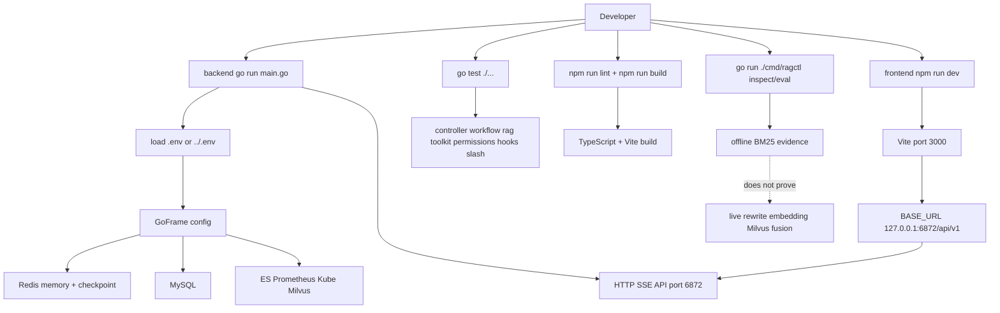

# 10 构建、测试与本地调试：哪些命令证明什么

> 本节继续保持同一写法：**数据结构跟着调用链讲**，不单独堆类型表。  
> 目标：把本地运行、测试、构建、RAG 离线检查和常见环境坑串成一张可执行清单。  
> 日期：2026-08-19。

## 1. 本节目标

前面几节主要读运行时链路。本节回答“怎么把项目跑起来、怎么验证改动没有弄坏”：

- 后端和前端分别从哪里启动？端口是什么？
- 哪些配置是启动强依赖，哪些是工具功能的降级依赖？
- Go / frontend / RAG 分别有哪些验证命令？
- Windows 下有哪些容易踩的命令行坑？
- 每类命令能证明什么，不能证明什么？

主线文件：

- `backend/main.go`
- `backend/go.mod`
- `backend/hack/hack.mk`
- `backend/manifest/config/config.yaml`
- `backend/cmd/ragctl/main.go`
- `frontend/package.json`
- `frontend/vite.config.ts`
- `frontend/src/services/api.ts`
- `docs/rag-operational-runbook.md`

## 2. 后端启动：入口是 backend/main.go，HTTP 端口固定 6872

后端入口是 `backend/main.go`。`main()` 会先尝试加载 backend-local `.env`，再尝试 repo-root `../.env`；如果都失败，会打印“using system default env”。证据在 `backend/main.go:23-37`。

启动时主流程是：

```text
load env
-> read GoFrame config
-> init Redis memory utility
-> init MySQL
-> optionally init Elasticsearch
-> read Prometheus / kubeconfig / log_sync / hooks config
-> bootstrap.NewApplication
-> register /api/v1 routes
-> server.SetPort(6872)
-> server.Run()
```

证据在 `backend/main.go:39-136`。

本地启动命令：

```powershell
cd D:\Code\project\oncall\backend
go run main.go
```

成功后，前端默认会请求 `http://127.0.0.1:6872/api/v1`。这个前端 API base URL 是硬编码在 `frontend/src/services/api.ts` 里的 `BASE_URL`，证据在 `frontend/src/services/api.ts:1-3`。

## 3. 后端依赖边界：启动强依赖和可降级依赖要分开看

`main.go` 中 Redis 会先被用于 `mem.InitRedis`；随后 `bootstrap.NewApplication` 里还会创建 Redis client 并 `Ping`，失败会返回错误，`main.go` 会 `log.Fatalf`。证据在 `backend/main.go:45-64` 与 `backend/internal/bootstrap/app.go:125-145`。

MySQL 初始化失败也是 fatal：`mysql.InitMySQL` 出错会 `log.Fatalf`。证据在 `backend/main.go:66-71`。

Elasticsearch 是可降级依赖：如果没有配置地址，会打印 fallback；如果初始化失败，也只是 warning。证据在 `backend/main.go:73-84`。

Prometheus、kubeconfig、log_sync 和 hooks config 会作为 bootstrap 配置传入应用。证据在 `backend/main.go:86-108`。这些依赖主要影响 AIOps 工具能力：Prometheus 与 Kubernetes 相关工具在初始化或调用时可能降级，但不等同于整个 HTTP 服务一定不能启动。

Milvus/RAG 需要更细看：dialogue retriever 初始化失败时会记录 warn 并返回 nil retriever；但 knowledge upload agent 会构造上传索引链路，内部包含 Milvus-backed indexer。证据在 `backend/internal/workflow/dialogue/agent.go:193-208` 与 `backend/internal/knowledge/indexer.go:23-31`。因此本地调试时，如果只想读非上传/非 RAG 功能，也要意识到当前 bootstrap 仍会创建 knowledge agent。

配置样例集中在 `backend/manifest/config/config.yaml`，包括 Redis、MySQL、Prometheus、kubeconfig、Elasticsearch、Milvus 等条目。证据在 `backend/manifest/config/config.yaml:31-84`。不要把本地真实密钥或生产连接串提交到仓库。

## 4. 后端测试：优先用模块根目录跑 go test ./...

后端是独立 Go module：`backend/go.mod` 的 module 是 `go_agent`，Go 版本是 `1.25.5`，核心依赖包括 Eino、GoFrame、Redis、Milvus、Prometheus、GORM、Kubernetes client 等。证据在 `backend/go.mod:1-22`。

推荐的完整后端测试命令：

```powershell
cd D:\Code\project\oncall\backend
go test ./...
```

如果 Windows 默认 Go cache 目录权限异常，可以在仓库根目录或 backend 内设置本地 GOCACHE，例如：

```powershell
cd D:\Code\project\oncall
New-Item -ItemType Directory -Force .gocache | Out-Null
$env:GOCACHE = (Resolve-Path ".gocache").Path
cd backend
go test ./...
```

当前测试覆盖面从文件分布看，至少包括 `rag`、`ragctl`、controller/chat、workflow/ops、dialogue、toolkit、permissions、hooks、slash、compact、mem 等包。现有 `*_test.go` 分布可从仓库扫描看到：`backend/internal/rag/rag_test.go`、`backend/cmd/ragctl/main_test.go`、`backend/internal/workflow/ops/*_test.go`、`backend/internal/controller/chat/chat_v1_test.go` 等。

常用局部测试命令：

```powershell
cd backend
go test ./internal/controller/chat
go test ./internal/workflow/ops
go test ./internal/rag ./cmd/ragctl
go test ./internal/toolkit ./internal/permissions
```

## 5. GoFrame 构建与生成命令

`backend/hack/hack.mk` 定义了 GoFrame 相关命令：

- `build`：依赖 `cli.install`，执行 `gf build -ew`。
- `ctrl`：执行 `gf gen ctrl`，用于从 API 定义生成 controller/sdk。
- `dao`：执行 `gf gen dao`。
- `service`：执行 `gf gen service`。
- `image` / `image.push` / `deploy`：构建镜像和部署，其中 deploy 会调用 `kubectl apply`。

证据在 `backend/hack/hack.mk:1-75`。

本地构建命令：

```powershell
cd backend
make -f hack/hack.mk build
```

如果只是在学习源码，不建议先跑 `dao/service/deploy` 这类生成或部署命令；它们会改变生成文件或外部集群状态。读代码时优先跑 `go test ./...` 和 `go run main.go`。

## 6. 前端启动与验证：Vite 端口 3000，API 指向 6872

前端 package scripts 定义了：

```text
dev     -> vite --port=3000 --host=0.0.0.0
build   -> vite build
preview -> vite preview
clean   -> rm -rf dist
lint    -> tsc --noEmit
```

证据在 `frontend/package.json:6-12`。核心前端依赖包括 React 19、Vite 6、Zustand、react-markdown、motion、lucide-react、Tailwind/Vite plugin 等，证据在 `frontend/package.json:13-40`。

本地启动命令：

```powershell
cd D:\Code\project\oncall\frontend
npm install
cmd /c npm run dev
```

在 Windows PowerShell 下，如果直接 `npm run ...` 被执行策略拦截，可以用 `cmd /c npm run ...`。前端 dev server 端口来自 package script；Vite config 还配置了 React、Tailwind plugin、`@` alias，以及通过 env 暴露 `GEMINI_API_KEY`。证据在 `frontend/package.json:7` 与 `frontend/vite.config.ts:1-23`。

前端验证命令：

```powershell
cd frontend
cmd /c npm run lint
cmd /c npm run build
```

`lint` 实际是 TypeScript 类型检查，不是 ESLint；`build` 是 Vite production build。证据在 `frontend/package.json:8-11`。

## 7. RAG 离线检查：ragctl 能证明 BM25，不证明 live hybrid

`ragctl` 的 usage 明确有四个命令：`inspect`、`rebuild-bm25`、`eval`、`backfill-v2`。证据在 `backend/cmd/ragctl/main.go:47-52`。

最容易误解的是 `inspect`：它输出 `inspection_mode=offline_bm25_only`，并明确说明不会调用 query rewrite、embedding retrieval、RRF fusion、reranker、Milvus 或运行中的 chat service。证据在 `backend/cmd/ragctl/main.go:70-77`。

常用学习命令：

```powershell
cd backend
# 看本地 BM25 index 和配置，不证明 live hybrid
 go run ./cmd/ragctl inspect --profile knowledge --query "redis timeout" --top-k 5 --final-top-k 3

# 用固定 corpus 做离线 eval
 go run ./cmd/ragctl eval --dataset testdata/rag_eval_gold.jsonl --profile all --corpus testdata/rag_eval_gold_corpus.jsonl
```

注意：如果要证明 live hybrid，必须启动后端以及 Milvus/Embedding 等依赖，再通过 `knowledge_retrieve` 或 `ops_case_retrieve` 走真实工具调用；`ragctl inspect` 不能替代这个验证。

## 8. 推荐验证矩阵

| 场景 | 推荐命令 | 能证明 | 不能证明 |
| --- | --- | --- | --- |
| 后端纯源码改动 | `cd backend; go test ./...` | Go 包编译与单元测试 | 外部 Redis/Milvus/Prom live 可用 |
| AIOps 工作流改动 | `go test ./internal/workflow/ops ./internal/controller/chat` | 工作流/控制器局部回归 | 前端交互完整性 |
| RAG 算法改动 | `go test ./internal/rag ./cmd/ragctl` | rewrite/BM25/fusion/ragctl 逻辑 | live Milvus + embedding 链路 |
| 前端状态/UI 改动 | `cd frontend; cmd /c npm run lint; cmd /c npm run build` | TypeScript 和生产构建 | 浏览器交互体验 |
| 本地联调 | 后端 `go run main.go` + 前端 `npm run dev` | HTTP/SSE 主链路可访问 | 依赖缺失时的全部功能可用性 |

## 9. 链路图

源文件：`docs/learning/diagrams/12-build-test-debug-map.mmd`



## 10. 证据、推断与未知

**证据**

- 后端入口固定调用 `server.SetPort(6872)`，前端 API base URL 指向 `127.0.0.1:6872/api/v1`。见 `backend/main.go:118-136` 与 `frontend/src/services/api.ts:1-3`。
- 前端 dev 脚本固定 Vite 端口 3000，lint 是 `tsc --noEmit`，build 是 `vite build`。见 `frontend/package.json:6-12`。
- GoFrame 构建/生成命令集中在 `backend/hack/hack.mk`，其中 `build` 是 `gf build -ew`。见 `backend/hack/hack.mk:1-16`。
- `ragctl inspect` 是离线 BM25 检查，不调用 live hybrid 链路。见 `backend/cmd/ragctl/main.go:70-77`。

**推断**

- 对学习者来说，第一优先级是 `go test ./...` + `npm run lint/build`，因为它们成本低、覆盖面广；完整 live 联调依赖 Redis/MySQL/Milvus/模型/Prometheus/K8s，环境成本更高。
- Windows 下优先用 `cmd /c npm run ...` 可以避开 PowerShell execution policy 对 `npm.ps1` 的影响。

**未知 / 后续可读**

- 本节没有实际启动服务，也没有探测本机 Redis/MySQL/Milvus 是否在线；这里只给出源码和脚本证据下的运行/验证地图。
- `backend/manifest/config/config.yaml` 中的本地地址是否符合你当前机器，需要结合实际 `.env`、GoFrame 配置加载路径和服务端口再检查。

## 11. 阅读检查清单

读完本节，可以用下面几个问题自测：

- 后端 HTTP API 实际监听哪个端口？前端请求哪个 base URL？
- `npm run lint` 在这个项目里到底做了什么？
- `ragctl inspect` 为什么不能证明 `knowledge_retrieve` 的 live hybrid 链路？
- 哪些依赖失败会让后端启动直接失败？哪些更多是工具能力降级？
- 修改后端/前端/RAG 时分别应该优先跑哪组命令？
