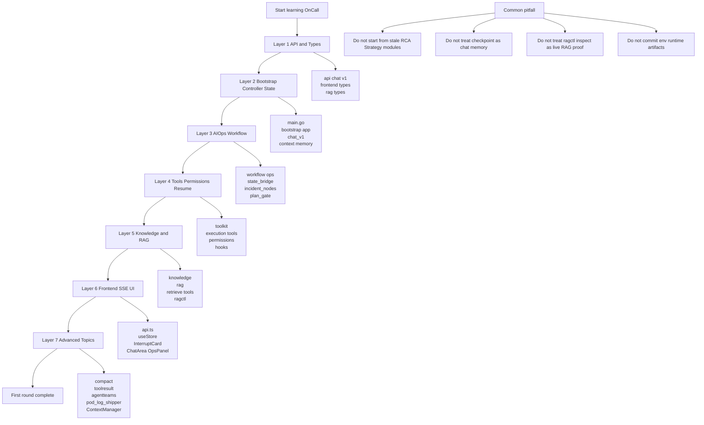

# 11 源码阅读路线图与踩坑笔记：按难度逐层进入项目

> 本节继续保持同一写法：**数据结构跟着调用链讲**，不单独堆类型表。  
> 目标：把前 10 节变成可执行的源码阅读顺序，并记录容易误读的模块边界。  
> 日期：2026-08-19。

## 1. 本节目标

现在你已经有了架构、启动、领域模型、AIOps、工具、checkpoint、RAG、前端 SSE、构建测试的笔记。最后这节解决两个问题：

- 从头重新学习时，应该按什么顺序读源码，避免一上来陷进复杂分支？
- 哪些文件名或历史模块容易误导，需要先建立边界？

本节引用的主要事实来自当前目录扫描：`backend/internal` 下包含 `bootstrap/controller/context/execution/hooks/knowledge/permissions/prompt/rag/slash/toolkit/toolresult/workflow` 等模块，`backend/internal/workflow` 下当前主要有 `agentteams/dialogue/ops`，前端组件集中在 `ChatArea/Header/InputArea/InterruptCard/OpsPanel/Sidebar`。这些目录是当前学习路线的骨架。

## 2. 第一轮阅读顺序：先从可运行主链路读起

不要从所有包名开始平均用力。这个项目最重要的主线是：

```text
main.go
-> bootstrap.NewApplication
-> chat.NewV1WithHooks
-> ChatStream / AIOpsStream
-> dialogue_agent / ops_agent / knowledge_agent
-> tool calls / checkpoint / frontend SSE
```

所以推荐按下面顺序读：

1. `docs/learning/01-architecture-overview.md`：先确认前后端边界、目录边界、HTTP/SSE 大图。
2. `docs/learning/02-bootstrap-and-request-flow.md`：跟 `main.go -> bootstrap -> controller -> runner`。
3. `docs/learning/03-domain-model-glossary.md`：把 `IncidentState/PlanState/ReplanState/PlanApprovalState` 放进工作流里理解。
4. `docs/learning/04-ops-workflow.md`：读 AIOps 主循环和高/中/低风险分支。
5. `docs/learning/05-execution-plan-tools.md`：读计划生成、校验、执行、验证、rollback 工具。
6. `docs/learning/06-tool-gateway-permissions-resume.md`：读工具网关、权限、interrupt/resume。
7. `docs/learning/07-checkpoint-session-memory.md`：区分 ADK checkpoint 与 SessionMemory。
8. `docs/learning/08-knowledge-rag-tools.md`：读知识上传、Hybrid RAG、ops_case 案例闭环。
9. `docs/learning/09-frontend-sse-interrupts.md`：读前端如何接 SSE 与恢复审批。
10. `docs/learning/10-build-test-local-debug.md`：最后把验证命令和本地依赖补齐。

这条路线的原则是：先跑通“用户请求如何被处理”，再读“Agent 内部如何组织”，最后再读“辅助系统如何增强能力”。

## 3. 第一层：简单但必须读的基础模块

这些模块不一定最核心，但读它们能快速建立项目语言：

- `backend/api/chat/v1/chat.go`：所有 HTTP/SSE 请求响应形状，尤其是 `ChatStreamReq`、`ChatResumeStreamReq`、`AIOpsStreamReq`、`AIOpsResumeStreamReq`。
- `frontend/src/types.ts`：前端的 `Message/InterruptData/OpsStep`，对应后端 SSE payload。
- `backend/internal/rag/types.go`：`DocumentChunk/RetrievedResult/RetrievedContext`，是 RAG 输出的统一语言。
- `backend/internal/execution/tools/validate_plan.go`：`ExecutionPlan` 和 `PlanValidationResult` 的入口，适合理解计划校验规则。
- `backend/internal/permissions/permissions.go`：权限判断、path sandbox、allow/ask/deny 的基础。
- `backend/internal/prompt/*`：各 agent 的 prompt 拼装逻辑，帮助理解模型被要求做什么。

读这一层时，不要试图理解所有算法。目标只是能回答：“这个项目有哪些请求、哪些状态、哪些工具结果类型？”

## 4. 第二层：入口、容器和状态主干

第二层开始读运行时：

- `backend/main.go`：进程入口、配置加载、基础设施初始化、路由注册、端口 6872。
- `backend/internal/bootstrap/app.go`：应用容器，创建 DialogueAgent、KnowledgeAgent、OpsAgent、Redis、ContextManager、HookEngine。
- `backend/internal/controller/chat/chat_v1.go`：后端最重要的 controller，大部分 SSE、checkpoint、resume、upload、slash 分发都在这里。
- `backend/internal/context/checkpoint_store.go`：ADK checkpoint Redis store。
- `backend/internal/context/session_memory.go` 和 `backend/utility/mem/mem.go`：跨轮聊天历史。

读这一层时要重点跟“状态 ID”走：`session_id`、`checkpoint_id`、`interrupt_ids`、`plan_id`、`plan_revision`。这些 ID 串起来，比函数名更能解释系统。

## 5. 第三层：AIOps 核心工作流

第三层读 `backend/internal/workflow/ops`：

- `incident_workflow.go`：创建整个 Incident Workflow Agent。
- `state_bridge.go`：`IncidentState/PlanState/PlanGateState/ReplanState/PlanApprovalState` 的读写和桥接。
- `incident_nodes.go`：verify plan、replan decider、final report、归档等节点。
- `plan_gate.go`：计划审批和 resume。
- `diagnosis_gate.go`：诊断契约 gate、执行保护与 resume。
- `plan_agent.go`：计划 agent 和工具注册。
- `diagnostic_toolset.go`、`integration.go`：K8s/Prometheus/日志等诊断工具组合。

这一层的读法是“跟 Graph State”：观察哪些节点写入 state，哪些节点读 state，哪些节点会因为 state 不满足条件而打回重试或转人工。

## 6. 第四层：工具、执行和权限

第四层读工具系统：

- `backend/internal/toolkit/types.go`、`gateway.go`、`adapter.go`：ToolSearch、InvokeDeferredTool、session-scoped discovery、Eino adapter。
- `backend/internal/execution/tools/normalize_plan.go`、`generate_plan.go`、`validate_plan.go`、`execute_step.go`、`validate_result.go`、`rollback.go`：执行计划工具集。
- `backend/internal/workflow/dialogue/tools/BashApprovalTool.go`、`detail_selection_tool.go`：普通 dialogue 场景也会触发 interrupt。
- `backend/internal/hooks/*`：tool 前后 hook、resume hook、callback handler。

这一层容易迷路，建议按“一个命令执行前后”读：计划怎么生成、怎么校验、命令如何触发权限、interrupt payload 怎么组装、resume 后怎么继续。

## 7. 第五层：知识、RAG 与案例闭环

第五层读知识系统：

- `backend/internal/knowledge/agent.go`、`orchestration.go`、`indexer.go`：上传专用 agent，Markdown 分片，Milvus + BM25。
- `backend/internal/rag/rewrite.go`、`hybrid.go`、`fusion.go`、`rerank.go`、`config.go`：Hybrid RAG 主算法。
- `backend/internal/workflow/dialogue/tools/KnowledgeRetrieveTool.go`：业务知识检索。
- `backend/internal/workflow/dialogue/tools/OpsCaseRetrieveTool.go`：历史运维案例检索和本地 final report fallback。
- `backend/cmd/ragctl/main.go`：离线 BM25 检查与 eval。

这一层要一直记住 profile 边界：`knowledge` 是业务知识；`ops_case` 是历史运维案例和最终报告。不要把上传 agent、检索工具、ragctl CLI 混成同一个入口。

## 8. 第六层：前端交互和 UI 状态

第六层读前端：

- `frontend/src/services/api.ts`：所有 HTTP/SSE 请求封装和 `streamRequest` parser。
- `frontend/src/store/useStore.ts`：Zustand store，Chat 和 Ops 两条状态流。
- `frontend/src/components/InterruptCard.tsx`：审批/补充细节/人工确认统一卡片。
- `frontend/src/components/ChatArea.tsx`：消息渲染、interrupt card 插入。
- `frontend/src/components/OpsPanel.tsx`：AIOps step 面板。
- `frontend/src/components/InputArea.tsx`、`Sidebar.tsx`、`Header.tsx`：入口、会话、布局辅助。

这一层的读法是“跟一个 SSE event”：`content` 如何追加，`step` 如何变成 timeline，`interrupt` 如何变成卡片，用户点击后如何再次进入 `streamRequest`。

## 9. 第七层：高级主题，最后再读

这些模块建议最后读：

- `backend/internal/compact/*`：模型上下文压缩中间件和恢复状态。
- `backend/internal/toolresult/*`：工具结果预算和替换策略。
- `backend/internal/workflow/agentteams/*`：ADK team builder 抽象。
- `backend/internal/workflow/ops/pod_log_shipper.go`：Kubernetes 日志同步到 ES 的后台任务。
- `backend/internal/context/manager.go`、`redis_storage.go`：ContextManager 与 L1/L2 迁移。
- `backend/internal/agent/rca`、`backend/internal/agent/strategy`：保留/旧方向或未直接接入当前主 bootstrap 的 agent 实现，读之前先确认是否在当前链路被调用。

高级主题的原则：先确认“是否在当前 bootstrap 主链路”，再决定投入多少精力。

## 10. 常见坑与修正方式

| 坑 | 容易误读 | 修正方式 |
| --- | --- | --- |
| 看到 `internal/agent/rca`、`internal/agent/strategy` 就从那里读 | 误以为当前 AIOps 仍是旧 RCA/Strategy 串联 | 先看 `bootstrap.NewApplication` 实际创建的是 dialogue、knowledge、ops；当前主 AIOps 在 `internal/workflow/ops` |
| 把 `knowledge_agent` 当问答 agent | 上传 agent 只负责分片入库 | 在线检索看 `dialogue/tools/KnowledgeRetrieveTool.go` 与 `rag.HybridRetriever` |
| 把 checkpoint 和 SessionMemory 混在一起 | 两者都可能用 Redis | checkpoint 是 ADK resume 状态；SessionMemory 是跨轮 prompt 历史 |
| 用 `ragctl inspect` 证明 live RAG | inspect 只看离线 BM25 | live 需要服务+Milvus+Embedding，并通过工具调用验证 |
| 忽略前后端端口 | 前端 dev 3000，API 6872 | 前端 `BASE_URL` 固定指向 `127.0.0.1:6872/api/v1` |
| 在 Windows 直接跑 npm 被拦 | PowerShell 执行策略可能拦截 `npm.ps1` | 用 `cmd /c npm run lint/build/dev` |
| Go cache 权限异常 | 默认用户缓存可能 Access denied | 设置 repo-local `$env:GOCACHE` |
| 随手提交运行产物 | `.env`、`.oncall/rag`、`logs/ops_reports`、`dist`、`node_modules` 可能污染提交 | 提交前 `git status --short` 和 staged diff 逐项检查 |
| 跑生成/部署命令当普通验证 | `gf gen dao/service`、deploy 可能改文件或外部集群 | 学习阶段优先 `go test`、`npm run lint/build` |

## 11. 第一轮完成标准

第一轮学习完成时，建议你能做到：

- 能画出 `main.go -> bootstrap -> controller -> runner -> agent -> tool -> SSE -> frontend` 主链路。
- 能解释 `checkpoint_id`、`interrupt_ids`、`session_id`、`plan_id`、`plan_revision` 分别在哪条链路使用。
- 能从 AIOps 的一个中断事件，追踪到后端生成 payload、前端渲染 `InterruptCard`、用户点击 resume、后端 `ResumeWithParams`。
- 能区分 `knowledge` 与 `ops_case` profile，知道上传、检索、归档分别看哪些文件。
- 能针对后端、前端、RAG 改动选择最小验证命令。
- 能指出哪些模块是当前主链路，哪些模块需要先验证调用关系再深入。

## 12. 链路图

源文件：`docs/learning/diagrams/13-source-roadmap-pitfalls.mmd`



## 13. 证据、推断与未知

**证据**

- 当前 `backend/internal` 实际包含 bootstrap、controller、context、execution、hooks、knowledge、permissions、prompt、rag、slash、toolkit、toolresult、workflow 等模块；`backend/internal/workflow` 下有 `agentteams/dialogue/ops`。
- 当前 controller 主入口是 `backend/internal/controller/chat/chat_v1.go`；前端核心组件包括 `ChatArea/InputArea/InterruptCard/OpsPanel/Sidebar`。
- 已生成的学习笔记覆盖从 00 到 10，图文件覆盖 01 到 12，可作为第一轮阅读材料。

**推断**

- 对学习者来说，按“请求链路 -> 状态主干 -> 工具执行 -> RAG -> 前端 -> 高级主题”的顺序，比按目录字母顺序阅读更不容易迷路。
- `internal/agent/rca` 和 `internal/agent/strategy` 仍有实现，但在深入前应先用 bootstrap 和调用关系确认它们是否属于当前活跃路径。

**未知 / 后续可读**

- 本路线图没有覆盖每个工具的所有参数和每个 prompt 的完整策略；后续可以按“一个工具一页”的方式继续扩展。
- 如果项目后续继续大规模目录重构，应重新跑一次目录扫描并更新本页，避免路线图变成旧地图。
