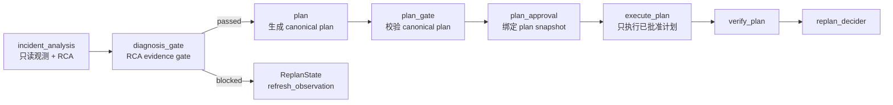

# 13 diagnosis_gate 深挖：诊断证据如何变成计划前置闸门

> 本节回答第二轮第一个问题：`diagnosis_gate` 到底挡什么？它和 `plan_gate`、`plan_approval`、`execute_plan` 的关系是什么？

## 1. 本节结论

`diagnosis_gate` 是 AIOps workflow 的第一道业务闸门：它不执行命令，也不生成计划；它只判断当前 RCA 证据是否足以进入 `plan` 阶段。通过后，它把 `IncidentState.IncidentContractValid` 标为 true；失败时，它写入 `IncidentContractIssues`、阻塞标记和 `ReplanState.Decision=refresh_observation`，让 workflow 回到观测/诊断，而不是继续生成计划。

## 2. 它在 workflow 中的位置

`NewIncidentWorkflowAgent` 的注释已经把边界说得很清楚：`ops_incident_agent` 做只读诊断和修复提案，`diagnosis_gate` 校验证据是否足够进入规划，`plan_agent` 再生成 canonical plan，后面才是 `plan_gate`、`plan_approval`、`execute_plan`、`verify_plan`、`replan_decider`、`final_reporter`。证据在 `backend/internal/workflow/ops/incident_workflow.go:30-39`。

创建 agent 时，`incident_analysis`、`plan`、`execute_plan` 会被 `wrapWithIncidentState` 包起来写 Graph State；`execute_plan` 还会再套 `newContractGuardedExecutionAgent`，而 `diagnosisGate := newDiagnosisGateAgent(cfg.Logger)` 是独立的 gate 节点。证据在 `backend/internal/workflow/ops/incident_workflow.go:95-105`。

真正的 loop stage 顺序是：`incident_analysis -> diagnosis_gate -> plan -> plan_gate -> plan_approval -> execute_plan -> verify_plan -> replan_decider`。所以 `diagnosis_gate` 位于 plan 之前，是“诊断质量足够吗”的前置门；`plan_gate` 位于 plan 之后，是“canonical plan 安全且有效吗”的后置门。证据在 `backend/internal/workflow/ops/incident_workflow.go:186-198`。

图源文件：`docs/learning/diagrams/14-diagnosis-gate-contract-flow.mmd`

## 3. Run 函数：只读消息和 Graph State，不碰执行工具

`diagnosisGateAgent.Run` 的链路很短：

1. 从 `input.Messages` 取当前 agent 消息。
2. 从 context 取 `IncidentState`。
3. 调 `validateIncidentDiagnosis(messages, state)`。
4. 调 `applyIncidentContractValidationForGate(ctx, state, result, a.name)` 写回状态。
5. 如果 valid，就发一条 assistant event；否则发一条 blocked 文本。

这段代码没有调用 `execute_step`、`validate_plan`、`rollback`，也没有直接调用 K8s/Prometheus/ES 工具。它是纯 gate + state update。证据在 `backend/internal/workflow/ops/diagnosis_gate.go:38-59`。

这里的数据结构不是独立存在的：`IncidentState` 里同时存诊断字段、计划字段、审批字段、验证字段和执行字段；`diagnosis_gate` 只读其中 RCA 相关字段，并只写 contract/gate/replan 相关字段。相关字段包括 `RootCause`、`Confidence`、`Evidence`、`IncidentContractValid`、`IncidentContractIssues`、`ValidationBlocked`、`ValidationRisk`、`ReplanState`、`PlanState`、`PlanGateState`、`PlanApprovalState`。证据在 `backend/internal/workflow/ops/state_bridge.go:108-180`。

## 4. validateIncidentDiagnosis：诊断门只看 RCA 必备质量

`validateIncidentDiagnosis` 先尝试从消息中解析 `RCAReport`；如果消息里解析不到，就从 `IncidentState` 回填 `RootCause / TargetNode / Path / Impact / Confidence / Evidence`。证据在 `backend/internal/workflow/ops/diagnosis_gate.go:297-301` 与 `backend/internal/workflow/ops/diagnosis_gate.go:361-375`。

它真正检查的条件只有四类：

| 检查项 | 失败 issue | 代码证据 |
| --- | --- | --- |
| 缺 RCA report | `missing_rca_report` | `backend/internal/workflow/ops/diagnosis_gate.go:313-315` |
| 缺 root cause | `missing_root_cause` | `backend/internal/workflow/ops/diagnosis_gate.go:319-321` |
| evidence 少于 2 条 | `insufficient_evidence` | `backend/internal/workflow/ops/diagnosis_gate.go:317-324` |
| confidence 不在 `(0,1]` 或低于 0.35 | `invalid_confidence` / `confidence_too_low` | `backend/internal/workflow/ops/diagnosis_gate.go:325-329` |

所以结论是：当前 `diagnosis_gate` **不是完整 remediation proposal gate**。它只证明“诊断证据是否足够进入 plan”。文件里另有 `validateIncidentContract` 会检查 proposal、actions、risk、fallback、是否声称已执行等，但 `Run` 当前调用的是 `validateIncidentDiagnosis`，不是 `validateIncidentContract`。证据分别在 `backend/internal/workflow/ops/diagnosis_gate.go:48`、`backend/internal/workflow/ops/diagnosis_gate.go:221-294`、`backend/internal/workflow/ops/diagnosis_gate.go:297-330`。

这解释了为什么第一轮读法要区分“诊断 gate”和“计划 gate”：`diagnosis_gate` 不检查 command 是否危险；危险命令与 plan 完整性由后续 `plan_gate`、`plan_approval` 和 execution tools 处理。

## 5. applyIncidentContractValidationForGate：失败不是终止，而是要求刷新观测

通过时，它会：

- `state.IncidentContractValid = true`
- 清除 `ValidationBlocked`
- 如果 `ValidationRisk` 是 `contract_invalid`，清空它
- 追加 execution log
- `setIncidentState(ctx, state)` 写回 Graph State

失败时，它会：

- `state.IncidentContractValid = false`
- 把 issues 写到 `IncidentContractIssues`
- `ValidationBlocked = true`
- `ValidationRisk = contract_invalid`
- 调 `applyReplanDecisionState(..., "refresh_observation", ...)`
- 追加 blocked execution log
- 写回 Graph State

证据在 `backend/internal/workflow/ops/diagnosis_gate.go:337-358`。

这里要注意命名：函数名仍叫 `applyIncidentContractValidationForGate`，但当它被 `diagnosis_gate` 调用时，写入的是“诊断证据 gate 的结果”。字段名叫 `IncidentContractValid`，实际承载的是当前 gate 对 incident contract / diagnosis readiness 的判断。

## 6. 为什么 execute_plan 还要 contractGuardedExecutionAgent

`diagnosis_gate` 通过以后，并不代表后续永远安全。计划可能缺失、plan gate 可能没跑、审批可能过期或 plan snapshot 可能变了。因此 `execute_plan` 外面还有 `contractGuardedExecutionAgent`。

`executionGuardAllowsExecution` 要连续检查：

1. `IncidentContractValid` 必须为 true。
2. `PlanState` 必须存在且有 `PlanID`。
3. `PlanGateState` 必须存在。
4. `plan_gate` 结果必须匹配当前 plan snapshot。
5. `PlanGateState` 不能 blocked，且必须 valid。
6. 当前 full plan snapshot 必须已被 `plan_approval` 批准。

只要任一条件不满足，`execute_plan` 就会被跳过，并返回原因。证据在 `backend/internal/workflow/ops/diagnosis_gate.go:168-200`。

通过所有检查后，`prepareExecutionToolStateFromApprovedPlan` 会把 Graph State 里的 `PlanState` 转成 execution tools 使用的 `ExecutionPlan`，并调用 `executiontools.PrepareApprovedExecutionPlanFromGraphState(ctx, plan)`。这一步让 `execute_step` 后续只能消费已批准 canonical plan，而不是重新自由生成计划。证据在 `backend/internal/workflow/ops/diagnosis_gate.go:202-210`。

## 7. 和 plan_gate 的边界

`plan_gate` 是另一层 gate：它不再判断 RCA 证据，而是从 `IncidentState.PlanState` 转换为 execution tool 的 `ExecutionPlan`，然后调用 `executiontools.ValidateExecutionPlan(plan)`。证据在 `backend/internal/workflow/ops/plan_gate.go:34-73`。

`plan_approval` 再检查 plan 是否 ready、plan gate 是否匹配当前 plan，必要时发 `plan_approval_required` interrupt，并把审批绑定到 `PlanID + Revision + SnapshotHash`。证据在 `backend/internal/workflow/ops/plan_gate.go:138-173` 与 `backend/internal/workflow/ops/plan_gate.go:221-234`。

所以三层关系是：

| 层 | 负责问题 | 主要状态 |
| --- | --- | --- |
| `diagnosis_gate` | 诊断证据够不够进入计划？ | `IncidentContractValid`、`IncidentContractIssues`、`ValidationBlocked`、`ReplanState` |
| `plan_gate` | canonical plan 是否结构有效、风险可控？ | `PlanState`、`PlanGateState` |
| `plan_approval` / execution guard | 当前完整 plan snapshot 是否已批准且未变？ | `PlanApprovalState`、`SnapshotHash`、prepared execution tool state |

## 8. 测试证据

现有测试覆盖了几个关键规则：

- `TestValidateIncidentDiagnosisRejectsSingleEvidence` 构造只有一条 evidence 的 RCA，期望出现 `insufficient_evidence`。证据在 `backend/internal/workflow/ops/diagnosis_gate_test.go:80-93`。
- `TestValidateIncidentContractAcceptsValidProposal` 证明 `validateIncidentContract` 可以接受完整 proposal，但这不是 `diagnosisGateAgent.Run` 当前主路径。证据在 `backend/internal/workflow/ops/diagnosis_gate_test.go:13-24`。
- `TestValidateIncidentContractRejectsLowEvidenceAndHighRiskWithoutFallback` 证明 proposal contract 会检查 high risk fallback 和 low confidence fallback。证据在 `backend/internal/workflow/ops/diagnosis_gate_test.go:46-67`。
- `TestValidateIncidentContractRejectsClaimedExecution` 证明 contract 会拒绝“已经执行/已经修复”的文字，但同样属于 `validateIncidentContract` 的规则。证据在 `backend/internal/workflow/ops/diagnosis_gate_test.go:69-78`。

这带来一个重要阅读边界：文件里存在比当前 `Run` 更严格的 proposal contract 校验函数；它有测试，但不是当前 diagnosis gate 的直接调用路径。后续如果想让 `diagnosis_gate` 同时校验 remediation proposal，需要先补行为测试，再改 `Run` 的调用策略。

## 9. 修改边界

如果以后要改 `diagnosis_gate`，优先补这些测试：

- `Run` 级测试：输入 RCA 消息，确认通过时写入 `IncidentContractValid=true`。
- `Run` 级失败测试：evidence 少于 2 条时，确认写入 `ValidationBlocked=true` 和 `ReplanState.Decision=refresh_observation`。
- 回归测试：确认 `diagnosis_gate` 不会跳过 `plan_gate`、`plan_approval`，`execute_plan` 缺任何 snapshot/approval 时仍被 `contractGuardedExecutionAgent` 拦住。
- 如果要启用 `validateIncidentContract`：补 proposal 缺失、high risk 无 fallback、claimed execution 三类 `Run` 级测试，避免只是函数级测试通过。

## 10. Evidence / Inference / Unknown

**Evidence**

- `incident_workflow.go` 明确注释 workflow 职责，`diagnosis_gate` 位于 `incident_analysis` 和 `plan` 之间。见 `backend/internal/workflow/ops/incident_workflow.go:30-39` 与 `backend/internal/workflow/ops/incident_workflow.go:186-198`。
- `diagnosisGateAgent.Run` 当前调用 `validateIncidentDiagnosis`，并把结果写回 Graph State。见 `backend/internal/workflow/ops/diagnosis_gate.go:38-59`。
- `validateIncidentDiagnosis` 检查 root cause、evidence 数量和 confidence。见 `backend/internal/workflow/ops/diagnosis_gate.go:297-330`。
- `executionGuardAllowsExecution` 在执行前要求 contract、PlanState、PlanGateState、approval 全部满足。见 `backend/internal/workflow/ops/diagnosis_gate.go:168-200`。

**Inference**

- 当前命名里的 `IncidentContractValid` 容易让人以为已经校验了完整 remediation proposal；但从 `Run` 调用路径看，它主要表示 diagnosis readiness。完整 proposal contract 目前更像可复用/保留的更严格规则。
- `diagnosis_gate` 的失败策略偏向“刷新观测再来一轮”，而不是直接 `manual_required`，说明作者希望自动补证据优先于立即转人工。

**Unknown**

- `validateIncidentContract` 是否未来准备替换或扩展 `validateIncidentDiagnosis`，源码没有直接说明。
- 当前缺少浏览器/真实 AIOps run 的端到端证据，尚未验证 blocked 文本如何呈现在前端 OpsPanel。
- `diagnosis_gate` 没有针对 `Run` 函数的完整状态写入测试，函数级测试不能完全证明 workflow 运行时表现。

## 11. 阅读检查清单

读完本节，你应该能回答：

- `diagnosis_gate` 失败时为什么是 `refresh_observation`，不是直接执行人工审批？
- `validateIncidentDiagnosis` 和 `validateIncidentContract` 的差异是什么？
- `IncidentContractValid=true` 为什么还不足以执行命令？
- `execute_plan` 外层 guard 为什么还要检查 `PlanGateState`、`SnapshotHash` 和 approval？
- 如果想扩展 diagnosis gate，你会先补哪些测试？

