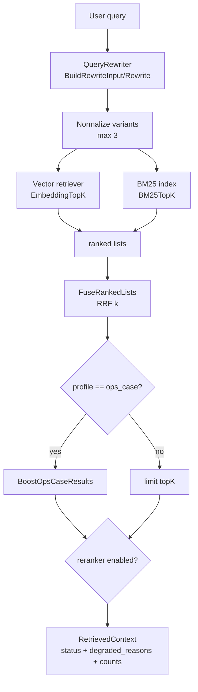

# 16 Hybrid RAG / eval 深挖：检索链路、降级状态与质量门

> 本节回答第二轮问题：Hybrid RAG 的 degraded 状态有哪些来源？ops_case 本地 final report fallback 什么时候生效？eval 如何证明检索形状可用？

## 1. 本节结论

OnCall 的 Hybrid RAG 是“query rewrite + embedding + BM25 + RRF + optional rerank”的组合检索器。它不是只返回文档列表，而是返回 `RetrievedContext`：里面带 `status`、`profile`、`rewritten_queries`、`degraded_reasons`、`candidate_counts`、`retrieval_path` 和最终 results。`status=degraded` 不等于失败；它表示某个子检索或 rerank 降级了，但仍可能通过 legacy embedding、BM25 或本地 final report fallback 返回可用结果。

## 2. 入口数据结构直接服务于可观测性

`HybridRetrieverConfig` 把 profile、config、vector retriever、legacy retriever、BM25 index、rewriter、reranker 都作为可注入依赖。`NewHybridRetriever` 会填默认配置、默认 profile 和 NoopRewriter。证据在 `backend/internal/rag/hybrid.go:13-54`。

返回结构 `RetrievedContext` 不是简单 `[]Document`：它记录 `Status`、`Profile`、原始 Query、重写 queries、重写置信度、是否需要澄清、降级原因、latency、candidate counts、count 和 `[]RetrievedResult`。每个 `RetrievedResult` 还保留 RRF/vector/BM25 score、source、retrieval path 和 meta。证据在 `backend/internal/rag/types.go:23-61`。

图源文件：`docs/learning/diagrams/17-hybrid-rag-eval-flow.mmd`

## 3. Query rewrite：使用会话摘要和最近 turns，但不能编造实体

`RewriteInput` 包括当前 query、session summary 和 recent turns；`BuildRewriteInput` 会从 system 消息拿摘要，从 user/assistant 消息拿最近 4 条 turns，并跳过当前 query，避免重复。证据在 `backend/internal/rag/rewrite.go:17-29` 与 `backend/internal/rag/rewrite.go:63-97`。

`ChatModelRewriter` 的 system prompt 明确要求“keep original facts, do not invent pods/files/namespaces”，最多生成两个 alternatives；解析失败时 `ParseRewriteResult` 回退到 original query，confidence 归零，并把 confidence 限定在 0–1。证据在 `backend/internal/rag/rewrite.go:125-169`。

这说明 rewrite 是增强召回的辅助层，不是事实来源。若 rewrite 模型失败，HybridRetriever 会把 `query_rewrite_failed: ...` 放进 degraded reasons，并用原 query 继续检索。证据在 `backend/internal/rag/hybrid.go:100-107`。

## 4. RetrieveContext 主链路：每个子系统失败都进入 degraded，而不是直接 panic

`RetrieveContext` 的核心顺序是：

1. 计算 finalTopK，初始化 degraded/candidateCounts。
2. 调 rewriter，归一化 query variants。
3. 对每个 variant 调 vector retriever；失败时记录 `embedding_retrieval_failed`，如果有 legacy retriever 就尝试 legacy embedding。
4. 如果 BM25 enabled 且 index 可用，调用 BM25；BM25 失败记录 `bm25_retrieval_failed`，index 不可用记录 `bm25_index_unavailable`。
5. 调 `FuseRankedLists` 做 RRF 融合。
6. ops_case profile 额外 `BoostOpsCaseResults`。
7. reranker enabled 时，缺 reranker 记录 `reranker_unavailable`，rerank 报错记录 `reranker_failed`，然后降级为 limitResults。
8. 只要 degraded reasons 非空，status 就是 `degraded`；如果 fused 为空且无 degraded，则 status 是 `empty`。

证据在 `backend/internal/rag/hybrid.go:87-200`。

因此 degraded 的主要来源包括：`query_rewrite_failed`、`embedding_retrieval_failed`、`legacy_embedding_retrieval_failed`、`embedding_retriever_unavailable`、`bm25_retrieval_failed`、`bm25_index_unavailable`、`reranker_unavailable`、`reranker_failed`，以及工具层的 retriever unavailable / schema mismatch。

## 5. RRF 融合：去重 key 和 retrieval_path 比单个分数更重要

`FuseRankedLists` 对每个 ranked list 用 `1/(rrfK+rank+1)` 累加 RRF 分数；去重 key 优先取 `chunk_id`，其次 `content_hash`、ID、content hash。重复命中时会合并 meta、source、vector/BM25 score 和 retrieval path。证据在 `backend/internal/rag/fusion.go:9-90`。

`BoostOpsCaseResults` 只对 ops_case 增加非常小的 boost：有 root_cause、target_node、final_status、service、namespace 等 meta 各加 0.0005，`source_type/type=ops_final_report` 再加 0.001。证据在 `backend/internal/rag/fusion.go:103-129`。这不是让历史案例压倒所有结果，而是在 RRF 接近时让结构化 final report 稍微靠前。

默认配置是 embeddingTopK=20、BM25TopK=20、FusionTopK=20、FinalTopK=3、MaxFinalTopK=10、RRFK=60，BM25 默认开启、reranker 默认关闭。证据在 `backend/internal/rag/config.go:13-44` 与 `backend/internal/rag/config.go:99-110`。

## 6. knowledge_retrieve 工具：优先用 Hybrid provider，兼容 legacy retriever

`KnowledgeRetrieveTool` 的 schema 对外只暴露 `query` 和可选 `top_k`，并把 top_k 限制在 default/max 范围。证据在 `backend/internal/workflow/dialogue/tools/KnowledgeRetrieveTool.go:34-68`。

如果 retriever 实现了 `RetrieveContext`，工具直接返回 Hybrid 的 `RetrievedContext`，并把每条 content 截到 500 rune。证据在 `backend/internal/workflow/dialogue/tools/KnowledgeRetrieveTool.go:81-88`。如果 retriever 为空，它返回 status=degraded，reason=`knowledge retriever unavailable`；如果 legacy retriever 报 “extra output fields”，它返回 schema mismatch degraded；其他错误返回 status=error。证据在 `backend/internal/workflow/dialogue/tools/KnowledgeRetrieveTool.go:70-121`。

所以 dialogue agent 拿到的是带降级解释的 JSON，而不是静默空结果。

## 7. ops_case fallback：本地 final report 总是先检索，再和 RAG 合并

`OpsCaseRetrieveTool.InvokableRun` 在调用 retriever 前先执行 `retrieveLocalFinalReports(query, topK)`。如果 retriever 为 nil，它返回 degraded，但结果来自本地 `logs/ops_reports` fallback。证据在 `backend/internal/workflow/dialogue/tools/OpsCaseRetrieveTool.go:61-81`。

如果 retriever 支持 Hybrid provider，工具会把 `localReports` 和 Hybrid `result.Results` merge，再写回 `candidate_counts[source.local_final_report_docs]` 和 final docs 数。证据在 `backend/internal/workflow/dialogue/tools/OpsCaseRetrieveTool.go:83-98`。如果 legacy retriever schema mismatch，也会 fallback 到本地 final reports。证据在 `backend/internal/workflow/dialogue/tools/OpsCaseRetrieveTool.go:100-117`。

本地 fallback 的扫描目录是 `logs/ops_reports`，只读 `.md` 文件，去掉 frontmatter 后用 query keywords 对文件名和正文打分；结果标记 `type/source_type=ops_final_report`、source=`local_file`、path 和 title。证据在 `backend/internal/workflow/dialogue/tools/OpsCaseRetrieveTool.go:237-292`。

合并时本地结果先 append，再 append RAG 结果，去重后排序会优先 `ops_final_report` 类型。证据在 `backend/internal/workflow/dialogue/tools/OpsCaseRetrieveTool.go:294-330`。

## 8. Eval 与测试证据：当前锁住的是“检索形状”和离线 BM25，而不是线上召回质量

已有测试覆盖：

| 测试 | 证明内容 | 证据 |
| --- | --- | --- |
| `TestFuseRankedListsDedupeByChunkIDAndRRF` | RRF 按 chunk_id 去重、合并 source/retrieval_path | `backend/internal/rag/rag_test.go:16-42` |
| `TestParseRewriteResultFallbackAndLimit` | rewrite 解析失败回原 query，rewrite 数量和 confidence 被限制 | `backend/internal/rag/rag_test.go:90-102` |
| `TestBuildRewriteInputUsesSummaryAndRecentTurns` | rewrite 输入使用 summary + 最近 turns，并不重复当前 query | `backend/internal/rag/rag_test.go:104-123` |
| `TestHybridRetrieverDegradesWhenRerankerEnabledButUnavailable` | reranker enabled 但无 reranker 时 status=degraded | `backend/internal/rag/rag_test.go:168-191` |
| `TestHybridRetrieverFallsBackToLegacyAndBM25` | primary embedding 失败时可用 legacy + BM25 融合结果 | `backend/internal/rag/rag_test.go:219-254` |
| `TestEvalCasesRunsOfflineBM25` | `ragctl eval` 可离线跑 BM25 并输出 candidate telemetry | `backend/cmd/ragctl/main_test.go:26-60` |
| `TestRebuildBM25AllPartitionsProfiles` | `profile=all` 会把 knowledge 和 ops_case 写入不同 BM25 profile | `backend/cmd/ragctl/main_test.go:62-98` |
| `TestSeedEvalDatasetHasPlanCoverage` | seed eval dataset 至少 40 条并覆盖 knowledge / ops_case | `backend/cmd/ragctl/main_test.go:140-170` |

这些测试证明接口形状、降级路径和离线 BM25 可用；它们不能证明真实 Milvus、真实 embedding 模型和真实 reranker 服务在线质量。

还要注意一个文档真实性边界：`backend/testdata/rag_eval_gold_corpus.jsonl` 是当前仓库里的测试 fixture，但其中部分 metadata 的 `source_path` 仍指向旧 runbook 路径；当前仓库没有对应文档。因此评估时只能把该 JSONL 的内容、`expected_ids` 和 `backend/cmd/ragctl/main_test.go` 当作当前可验证证据，不能把 metadata 里的旧路径当作现存文档引用。

## 9. 可修改边界

- 改 `DefaultConfig`：同时更新 config 测试和 eval 输出解释。
- 改 RRF 去重 key：必须补 `chunk_id/content_hash/id/content` 的重复命中测试。
- 改 ops_case fallback：必须补本地 report 优先级、schema mismatch fallback、空 retriever fallback。
- 接入 reranker：必须补 `reranker_failed` 降级和成功 rerank path。
- 改 eval dataset：保持 knowledge/ops_case 都覆盖，并让缺 expected IDs 时显式 degraded。

## 10. Evidence / Inference / Unknown

- **Evidence**：HybridRetriever 主链路包含 rewrite、embedding/legacy、BM25、RRF、ops_case boost、optional rerank 和 status/degraded 汇总。证据在 `backend/internal/rag/hybrid.go:87-200`。
- **Evidence**：ops_case 工具在 retriever 调用前读取本地 `logs/ops_reports`，retriever nil 或 schema mismatch 时仍 fallback。证据在 `backend/internal/workflow/dialogue/tools/OpsCaseRetrieveTool.go:78-117` 与 `backend/internal/workflow/dialogue/tools/OpsCaseRetrieveTool.go:237-330`。
- **Inference**：当前 eval 更偏“质量门形状 ready”和离线 corpus/BM25 流程，不等价于线上 Milvus 召回效果验收。
- **Unknown**：未在本节连接真实 Milvus/Ark embedding/reranker 服务跑线上召回；这些属于环境依赖验证。fixture metadata 中旧 runbook source_path 也未被现存仓库文档证实。

## 11. 阅读检查清单

读完本节后，应该能回答：

- degraded 和 error 的区别是什么？
- query rewrite 为什么不能当事实来源？
- RRF 如何去重并保留 retrieval_path？
- ops_case 本地 final report fallback 何时生效？
- eval 当前证明的是检索链路哪一层？
