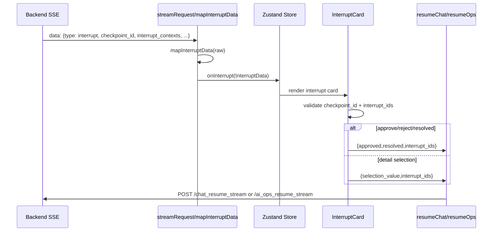

# 17 前端 interrupt QA：approve / reject / detail selection 到底发什么

> 本节回答第二轮问题：前端 approve、reject、detail selection 最终分别发什么 resume payload？当前源码能证明哪些行为，哪些还需要浏览器 e2e？

## 1. 本节结论

前端 interrupt 的核心合同是：SSE 收到 `type=interrupt` 后转成 `InterruptData`，`InterruptCard` 校验 `checkpoint_id` 和 `interrupt_ids`，再根据 card 类型提交 resume payload。普通审批按钮发送 `{approved, resolved, interrupt_ids}`；detail selection 发送 `{selection_value, interrupt_ids}`；chat 恢复额外带 `id=sessionId`，ops 恢复不带 session id、由后端固定 `session_id=aiops`。缺 `checkpoint_id` 或缺 `interrupt_ids` 时前端不会发 resume 请求。

## 2. SSE 解析：streamRequest 只认协议字段，interrupt 先 map 再入 store

`streamRequest` 对 `/chat_stream`、`/chat_resume_stream`、`/ai_ops_stream`、`/ai_ops_resume_stream` 共用一套 SSE 解析：读取 `data:`，支持 `[DONE]`、`[ERROR]`，JSON 里按 `type` 分发。`type=interrupt` 时调用 `mapInterruptData(json)`；`type=step/content/command_action/done/error` 分别走对应 handler。证据在 `frontend/src/services/api.ts:76-185`。

`mapInterruptData` 从 raw payload 提取 `checkpoint_id`、`message`、`interrupt_contexts`、`bash_request`、`detail_request`、`workflow`、`resume_endpoint`。其中 `workflow` 只接受 `chat|ops`，resume endpoint 只接受 `chat_resume_stream|ai_ops_resume_stream`。证据在 `frontend/src/services/api.ts:187-213`。

图源文件：`docs/learning/diagrams/18-frontend-interrupt-qa-flow.mmd`

## 3. Store：chat interrupt 和 ops interrupt 落在不同 UI 状态

聊天流 `sendMessage` 先追加 user message 和空 assistant message，然后调用 `streamChat`。普通 content 追加到最后一条 assistant；step 追加到 message.steps；interrupt 写入最后一条 message 的 `interrupt` 字段。证据在 `frontend/src/store/useStore.ts:320-376`。

Ops 流 `runOps` 会打开 OpsPanel、清空旧 opsSteps、创建当前步骤；收到 interrupt 时如果没有 currentStep 就创建“执行确认”或“人工确认”步骤，并把 interrupt 写到当前 ops step。`onDone` 中如果本轮是被 interrupt 暂停，`isOpsRunning` 会保持 true，表示 UI 等待用户处理。证据在 `frontend/src/store/useStore.ts:263-318`。

store 的持久化只保留最近 50 个 sessions、theme、opsSteps、currentOpsTask、sidebar 状态。证据在 `frontend/src/store/useStore.ts:378-399`。这意味着刷新页面后 opsSteps 可能仍显示上次 interrupt，但真正能否 resume 取决于后端 checkpoint 是否还存在。

## 4. InterruptData 类型：前端明确区分命令审批和细节选择

`InterruptData` 包含 `checkpoint_id`、`interrupt_contexts`、message、可选 `bash_request`、可选 `detail_request`、handled、workflow、resume_endpoint。`DetailRequest` 由 field、question、reason、options 构成，选项有 label/value/description。证据在 `frontend/src/types.ts:8-45`。

`api.ts` 会从 `detail_request`、`interrupt_data` 或 `data` 中解析 detail request；只有 field、question 和 options 都存在时才认定为 detail selection。证据在 `frontend/src/services/api.ts:260-295`。

命令审批请求则可来自结构化 `bash_request/interrupt_data/data`，也可从 message 或 interrupt_contexts 的文本里解析 Go map / JSON / 中文 “待执行命令：...” 句式。证据在 `frontend/src/services/api.ts:228-258` 与 `frontend/src/services/api.ts:298-380`。

## 5. InterruptCard：三类按钮如何构造 payload

`InterruptCard` 先判断：

- `isDetailSelection`：有 detail question 和 options。
- `isCommandApproval`：有 `fullCommand`。
- `resumeViaOps`：`isOps`、或 interrupt.workflow 为 `ops`、或 resume_endpoint 是 `ai_ops_resume_stream`。

证据在 `frontend/src/components/InterruptCard.tsx:45-57`。

`submitResume` 是唯一提交入口。它会阻止重复提交和已处理 interrupt；缺 `checkpoint_id` 报错；chat 模式缺 current session 报错；然后收集 `interruptIDs = interrupt_contexts.map(id).filter(Boolean)`。如果没有 interrupt_ids，它会停止 streaming 并显示“缺少 interrupt_ids，无法恢复到具体中断点”，不会发请求。证据在 `frontend/src/components/InterruptCard.tsx:73-110`。

真正发送前，`requestPayload = {...payload, interrupt_ids: interruptIDs}`。如果 `resumeViaOps`，调用 `resumeOps(checkpointId, requestPayload, options)`；否则调用 `resumeChat(currentSessionId, checkpointId, requestPayload, options)`。证据在 `frontend/src/components/InterruptCard.tsx:210-219`。

按钮到 payload 的映射是：

| UI 动作 | 前端 payload | 证据 |
| --- | --- | --- |
| 命令卡 “准许执行” | `{ approved: true, resolved: false, interrupt_ids }` | `frontend/src/components/InterruptCard.tsx:228-255` |
| 命令卡 “标记为已解决” | `{ approved: true, resolved: true, interrupt_ids }` | `frontend/src/components/InterruptCard.tsx:249-255` |
| 命令卡 “拒绝请求” | `{ approved: false, resolved: false, interrupt_ids }` | `frontend/src/components/InterruptCard.tsx:249-255` |
| 普通人工确认 “继续执行” | `{ approved: true, resolved: false, interrupt_ids }` | `frontend/src/components/InterruptCard.tsx:256-260` |
| 普通人工确认 “已修复完成” | `{ approved: true, resolved: true, interrupt_ids }` | `frontend/src/components/InterruptCard.tsx:256-260` |
| 普通人工确认 “停止处理” | `{ approved: false, resolved: false, interrupt_ids }` | `frontend/src/components/InterruptCard.tsx:256-260` |
| detail option 点击 | `{ selection_value: option.value, interrupt_ids }` | `frontend/src/components/InterruptCard.tsx:232-234` 与 `frontend/src/components/InterruptCard.tsx:356-389` |

注意：detail selection 当前不发送 `approved/resolved`；它只发送 `selection_value`。

## 6. resumeChat / resumeOps：两个 endpoint 的 body 形状

`resumeChat(sessionId, checkpointId, data)` POST 到 `/chat_resume_stream`，body 是 `{id: sessionId, checkpoint_id: checkpointId, ...data}`。证据在 `frontend/src/services/api.ts:48-59`。

`resumeOps(checkpointId, data)` POST 到 `/ai_ops_resume_stream`，body 是 `{checkpoint_id: checkpointId, ...data}`。证据在 `frontend/src/services/api.ts:65-74`。

后端 API 类型也匹配这个形状：`ChatResumeStreamReq` 多一个 `Id`，两者都有 `CheckpointID`、`InterruptIDs`、`Approved`、`Resolved`、`Comment`、`SelectionValue`。证据在 `backend/api/chat/v1/chat.go:39-48` 与 `backend/api/chat/v1/chat.go:68-78`。

后端 `AIOpsResumeStream` 要求 checkpoint_id，然后调用 `resumeAgent(..., req.InterruptIDs, req.Approved, req.Resolved, req.Comment, req.SelectionValue, session_id=aiops)`。证据在 `backend/internal/controller/chat/chat_v1.go:618-628`。

## 7. 后端 resume target：interrupt_ids 决定定向恢复

`resumeAgent` 会把 `interruptIDs` normalize 成 `targetIDs`。如果 targetIDs 为空，则调用 `runner.Resume(ctx, checkpointID, ...)` 做 checkpoint-level resume；如果 targetIDs 不为空，则调用 `buildResumeTargetPayload`，再把同一个 payload 写入每个 target id，最后 `runner.ResumeWithParams(... ResumeParams{Targets: targets})`。证据在 `backend/internal/controller/chat/chat_v1.go:1027-1068`。

`buildResumeTargetPayload` 只写入非空字段：approved、resolved、comment、selection_value。证据在 `backend/internal/controller/chat/chat_v1.go:1617-1633`。这和前端缺 interrupt_ids 不发送请求的策略形成双保险：前端要求精确目标，后端仍兼容 checkpoint-level resume。

## 8. UI 渲染：chat 与 ops 复用同一张 InterruptCard

ChatArea 渲染每条 message；如果 message 上有 interrupt，就插入 `InterruptCard`。证据在 `frontend/src/components/ChatArea.tsx:377-392` 与前文 `useStore.updateLastMessage` 证据。

OpsPanel 对每个 ops step 渲染 Markdown 内容；如果 step.interrupt 存在，也插入 `InterruptCard`，并传 `isOps` 与 `opsStepId`。证据在 `frontend/src/components/OpsPanel.tsx:107-167`。

`InterruptCard` 在 ops 模式下会把当前 ops step 标成 handled/completed，resume 后新建“审批后继续/输出最终技术报告/下一次中断”步骤；chat 模式则追加空 assistant 并持续写最后一条 message。证据在 `frontend/src/components/InterruptCard.tsx:111-207` 与 `frontend/src/components/InterruptCard.tsx:435-453`。

## 9. 当前 QA 结论与缺口

源码可确认：

- 缺 `checkpoint_id` 或缺 `interrupt_ids` 时前端不会 resume。
- detail selection payload 只带 `selection_value + interrupt_ids`。
- approve/reject/resolved payload 明确区分 `approved` 与 `resolved`。
- ops interrupt 会走 `/ai_ops_resume_stream`，chat interrupt 会走 `/chat_resume_stream`。
- 后端 SSE interrupt payload 会带 `workflow` 和 `resume_endpoint`，ops 流明确标注 `ai_ops_resume_stream`。证据在 `backend/internal/controller/chat/chat_v1.go:1302-1313` 与 `backend/internal/controller/chat/chat_v1_test.go:75-84`。

未验证：

- 本节没有打开浏览器点击真实按钮；没有截 network payload。
- 没有验证后端 checkpoint TTL、页面刷新后 checkpoint 是否仍可 resume。
- 没有验证真实 ADK 多 interrupt target 下 selection_value 是否只作用于目标 interrupt。

## 10. Evidence / Inference / Unknown

- **Evidence**：前端 `submitResume` 强制 checkpoint_id 和 interrupt_ids，并根据 ops/chat 选择 endpoint。证据在 `frontend/src/components/InterruptCard.tsx:73-110` 与 `frontend/src/components/InterruptCard.tsx:210-219`。
- **Evidence**：按钮和 detail option 到 payload 的映射由 `handleAction`、`handleSelection`、`actionButtons` 固定。证据在 `frontend/src/components/InterruptCard.tsx:228-260` 与 `frontend/src/components/InterruptCard.tsx:356-389`。
- **Evidence**：后端 API 结构和 `resumeAgent` target payload 支持 approved/resolved/comment/selection_value。证据在 `backend/api/chat/v1/chat.go:39-78` 与 `backend/internal/controller/chat/chat_v1.go:1027-1068`。
- **Inference**：当前前端比后端更严格，因为后端允许 targetIDs 为空时 checkpoint-level resume，而前端要求必须有 interrupt_ids。
- **Unknown**：未做浏览器 e2e，无法声明“UI 点击已实测通过”。

## 11. 阅读检查清单

读完本节后，应该能回答：

- chat interrupt 和 ops interrupt 分别写入哪个 store 字段？
- approve / reject / resolved 三个按钮的 payload 差异是什么？
- detail selection 为什么没有 approved/resolved？
- 前端缺 checkpoint_id / interrupt_ids 时如何处理？
- 后端如何把 interrupt_ids 转成 ADK ResumeParams？
