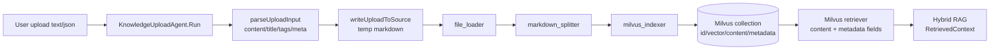

# 18 Milvus / embedding schema 深挖：知识分片如何入库并被召回

> 本节回答第二轮问题：Milvus / embedding adapter / schema 在 OnCall 里怎么连起来？哪些字段是检索闭环必须稳定的？

## 1. 本节结论

OnCall 当前知识入库链路是：上传文本先写成临时 markdown 文件，再经过 `file_loader -> markdown_splitter -> milvus_indexer`，最终以 Eino `schema.Document` 存入 Milvus。Milvus collection 的稳定字段是 `id`、`vector`、`content`、`metadata`；vector 维度固定 2048，metric 是 COSINE。`metadata` 承载 `chunk_id/content_hash/source_type/type/root_cause/final_status` 等业务字段，因此它不是“附属信息”，而是 Hybrid RAG 去重、ops_case boost、final report 归档和 BM25 分区的关键连接点。

## 2. 知识上传入口：Agent 只负责把文本变成 uploadInput

`KnowledgeUploadAgent` 的配置和输入结构很窄：`uploadInput` 包含 content、title、tags、meta；`uploadResult` 只返回 IDs。`NewKnowledgeAgent` 构建 `BuildKnowledgeUploadChain`，agent 描述也明确“仅负责将文本分片并索引到向量库”。证据在 `backend/internal/knowledge/agent.go:16-62`。

`Run` 会解析最新用户消息，调用 runnable，成功后返回“知识上传完成，已入库 N 个分片”，并在 customized output 中带 `indexed=true`、ids、title、tags。证据在 `backend/internal/knowledge/agent.go:72-112`。

`parseUploadInput` 支持两种输入：如果最新用户内容是 JSON 且有 content，则直接用 JSON；否则把整段文本当 content，并用第一行推断 title。证据在 `backend/internal/knowledge/agent.go:114-175`。

图源文件：`docs/learning/diagrams/19-milvus-embedding-schema-flow.mmd`

## 3. Upload chain：临时文件是为了复用 Eino loader/splitter/indexer 图

`BuildKnowledgeGraph` 先创建 indexer、loader、markdown transformer，然后建 Eino graph：`START -> file_loader -> markdown_splitter -> milvus_indexer -> END`。证据在 `backend/internal/knowledge/orchestration.go:16-58`。

`BuildKnowledgeUploadChain` 在 graph 外再包三步 chain：

1. `writeUploadToSource(in)`：把 content/meta 写入临时 markdown。
2. 调 indexing runnable invoke，得到 ids；然后删除临时文件。
3. 把 ids 包成 `uploadResult`。

证据在 `backend/internal/knowledge/orchestration.go:60-80`。

`writeUploadToSource` 会要求 content 非空；title 为空时用 `knowledge_upload`；文件名会替换 `/ \ : * ? " < > |`、换行和 tab，最后写到 `os.TempDir()`。如果 meta 非空，它会追加 `meta: %v` 到正文。证据在 `backend/internal/knowledge/orchestration.go:82-126`。

这里要注意：这个临时文件不是知识库持久存储；持久层是后面的 Milvus 与 BM25/index 文件。临时文件只是为了把上传文本适配进 Eino document pipeline。

## 4. Indexer：embedding、collection、schema 和 vector converter 必须一致

`NewMilvusIndexerWithCollection` 做四件事：创建 Milvus client，创建 Doubao/Ark embedder，确认 collection 存在，然后构造 Eino Milvus indexer。indexer config 使用：collection、fields、embedding、COSINE metric、`docConverterFloatVector("vector")`。证据在 `backend/internal/ai/indexer/indexer.go:20-51`。

`docConverterFloatVector` 要求 docs 和 vectors 数量一致，并把每个 document 转成 row：`id`、`content`、`vector`、`metadata`。关键点是把 `[]float64` 转成 `[]float32`，因为 Milvus FloatVector 字段需要 float32。证据在 `backend/internal/ai/indexer/indexer.go:53-78`。

indexer 自己定义的 fields 是：

| 字段 | 类型 | 作用 | 证据 |
| --- | --- | --- | --- |
| `id` | VarChar max_length 255，PrimaryKey | 文档/分片主键 | `backend/internal/ai/indexer/indexer.go:80-88` |
| `vector` | FloatVector dim 2048 | 向量检索字段 | `backend/internal/ai/indexer/indexer.go:89-95` |
| `content` | VarChar max_length 8192 | 召回正文 | `backend/internal/ai/indexer/indexer.go:96-102` |
| `metadata` | JSON | 业务元数据、去重、profile/boost | `backend/internal/ai/indexer/indexer.go:103-107` |

## 5. Milvus client：默认库/集合、自动建 collection、AUTOINDEX

Milvus 配置优先从 `manifest/config/config.yaml` 读，再回退环境变量，最后用默认值。配置项包括 address、database、collection、knowledge_v2_collection、ops_v2_collection、timeout、auto_create_collection。证据在 `backend/utility/common/milvus_config.go:15-67`。

常量里默认 database 是 `agent`，默认业务集合是 `biz`，老 ops 集合是 `ops_cases`，v2 集合是 `biz_v2` 和 `ops_cases_v2`。证据在 `backend/utility/common/common.go:3-9`。

`NewMilvusClient` 先连 default DB，必要时创建目标 DB，再连目标 DB；如果 `AutoCreateCollection` 为 true，就调用 `EnsureMilvusCollection`。证据在 `backend/utility/client/client.go:14-75`。

`EnsureMilvusCollection` 会检查 collection 是否存在；不存在时用同一组字段创建 collection，并开启 dynamic field，再对 `vector` 建 AUTOINDEX + COSINE。这里 client 侧 `id` max_length 是 256，indexer 侧是 255；这不影响当前文档结论，但后续如果严格校验 schema，应统一这个长度。证据在 `backend/utility/client/client.go:77-143`。

## 6. Embedder：Doubao/Ark 配置决定向量来源，但维度由 schema 固定要求

`DoubaoEmbedding` 从 `doubao_embedding_model.model/api_key/base_url/api_type` 读取配置；`api_type` 为空或 auto 时根据模型名是否含 vision/multimodal 推断 text 或 multi_modal。证据在 `backend/internal/ai/embedder/embedder.go:13-38` 与 `backend/internal/ai/embedder/embedder.go:63-80`。

`newArkEmbedder` 会校验 model、apiKey、baseURL 非空，然后创建 ark embedder。证据在 `backend/internal/ai/embedder/embedder.go:40-61`。

这里的关键风险是：Milvus schema 固定 `vector.dim=2048`，但代码没有在写入前显式检查 embedding 返回维度是否 2048；如果模型变更导致维度不一致，失败会出现在 Milvus/Eino indexer 阶段，而不是 `DoubaoEmbedding` 阶段。

## 7. Retriever：召回时必须拿回 content/metadata，旧 ops_cases 有兼容分支

`NewMilvusRetrieverWithCollection` 同样创建 Milvus client 和 Doubao embedder，并在 auto create 开启时确保 collection 存在；随后 `LoadCollection`，解析 output fields，并用 `VectorField="vector"`、COSINE、TopK=3、ScoreThreshold=0.8 创建 Milvus retriever。证据在 `backend/internal/ai/retriever/retriever.go:29-98`。

`resolveOutputFields` 会 DescribeCollection，如果 schema 里有 `content` / `metadata` 才请求这两个 output fields。证据在 `backend/internal/ai/retriever/retriever.go:100-125`。

特殊兼容：如果 collection 是旧 `common.MilvusOpsCollection`（`ops_cases`），代码会把 outputFields 置空，因为当前 Milvus 环境下显式请求 `content metadata` 会报 extra output fields 错误。证据在 `backend/internal/ai/retriever/retriever.go:64-69`。这也是为什么第 16 节的 `knowledge_retrieve` / `ops_case_retrieve` 工具都保留了 schema mismatch degraded/fallback 逻辑。

## 8. final report 与 ops_v2：metadata 是历史案例闭环的桥

最终报告归档时不会走 markdown splitter，而是把完整 final report 作为单个 `schema.Document` 存入 `OpsV2Collection`。metadata 明确写入 `type/source_type=ops_final_report`、doc_id/chunk_id/content_hash、title、session_id、final_status、root_cause、target_node、plan/verification/replan/terminal decision、report_path、knowledge_eligible、evidence_count、confidence。证据在 `backend/internal/workflow/ops/incident_nodes.go:1700-1748`。

这些字段后来会被 `BoostOpsCaseResults` 用来给 ops_case 检索加小权重，也会被 `resultDedupeKey` 用 chunk_id/content_hash 去重。证据在 `backend/internal/rag/fusion.go:75-129`。

## 9. 测试证据与缺口

已有测试证明 Milvus 配置优先级和 v2 默认值：`resolveMilvusSetting` 优先 config、再 env、再 default；`TestMilvusV2DefaultsAndEmptyOverride` 验证 `biz_v2`、`ops_cases_v2` 默认和覆盖。证据在 `backend/utility/common/milvus_config_test.go:8-54` 与 `backend/utility/common/milvus_config_test.go:97-110`。

但当前没有离线测试直接创建 Milvus collection 或验证真实 embedding 维度；这需要真实 Milvus/Ark 环境，不适合在纯 docs 写作中伪造通过。

## 10. 可修改边界

- 改 vector dim：同步改 client fields、indexer fields、embedding 模型，并增加维度 mismatch 测试/启动检查。
- 改 metadata 字段名：同步检查 RRF 去重、ops_case boost、final report archive、BM25 upsert 和前端展示。
- 改 v2 collection 默认名：同步更新 `common.go`、`milvus_config.go`、config test、部署配置。
- 改 retriever output fields：保留旧 `ops_cases` schema mismatch 兼容，或写迁移脚本。

## 11. Evidence / Inference / Unknown

- **Evidence**：知识上传链路是 temp markdown -> file_loader -> markdown_splitter -> milvus_indexer。证据在 `backend/internal/knowledge/orchestration.go:16-80`。
- **Evidence**：Milvus schema 核心字段是 id/vector/content/metadata，vector dim=2048，metric/index 使用 COSINE/AUTOINDEX。证据在 `backend/internal/ai/indexer/indexer.go:80-107` 与 `backend/utility/client/client.go:96-143`。
- **Inference**：metadata 是 OnCall RAG 的业务连接层，因为去重、boost、final report 归档和 BM25 upsert 都依赖它。
- **Unknown**：未验证真实 Ark embedding 返回维度，也未连接真实 Milvus 做 collection schema diff。

## 12. 阅读检查清单

读完本节后，应该能回答：

- 知识上传为什么先写临时 markdown？
- Milvus collection 必须有哪些字段？
- vector 为什么转成 float32？
- `biz/biz_v2/ops_cases/ops_cases_v2` 分别是什么？
- 为什么 metadata 字段不能随意改名？
