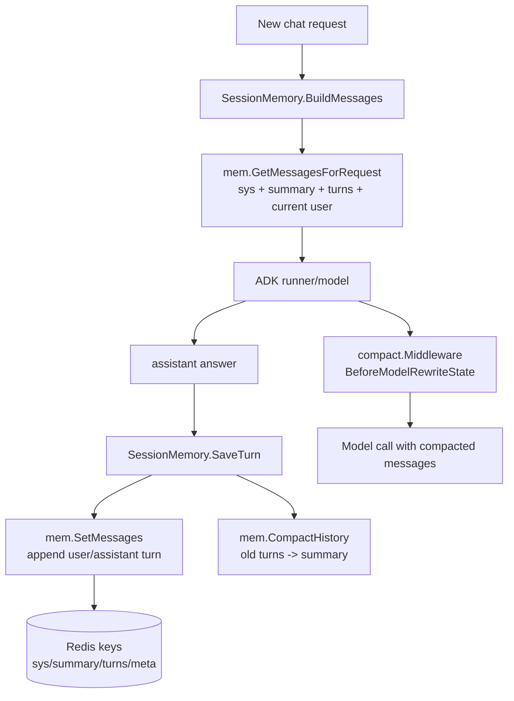

# 19 context compact / SessionMemory 深挖：三层上下文机制不要混在一起

> 本节回答第二轮问题：context compact 和 checkpoint resume 是否是同一层机制？SessionMemory、Redis history、live compaction 分别解决什么？

## 1. 本节结论

OnCall 至少有三层“上下文/恢复”机制，不能混为一谈：

1. **Checkpoint / resume**：ADK runner 的执行暂停与恢复，解决 interrupt 后从哪个节点继续。
2. **SessionMemory**：跨请求聊天历史，使用 Redis 保存 turns/summary/meta，解决下一轮请求如何带上历史。
3. **compact middleware**：单次 ADK run 内给模型调用前压缩 live messages 和工具输出，解决当前 prompt 超上下文窗口。

本节聚焦第 2、3 层；checkpoint/resume 已在第 07 与第 17 节覆盖。

## 2. SessionMemory：请求开始组装历史，请求结束保存 turn

`SessionMemoryConfig` 默认预留 tools tokens=20000、最多 recent turns=20、超过 40 turns 开始 summary、summary max runes=1200。证据在 `backend/internal/context/session_memory.go:16-44`。

`SessionMemory.BuildMessages(ctx, sessionID, question)` 会把当前 question 变成 user message，然后调用 `mem.GetMessagesForRequest`；如果 Redis 未初始化或加载失败，会 warn 并 fallback 为“当前问题一条 user message”。证据在 `backend/internal/context/session_memory.go:87-124`。

`SaveTurn` 在回答非空时构造 user/assistant message，估算或精确计算 prompt/completion tokens，调用 `memory.SetMessages` 写入 Redis；如果上下文已取消，会用 3 秒 detached context 再试一次。写完后调用 `memory.CompactHistory` 做 Redis 历史增量压缩。证据在 `backend/internal/context/session_memory.go:145-202`。

图源文件：`docs/learning/diagrams/20-context-compact-memory-flow.mmd`

## 3. Redis memory：turns 与 summary 是持久历史，不是 ADK checkpoint

`mem.Config` 的默认输入预算是 96k，输出预留 8192，tools 预留 20000，user 预留 4000，safety 2048，TTL 2h，并默认不把 reasoning 放进历史。证据在 `backend/utility/mem/mem.go:19-46`。

`SetMessages` 的写入逻辑是：先估算 user tokens，如果 provider 返回 promptTokens，就按 scale 校准；assistant tokens 优先用 completionTokens，否则估算；然后把 user 和 assistant 作为一个 turn 追加到 Redis，并写 `last_prompt_tokens/last_completion_tokens/updated_at` 到 meta。证据在 `backend/utility/mem/mem.go:140-211`。

Redis key 设计是：

| Key | 含义 | 证据 |
| --- | --- | --- |
| `aiagent:ctx:{session}:sys` | system messages | `backend/utility/mem/mem.go:391` |
| `aiagent:ctx:{session}:summary` | 历史摘要 | `backend/utility/mem/mem.go:392-394` |
| `aiagent:ctx:{session}:turns` | 原始对话 turns | `backend/utility/mem/mem.go:395` |
| `aiagent:ctx:{session}:meta` | token 和更新时间等元数据 | `backend/utility/mem/mem.go:396` |

这四类 key 都是跨请求历史；它们不保存 ADK graph 的暂停节点，也不替代 checkpoint。

## 4. GetMessagesForRequest：每次请求按预算裁剪，而不是把所有历史塞回模型

`GetMessagesForRequest` 读取 system、summary、turns，把当前 user message 附加在末尾；它会计算 turns budget：MaxInputTokens 减去 output/tools/user/safety/sys/summary 预留，然后用 `trimTurnsToBudget` 在 Redis 中按 turn 裁剪，再读取 turns 拼装 messages。证据在 `backend/utility/mem/mem.go:317-387`。

这意味着历史不是“越多越好”，而是按当前请求预算动态裁剪。summary 作为独立 message 插入在 sys 之后、turns 之前，用于保留旧上下文的压缩记忆。证据在 `backend/utility/mem/mem.go:373-381`。

## 5. CompactHistory：跨请求历史压缩，超过触发轮次才把旧 turns 合并进 summary

`CompactHistory` 的注释写明：Redis 原始 turns 最多保留约 40 轮；超过 40 轮时，将最旧 20 轮合并进持久化摘要；摘要单独存储，不作为新的 turn。证据在 `backend/utility/mem/mem.go:213-217`。

实现上它用 Redis WATCH 监听 turns/summary/meta，读出所有 turns；如果 turns 数不超过 triggerTurns 就不做事；超过后调用 `compactStoredTurns` 得到 nextSummary 和 remainingTurns，再通过 TxPipelined 删除/重写 turns、写 summary、更新 meta 和 TTL。证据在 `backend/utility/mem/mem.go:217-313`。

这层 compact 是“保存后历史整理”，不是模型调用前实时整理。

## 6. compact.Middleware：live context 压缩发生在模型调用前

`compact.Config` 控制的是 ADK ChatModelAgent 的 live context：模型、workdir、context window、max output、tail tokens、soft failure limit、tool result spill 配置和 in-process Store。`Store` 按 session_id 保存 `SessionState`，里面有工具输出替换状态、recovery、usage anchor、soft failures、compaction count、last used tokens、last reason。证据在 `backend/internal/compact/compact.go:31-67`。

`NewMiddleware` 会填默认 context window=128k、max output=8192、tail tokens=40000、soft failure limit=2、workdir=.、store=defaultStore。证据在 `backend/internal/compact/compact.go:99-135`。

session id 通过 ADK session value `session_id` 获取；没有则落到 `_default`。证据在 `backend/internal/compact/compact.go:137-146`。

## 7. Before/After hooks：先处理工具大输出，再决定是否 summarize

`BeforeModelRewriteState` 会先对 state.Messages 执行 `toolresult.Apply`，处理工具输出预算/替换；然后调用 `manageMessages`，必要时压缩 live messages，并把结果写回 state.Messages。证据在 `backend/internal/compact/compact.go:148-165`。

`AfterModelRewriteState` 会从最后一条 message 的 provider usage 里记录真实 prompt tokens，作为下一次估算 anchor。证据在 `backend/internal/compact/compact.go:168-182`。

工具调用 wrapper 还会在工具执行前标记 spill readback，执行后记录工具输出，避免大工具结果无限塞进后续上下文。证据在 `backend/internal/compact/compact.go:184-208`。

## 8. manageMessages：软阈值尝试 summarize，硬阈值失败时强制 drop oldest

`manageMessages` 先用 usage anchor 或估算计算 used tokens，再算 soft/hard threshold。未到 soft 不改；超过 hard 会 force；soft failure 超过配置也会停止反复尝试。证据在 `backend/internal/compact/compact.go:217-258`。

`compactMessages` 会保留 leading system messages 和最近 tail tokens，把中间 prefix 交给 summary model，总结成一条 system message，再拼回 leading system + summary + tail。summary prompt 明确要求用中文结构化笔记保留目标、决策、约束、工具发现、路径、错误和未解决 next steps，不能编造事实。证据在 `backend/internal/compact/compact.go:260-305`。

如果硬阈值下 summary model 失败，`forceDropOldest` 会插入一条系统 note，说明早期上下文因硬限制被强制降载，并保留最近未压缩消息。证据在 `backend/internal/compact/compact.go:307-326`。

## 9. 三层边界对照表

| 机制 | 生命周期 | 存储 | 解决的问题 | 不负责什么 |
| --- | --- | --- | --- | --- |
| ADK checkpoint/resume | 一次 workflow run 暂停/恢复 | checkpoint store | interrupt 后从哪里继续 | 不保存跨请求完整聊天历史 |
| SessionMemory / Redis | 多个 chat request | Redis sys/summary/turns/meta | 下一轮请求带历史、按预算裁剪 | 不知道 ADK graph 节点 |
| compact.Middleware | 单次 agent/model 调用前后 | 进程内 Store + state.Messages | 当前 prompt 超窗时压缩 live context / 工具输出 | 不持久保存长期历史 |

## 10. 可修改边界

- 改 Redis key 或 TTL：要补 `GetMessagesForRequest`、`SetMessages`、`CompactHistory` 的兼容测试。
- 改 SessionMemory fallback：确保 Redis 故障时仍能单轮回答。
- 改 compact middleware summary prompt：保持 Evidence/路径/错误/未解决项，不要把 summary 当事实来源。
- 改 tool result spill：要验证 readback/recovery attachment 仍能让模型重新读取来源。
- 不要用 checkpoint 机制替换 SessionMemory；它们的状态粒度不同。

## 11. Evidence / Inference / Unknown

- **Evidence**：SessionMemory 从 Redis 构建请求消息，失败时回退到当前 user message；回答后写 turn 并调用 CompactHistory。证据在 `backend/internal/context/session_memory.go:105-202`。
- **Evidence**：Redis history key 分为 sys/summary/turns/meta，Get 阶段按预算裁剪 turns，CompactHistory 把旧 turns 合并进 summary。证据在 `backend/utility/mem/mem.go:317-396` 与 `backend/utility/mem/mem.go:213-313`。
- **Evidence**：compact.Middleware 是 ADK ChatModelAgent 调用前后的 live message 压缩与工具输出管理。证据在 `backend/internal/compact/compact.go:148-258`。
- **Inference**：checkpoint/resume、SessionMemory、compact middleware 是三层互补机制；不能用其中一层解释所有“上下文恢复”。
- **Unknown**：未在真实 Redis 中检查 key TTL 和压缩后的 summary 文本质量。

## 12. 阅读检查清单

读完本节后，应该能回答：

- SessionMemory 在请求开始和结束分别做什么？
- Redis 的 sys/summary/turns/meta 分别保存什么？
- CompactHistory 和 compact.Middleware 的触发时机差异是什么？
- 为什么 checkpoint resume 不是长期会话记忆？
- 硬阈值下 summary 失败时如何降级？
