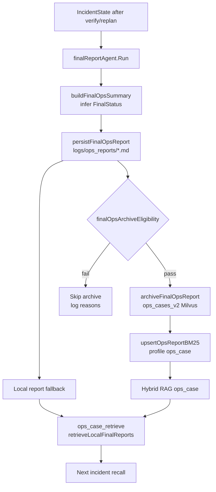

# 20 final report archive / ops_case 闭环：最终报告如何沉淀成下一次召回

> 本节回答第二轮问题：final_reporter 生成的最终报告如何落盘、如何归档到 ops case、什么条件下跳过归档，以及下一轮如何被 ops_case_retrieve 召回？

## 1. 本节结论

OnCall 的 ops_case 闭环是：`final_reporter` 生成最终运维总结，先落盘到 `logs/ops_reports/*.md`；如果质量门通过，再把完整报告作为单个 `schema.Document` 写入 `ops_cases_v2` Milvus collection，并同步写 BM25 ops_case profile。下一轮 `ops_case_retrieve` 会先检索本地 final reports，再合并 Hybrid RAG 结果。因此即使 Milvus 或 schema 失败，本地落盘报告仍可作为 degraded fallback 参与历史案例召回。

## 2. final_reporter：生成报告后立即尝试持久化和归档

`finalReportAgent.Run` 从 context 取 `IncidentState`，推断 `FinalStatus`，调用 `buildFinalOpsSummary(state)`，把 summary 截断到 state.FinalReport，更新 UpdatedAt，再写回 state。证据在 `backend/internal/workflow/ops/incident_nodes.go:762-772`。

随后它调用 `persistFinalOpsReport(ctx,state,summary)` 落盘；落盘成功后再检查 `finalOpsArchiveEligibility(state, summary)`，符合条件才调用 `archiveFinalOpsReport` 入知识库，否则日志记录 skip reasons。无论持久化/归档是否成功，最终都会把 summary 发给前端。证据在 `backend/internal/workflow/ops/incident_nodes.go:773-795`。

图源文件：`docs/learning/diagrams/21-final-report-archive-loop.mmd`

## 3. 落盘报告：YAML frontmatter 保存 plan/verification/replan 元数据

`persistFinalOpsReport` 要求 report 非空；session id 默认 `aiops`，可从 ADK session value `session_id` 读取；status 取 `state.FinalStatus`，空则 `unknown`。它创建 `logs/ops_reports`，文件名由 session/status/timestamp 组成。证据在 `backend/internal/workflow/ops/incident_nodes.go:1640-1674`。

frontmatter 包括：session_id、final_status、plan_id、plan_revision、verification_status、verification_success、verification_failed_step_id、replan_count、terminal_decision、generated_at。证据在 `backend/internal/workflow/ops/incident_nodes.go:1675-1695`。

测试 `TestPersistFinalOpsReportIncludesPlanMetadata` 会在临时目录调用 persist，读取文件并断言 plan_id、plan_revision、verification_status、verification_success、failed step、replan_count、terminal_decision 都写进 frontmatter。证据在 `backend/internal/workflow/ops/diagnosis_gate_test.go:190-246`。

## 4. 归档报告：完整 report 作为单文档写入 ops_cases_v2

`archiveFinalOpsReport` 初始化 `NewMilvusIndexerWithCollection(ctx, common.LoadMilvusConfig(ctx).OpsV2Collection)`，也就是当前配置的 `ops_cases_v2`。证据在 `backend/internal/workflow/ops/incident_nodes.go:1700-1709` 与 `backend/utility/common/common.go:3-9`。

它生成 `reportID=ops_report_{session}_{nanos}`，title 来自 `buildFinalReportTitle`，content_hash 用 `rag.ContentHash(report)`，然后构造一个 `schema.Document{ID, Content, MetaData}`。metadata 里最关键的字段是：

- `type/source_type=ops_final_report`
- `doc_id/chunk_id/content_hash`
- `title/session_id/final_status/root_cause/target_node`
- `plan_id/plan_revision/verification_status/verification_success/verification_failed_step_id/verification_reason`
- `replan_count/terminal_decision/report_path/knowledge_eligible/evidence_count/confidence`

证据在 `backend/internal/workflow/ops/incident_nodes.go:1711-1749`。

然后它调用 `indexer.Store(ctx, []*schema.Document{doc})`，成功后尝试 `upsertOpsReportBM25`；BM25 失败只 warn，不让 Milvus 归档失败回滚。证据在 `backend/internal/workflow/ops/incident_nodes.go:1751-1764`。

## 5. BM25 同步：让 ops_case profile 离线检索也能命中报告

`upsertOpsReportBM25` 会读取 RAG config；如果 BM25 disabled 直接返回 nil。否则打开 `NewProfileBM25Index(config.BM25Root, rag.ProfileOpsCase)`，把 report document 转成 `rag.DocumentChunk` 写入 BM25：ID、DocID、ChunkID、SourceType、Content、Metadata、ContentHash 都来自 doc/meta。证据在 `backend/internal/workflow/ops/incident_nodes.go:1766-1787`。

这和第 16 节的 Hybrid RAG 对应：ops_case profile 可以从 embedding/Milvus 和 BM25 两路召回 final report，RRF 再融合；如果 retriever 不可用，工具层还有本地文件 fallback。

## 6. 质量门：不是所有最终报告都会入知识库

`finalOpsArchiveEligibility` 会拒绝这些情况：

- state 缺失。
- report 为空或少于 80 rune。
- final_status 为空或 unknown。
- 没有 evidence、execution logs、remediation actions 任一类证据。
- confidence <= 0 且没有 evidence。

证据在 `backend/internal/workflow/ops/incident_nodes.go:1789-1811`。

测试 `TestInferFinalStatusResolvedWithoutStrategyStage` 证明即使没有 strategy stage，只要 execution 成功、有 evidence/confidence/actions，final status 可推断为 resolved，并通过 archive eligibility。证据在 `backend/internal/workflow/ops/diagnosis_gate_test.go:95-114`。

测试 `TestFinalOpsArchiveEligibilityRejectsUnknownStatus` 证明 final_status=unknown 会被拒绝，reason 包含 `missing_final_status`。证据在 `backend/internal/workflow/ops/diagnosis_gate_test.go:248-263`。

## 7. ops_case_retrieve：本地 final report fallback 让闭环更稳

`OpsCaseRetrieveTool.InvokableRun` 一开始就执行 `retrieveLocalFinalReports(query, topK)`。如果 retriever nil，则返回 degraded + 本地 final reports。证据在 `backend/internal/workflow/dialogue/tools/OpsCaseRetrieveTool.go:61-81`。

如果使用 Hybrid provider，它会把 Hybrid results 和本地 reports merge，写 candidate count，并保留 final docs 数。证据在 `backend/internal/workflow/dialogue/tools/OpsCaseRetrieveTool.go:83-98`。

`retrieveLocalFinalReports` 扫描 `logs/ops_reports` 下 `.md`，剥掉 frontmatter，用 query keywords 对文件名/正文打分；结果 meta 会标记 `type/source_type=ops_final_report`、`source=local_file`、path、title。证据在 `backend/internal/workflow/dialogue/tools/OpsCaseRetrieveTool.go:237-292`。

`mergeOpsCaseResults` 先追加 localReports 再追加 retrieved，并在排序时优先 `ops_final_report` 类型。证据在 `backend/internal/workflow/dialogue/tools/OpsCaseRetrieveTool.go:294-330`。

所以这个闭环有两条召回路径：

1. **快速本地兜底**：落盘 report -> `logs/ops_reports` -> local file scoring。
2. **知识库召回**：质量门通过 -> Milvus ops_v2 + BM25 ops_case -> Hybrid RAG。

## 8. final report 内容和 plan/replan/verify 的关系

`buildFinalOpsSummary` 会把 state 中 root cause、target、evidence、plan、verify/replan/terminal decision 等整合成面向前端的最终总结；测试 `TestBuildFinalOpsSummaryIncludesCanonicalPlanAndReplan` 明确断言报告包含 canonical plan id、replan decision、verify_plan 和 failed_step_id，同时 helper 能取到 plan revision、replan count、terminal decision、verification status。证据在 `backend/internal/workflow/ops/diagnosis_gate_test.go:133-188`。

这意味着 final report 不是“最后一句话”，而是 plan/execute/verify/replan 的归档摘要。后续历史案例召回时，metadata 里的 plan/verification/replan 字段可以帮助模型判断类似 incident 的处置质量。

## 9. 可修改边界

- 改 final report frontmatter：同步更新 `TestPersistFinalOpsReportIncludesPlanMetadata`。
- 改归档质量门：补 resolved/unresolved/unknown、缺 evidence、短 report 的测试。
- 改 ops_v2 metadata 字段：同步检查 `BoostOpsCaseResults`、BM25 upsert、ops_case_retrieve 本地 meta。
- 改本地 fallback 目录：同步迁移 `logs/ops_reports` 的读取、落盘和 docs。
- 改 BM25 profile：保持 `ProfileOpsCase` 与 eval/rebuild 测试一致。

## 10. Evidence / Inference / Unknown

- **Evidence**：final_reporter 会先 persist 本地报告，再按 eligibility 归档 Milvus/BM25。证据在 `backend/internal/workflow/ops/incident_nodes.go:762-795` 与 `backend/internal/workflow/ops/incident_nodes.go:1640-1811`。
- **Evidence**：ops_case_retrieve 始终先读本地 final reports，再与 retriever 结果合并；retriever 不可用时返回 degraded fallback。证据在 `backend/internal/workflow/dialogue/tools/OpsCaseRetrieveTool.go:61-98` 与 `backend/internal/workflow/dialogue/tools/OpsCaseRetrieveTool.go:237-330`。
- **Evidence**：测试覆盖 final status 推断、frontmatter 元数据、archive eligibility 对 unknown status 的拒绝。证据在 `backend/internal/workflow/ops/diagnosis_gate_test.go:95-114`、`backend/internal/workflow/ops/diagnosis_gate_test.go:190-263`。
- **Inference**：本地落盘和 ops_v2/BM25 双路径让历史案例闭环对 Milvus 短期故障更耐受。
- **Unknown**：未连接真实 Milvus 验证 final report doc 是否实际写入 ops_cases_v2，也未跑浏览器端“下一轮召回显示历史案例”的 e2e。

## 11. 阅读检查清单

读完本节后，应该能回答：

- final_reporter 什么时候落盘，什么时候归档？
- frontmatter 与 Milvus metadata 分别保存哪些 plan/verification 信息？
- finalOpsArchiveEligibility 为什么会拒绝 unknown status？
- BM25 upsert 为什么使用 ProfileOpsCase？
- ops_case_retrieve 的本地 fallback 与 Hybrid RAG 结果如何合并？
